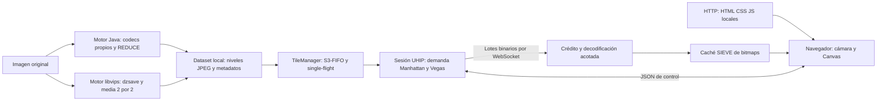

# Catálogo de algoritmos y protocolos del sistema UHIP

Fecha de revisión: 5 de octubre de 2026. Este documento describe el código de este directorio y distingue los algoritmos originales, las adaptaciones del proyecto y los mecanismos propios. Las referencias explican su procedencia; los parámetros y el comportamiento concreto se obtienen de las clases y módulos indicados.

## 1. Arquitectura y recorrido de una imagen

UHIP prepara una imagen como pirámide de JPEG de hasta 256 × 256 píxeles y después entrega únicamente las teselas correspondientes a la vista solicitada. La generación y la visualización son procesos distintos: se puede preparar el dataset con Java o libvips y servirlo con el mismo servidor Java 21.



El cliente actual está en `public/`: HTML, CSS y módulos JavaScript ES6. HTTP entrega los recursos iniciales; las imágenes se transportan por el canal binario WebSocket. No es necesario descargar la imagen original completa al navegador ni conectar con servicios externos para utilizar el visor local.

## 2. Inventario principal

| Nombre | Ubicación de producción | Responsabilidad | Relación con el original |
|---|---|---|---|
| TCP Vegas | `src/main/java/com/uhip/traffic/TrafficEngine.java`; `session/ClientSession.java` | Ajustar el número de teselas de cada lote según el retardo de confirmación | Adaptación a la capa de aplicación; no reemplaza TCP del sistema operativo |
| Distancia Manhattan, norma L1 | `src/main/java/com/uhip/dispatch/TileDispatcher.java` | Priorizar teselas próximas al centro visible | Fórmula L1 exacta; se agregan geometría rectangular, raíz y deduplicación |
| SIEVE | `public/js/cache.js`, `TileCache` | Expulsar bitmaps del navegador bajo presión de memoria | Núcleo de mano/bit visited; extensión con protección de claves, bytes, créditos y préstamos |
| S3-FIFO | `src/main/java/com/uhip/storage/S3FifoCache.java`; `storage/TileManager.java` | Reutilizar JPEG comprimidos entre clientes | Tres FIFO y frecuencia saturada; presupuesto por bytes e historial acotado |
| AMP, anticipación multistream | `public/js/viewport.js`, `AmpTilePrefetcher` | Anticipar teselas hacia el movimiento de cámara | Heurística espacial inspirada en AMP; no implementa toda la adaptación del artículo |
| Burt–Adelson REDUCE | `src/main/java/com/uhip/imaging/RegionReducer.java` | Construir niveles menores desde muestras sin pérdidas | Operador REDUCE separable, parametrizado con cinco coeficientes; activo por defecto en Java |

Además de estos seis, el sistema implementa algoritmos de geometría, presentación, sincronización, memoria y codecs. Se documentan en las secciones siguientes porque también intervienen en el funcionamiento real.

## 3. Protocolos de transporte

### 3.1 HTTP y TCP

HTTP se utiliza para la entrega inicial de `public/index.html`, CSS, módulos y demás recursos locales. `HttpStaticServer.start()` usa `com.sun.net.httpserver.HttpServer` del JDK con `Executors.newVirtualThreadPerTaskExecutor()`. El puerto predeterminado es **8080**. `handleStaticRequest()` acepta GET, resuelve `/` como `index.html`, normaliza la ruta y comprueba que permanezca dentro del directorio público; responde 200, 404 o 405 según el caso y envía tipos MIME y `Cache-Control: no-cache`.

HTTP y WebSocket usan TCP como transporte ordenado y fiable. La pila del sistema operativo gestiona segmentos, retransmisiones y el control de congestión del TCP real; `TrafficEngine` solo regula lotes de aplicación. Referencias de transporte: [semántica HTTP, RFC 9110](https://www.rfc-editor.org/rfc/rfc9110), [HTTP/1.1, RFC 9112](https://www.rfc-editor.org/rfc/rfc9112) y [TCP, RFC 9293](https://www.rfc-editor.org/rfc/rfc9293).

### 3.2 WebSocket en dos canales

| Canal | Puerto predeterminado y URL | Contenido | Implementación |
|---|---|---|---|
| Control | `8081`, `/control?clientId=<id>` | Mensajes de texto JSON | `ws/ControlWebSocket.java`; `ProtocolClient.openControlChannel()` |
| Datos | `8082`, `/data?clientId=<id>&generationId=<uuid>` | Mensajes binarios UHIP con JPEG | `ws/DataWebSocket.java`; `ProtocolClient.openDataChannel()` |

La biblioteca Java-WebSocket implementa el handshake y el framing WebSocket; el navegador utiliza su API `WebSocket`. El cliente fija `binaryType = 'arraybuffer'` para datos. Los puertos HTTP/WS son configurables al iniciar el servidor; el cliente también permite indicarlos en `ProtocolClient.connect(host, ctrlPort, dataPort)`, aunque la aplicación actual lo llama con sus valores predeterminados.

La conexión de datos debe pertenecer a una sesión que completó HELLO, tener el `generationId` actual y un control abierto. Una conexión de datos vieja o duplicada se rechaza. Ambos sockets tienen un ciclo de vida conjunto: un error en el socket propietario invalida la pareja. Los callbacks antiguos se ignoran mediante identidad del socket. El protocolo utilizado es `ws://`; este código no configura TLS/WSS. [WebSocket, RFC 6455](https://www.rfc-editor.org/rfc/rfc6455).

## 4. UHIP: protocolo de aplicación

### 4.1 Versión, perfil e identidades

UHIP es el protocolo propio del proyecto. Su cabecera binaria conserva **versión `0x01`**, y HELLO declara `clientVersion: "1.0"`. **`BATCH_STREAM_V2` es el nombre del perfil negociado de lotes y crédito**, no una modificación del byte de versión de la cabecera ni una versión de WebSocket.

| Identidad | Emisor / almacenamiento | Función |
|---|---|---|
| `clientId` | `ProtocolClient`; `SessionManager` | Identificar una pestaña y localizar su sesión de control |
| `generationId` | UUID creado en `ClientSession` | Separar conexiones y transferencias de una sesión válida de las retiradas |
| `datasetId` | UUID de la instancia `TileManager` | Identificar el dataset servido durante esa instancia; no es un hash del archivo |
| `epoch` | Vista del cliente; monotonía en sesión | Distinguir revisiones de demanda de cámara |
| `batchId` | Contador de `ClientSession` | Identificar un lote dentro del intercambio |
| `grantId` | Contador de `ProtocolClient` | Asociar lote y reserva explícita de memoria |
| `residencySeq` | Contador del cliente | Ordenar ACK/EVICT y evitar que una confirmación tardía restablezca residencia anterior |

`TransferContext` conserva la generación y la época de origen de la transferencia aunque la cámara cambie. `ActiveBatch` mantiene su manifiesto y resultados esperados. Un ACK de un lote viejo se valida contra su época de origen, no contra la nueva vista.

### 4.2 Negociación inicial

1. El navegador abre control y envía HELLO con `clientId`, versión 1.0, perfil `BATCH_STREAM_V2` y `maxMemoryBytes`.
2. `ControlMessage.parse()` valida el mensaje completo antes de modificar la sesión. El servidor verifica la identidad y prepara la generación.
3. `ClientSession.sendSessionReady()` envía SESSION_READY con `generationId`, `datasetId`, `originalWidth`, `originalHeight`, `tileSize` y `maxZoom`.
4. El cliente actualiza geometría, retira los recursos de la generación anterior y abre datos con la generación recibida.
5. `ClientSession.pairData()` confirma DATA_READY por control.
6. `Application.handleDataReady()` fuerza SYNC_VIEW. El servidor agrega `0:0:0` a la demanda hasta que su residencia esté confirmada y el visor obtiene una base para el respaldo jerárquico.

### 4.3 Catálogo de mensajes JSON

JSON es el formato de los mensajes de control, definido por [RFC 8259](https://www.rfc-editor.org/rfc/rfc8259). Los nombres, campos y reglas siguientes son propios de UHIP.

| Mensaje | Dirección | Campos significativos y efecto |
|---|---|---|
| HELLO | Cliente → servidor | `clientVersion`, `protocolProfile`, `clientId`, `maxMemoryBytes`; negociación inicial obligatoria |
| SESSION_READY | Servidor → cliente | Generación, dataset y geometría real de la pirámide |
| DATA_READY | Servidor → cliente | Generación que completó el emparejamiento |
| SYNC_VIEW | Cliente → servidor | `epoch`, `zoom`, `minX/minY/maxX/maxY`, `centerX/centerY`; sustituye demanda visible y anticipada |
| BATCH_OFFER | Servidor → cliente | Generación, lote, época y candidatos con clave, coordenadas, `jpegLength` y `rasterBytes` |
| BATCH_ACCEPT | Cliente → servidor | Generación, lote, `grantId`, `acceptedKeys`; confirma el subconjunto con crédito reservado |
| BATCH_DEFER | Cliente → servidor | Generación, lote y motivo; difiere cuando no se puede reservar crédito |
| CREDIT_AVAILABLE | Cliente → servidor | Generación; despierta demanda diferida tras un cambio de capacidad o protección |
| BATCH_START | Servidor → cliente | Telemetría de lote, época, cantidad y ventana; el ledger operativo de datos procede de BEGIN/TILE/END |
| ACK_BATCH | Cliente → servidor | Generación, lote, época, grant, conteos, `terminalResults`, `admittedKeys` y secuencia de residencia |
| EVICT | Cliente → servidor | Generación, clave y secuencia; informa que un bitmap dejó de ser residente |
| ABORT | Cliente → servidor | Época a cancelar; retira demanda pendiente hasta la próxima SYNC_VIEW |
| GET_IMAGE_INFO | Cliente → servidor | Solicita la información; la implementación responde con SESSION_READY |
| CWND_UPDATE | Servidor → cliente | Algoritmo, ventana, RTT, BaseRTT, Diff, demanda pendiente y nivel máximo |

`ProtocolClient` conserva soporte de recepción para IMAGE_INFO; el intercambio activo obtiene esa información mediante SESSION_READY. CLIENT_CONFIG es una configuración local del navegador, no un mensaje de negociación recibido por la red. HELLO informa un presupuesto, pero la seguridad de aceptación se realiza mediante los créditos del cliente; no configura una cuota global de heap del servidor.

### 4.4 Negociación, entrega y confirmación de un lote

`ClientSession.pumpBatchOrchestration()` toma hasta `cwnd` tareas Manhattan. PREPARING lee los JPEG por `TileManager`, calcula los bytes raster reales del borde (`4 × ancho × alto`) y registra propiedad por token. WAITING_CREDIT envía BATCH_OFFER. El cliente reserva crédito por candidato y responde ACCEPT con un subconjunto o DEFER.

ACCEPT libera la propiedad de los candidatos no elegidos y los devuelve a la cola. SENDING emite BEGIN, TILE para los aceptados y END. AWAITING_ACK espera resultados terminales de todos los ítems. Los estados terminales son `admitted`, `discarded`, `failed_decode` y `omitted`; `admittedKeys` solo incluye los admitidos que siguen residentes al confirmar. El servidor comprueba generación, lote, época de origen, grant, conteos, claves y partición del manifiesto antes de liberar el lote y actualizar Vegas.

DEFER devuelve las tareas y deja la sesión esperando capacidad, sin un bucle de reofertas por frame. CREDIT_AVAILABLE o una nueva SYNC_VIEW pueden reanudarla. EVICT y la finalización de ACK reconstruyen la demanda lógica que todavía hace falta, incluso si la cola física se había vaciado.

ABORT cancela tareas pendientes de esa época o anteriores; no desenvía bytes que WebSocket ya aceptó. Vegas mantiene su ventana operativa. Las transferencias iniciadas conservan su identidad y se resuelven por confirmación o invalidación de la sesión.

### 4.5 Cabecera binaria común

`protocol/UhipCodec.java` serializa con `ByteBuffer` en **big endian**. `ProtocolClient.processBinaryFrame()` lee con `DataView` y comprueba que la longitud total coincida exactamente con la declarada. Cada mensaje WebSocket binario contiene una cabecera UHIP y su payload.

| Offset de cabecera | Tamaño | Campo | Valor / interpretación |
|---|---:|---|---|
| 0 | 1 byte | Magic | `0x55`, ASCII U |
| 1 | 1 byte | Version | `0x01` |
| 2 | 1 byte | OpCode | `0x13` BEGIN, `0x12` TILE, `0x14` END |
| 3 | 1 byte | Flags | TILE usa `0x02` JPEG; BEGIN/END usan cero |
| 4–7 | 4 bytes | Epoch | Revisión de origen del lote |
| 8–11 | 4 bytes | PayloadLength | Longitud del payload que sigue, sin contar los 12 bytes |

El contrato histórico contempla bits WebP `0x01` y prioridad `0x04`, pero la salida actual transmite JPEG `0x02`; no existe un encoder WebP Java activo. Magic, versión, opcodes, longitudes o ledger inválidos en recepción provocan la retirada de la pareja.

El receptor actual no valida semánticamente los bits flags ni exige cero en los campos reservados. Esos valores se escriben conforme al convenio anterior por el emisor, mientras que las comprobaciones activas del cliente se concentran en framing, identidad, longitudes, crédito y partición de claves.

### 4.6 Payloads binarios

Los offsets de estas tablas son relativos al comienzo del payload, es decir, después de la cabecera común.

| Mensaje | Longitud | Parte fija |
|---|---:|---|
| BATCH_BEGIN `0x13` | `16 + 10 × plannedCount` | `batchId:uint32` en 0, `grantId:uint32` en 4, `plannedCount:uint16` en 8, reservado:uint16 en 10, `totalJpegBytes:uint32` en 12 |
| TILE_DATA `0x12` | `6 + N` | `zoom:uint8` en 0, reservado:uint8 en 1, `tileX:uint16` en 2, `tileY:uint16` en 4; N bytes JPEG desde 6 |
| BATCH_END `0x14` | `8 + 8 × omittedCount` | `batchId:uint32` en 0, `sentCount:uint16` en 4, `omittedCount:uint16` en 6 |

Cada entrada BEGIN ocupa 10 bytes: zoom (1), reservado (1), X (2), Y (2), longitud JPEG (4). Cada entrada omitida de END ocupa 8: zoom (1), reservado (1), X (2), Y (2), motivo (1), reservado (1). Los motivos previstos son `0x01` época obsoleta y `0x02` error de I/O. La ruta de envío actual prepara los JPEG antes de ofertarlos y normalmente emite END sin omitidos; el cliente conserva validación para una partición con omitidos.

No se envían bitmaps sin comprimir por WebSocket. El navegador decodifica cada JPEG mediante `Blob` y `createImageBitmap()` y verifica que sus dimensiones coincidan con el costo raster reservado.

### 4.7 Validación, orden y recuperación

| Mecanismo | Ubicación | Regla actual |
|---|---|---|
| JSON estricto | `protocol/StrictJson.java`; `ControlMessage.java` | Hasta 65.536 caracteres, profundidad 12 y hasta 1.024 miembros/elementos; rechaza duplicados, basura final y enteros decimales/exponenciales/fuera de rango |
| Límites de demanda | `ClientSession.validateViewport()` | Nivel real; límites ordenados; geometría rectangular; hasta 4.096 celdas tras clamping |
| Serialización FIFO por sesión | `ClientSession.executeSerial()` / `drainCommands()` | Hasta 256 comandos pendientes; control, bombeo y expiración se ejecutan en orden |
| Identidad y propiedad | `SessionManager`; `ownsControl()` / `ownsData()` | Solo el socket propietario puede cerrar su sesión; sesiones rechazadas no invalidan otra conexión válida |
| Timeout de oferta | `armOfferTimeout()` | 3 segundos; invalida y cierra la pareja |
| Timeout de ACK | `armBatchTimeout()` | 5 segundos; declara congestión y cierra la pareja incierta |
| Backoff exponencial | `ProtocolClient.scheduleCoordinatedReconnect()` | Esperas 1, 2, 4 y como máximo 8 segundos; DATA_READY restablece la espera a 1 segundo |
| Retirada de generación | `invalidatePendingWork()`; `TileCache.retireGeneration()` | Cancela cola de decode y grants inactivos; las decodificaciones iniciadas conservan sus cargos hasta terminar y no admiten resultados a otra generación |

El estado CLOSED es terminal y libera demanda, tokens, referencias de sockets, residencia y timeout. El cliente negocia otra generación y fuerza la vista actual; no reutiliza una transferencia con confirmación incierta. `SYNC_VIEW` y `ABORT` se vinculan a la sesión por el socket de control propietario, mientras que los mensajes de lote, crédito y residencia llevan la generación explícita.

## 5. Algoritmos principales en detalle

### 5.1 TCP Vegas adaptado a UHIP

**Propósito y uso.** `TrafficEngine` intenta ajustar lotes sin esperar pérdida de paquetes. `ClientSession.finalizeSuccessfulBatch()` llama `onAck()` solo tras un ACK válido. La muestra es tiempo de aplicación desde `recordBatchStart()` hasta esa confirmación, incluyendo procesamiento/decodificación del cliente; no es una medición de RTT de segmentos TCP. El marcador se registra después de encolar los frames del lote en WebSocket.

```text
BaseRTT = mínimo RTT observado por esta instancia
RTT = max(1 ms, ahora - batchStartTime)
Expected = cwnd / BaseRTT
Actual = cwnd / RTT
Diff = max(0, (Expected - Actual) × BaseRTT)

si Diff < 2: cwnd = min(256, cwnd + 1)
si Diff > 5: cwnd = max(16, cwnd - 1)
en otro caso: conservar cwnd
```

La ventana inicial activa es **32 teselas**, mínimo 16 y máximo 256. `onCongestion()` resta una tesela respetando el mínimo; `onAbort()` conserva la ventana. Cada sesión tiene su instancia y un lote normal activo a la vez.

Se adapta la señal de retardo y la regla de evitación de congestión de [TCP Vegas, Brakmo y Peterson](https://www.cs.princeton.edu/courses/archive/fall06/cos561/papers/vegas.pdf). No se implementan su pila TCP, retransmisión ni slow start original. Algunos campos históricos de `ServerConfig` se llaman `initialCwnd`, `initialSsthresh` y `maxClientCacheTiles`; no gobiernan el camino activo, que usa `TrafficEngine.createDefault()` y CLIENT_CONFIG. El costo de memoria se controla aparte mediante crédito, aunque Vegas permita un lote más grande.

### 5.2 Distancia Manhattan

**Propósito y uso.** `TileDispatcher.calculateManhattanDistance()` calcula `|x-cx| + |y-cy|`. Las unidades son índices de tesela del nivel solicitado, no píxeles ni distancia euclidiana.

`enqueueViewport()` limita la demanda a la geometría real y crea tareas en `PriorityQueue`. La comparación ordena por distancia, luego nivel, Y y X para desempates deterministas. La raíz `0:0:0` se encola con prioridad cero y desempata por nivel. `enqueuedKeys` evita repetidos; el filtro excluye residencia confirmada, propiedad de transferencia y fallos registrados para la época actual. Al avanzar época se elimina trabajo viejo; EVICT y ACK pueden regenerar las celdas de la demanda guardada.

El centro se obtiene del rectángulo **estrictamente visible** antes de AMP. Así, las bandas anticipadas no desplazan la prioridad del centro que ve el usuario.

### 5.3 SIEVE en el navegador

**Propósito y uso.** `TileCache` conserva `ImageBitmap` en un `Map` y una lista doblemente enlazada. Un nodo nuevo entra en la cabeza con `visited=false`. Un acceso de demanda, préstamo de render o visibilidad marca `visited=true`; los hits no mueven el nodo en la lista.

`sieveEvictOneVictim()` recorre desde la mano hacia los antiguos: omite claves protegidas, limpia el bit de un nodo visitado y expulsa un nodo no visitado. `discardSieveVictim()` actualiza mano, lista, mapa y contabilidad; informa EVICT y cierra el bitmap cuando no esté prestado. El recorrido está acotado a dos vueltas de los nodos disponibles, evitando un bucle cuando todo está protegido.

La raíz es inmortal durante una generación. También se protegen claves visibles y reservadas; la admisión puede fallar si esa protección no deja espacio. El límite predeterminado es 128 MiB y 512 entradas, incluyendo plazas reservadas por crédito. `borrow()` / `releaseFrameBorrows()` mantienen seguros los bitmaps durante un frame; los retirados prestados pasan a T hasta el final del frame. Son extensiones necesarias para el visor sobre el núcleo descrito en [SIEVE, NSDI 2024](https://www.usenix.org/conference/nsdi24/presentation/zhang-yazhuo); no se atribuyen al proyecto los resultados de rendimiento del artículo.

### 5.4 S3-FIFO en el servidor

**Propósito y uso.** `TileManager` comparte JPEG comprimidos entre clientes mediante `S3FifoCache`. El presupuesto predeterminado de payload es 128 MiB; los metadatos Java y referencias de otros componentes no se contabilizan dentro de ese número.

| Cola | Estructura | Regla |
|---|---|---|
| S, pequeña | `LinkedHashMap` en orden de inserción | Admite claves nuevas con frecuencia cero; umbral de decisión cercano al 10 % de los bytes de caché |
| M, principal | `LinkedHashMap` FIFO | Recibe promociones y reingresos conocidos por el historial |
| G, fantasma | `LinkedHashSet` | Conserva únicamente claves; hasta 4.000 entradas, sin payload JPEG |

Los hits incrementan frecuencia hasta 3 sin reordenar. Una clave en G reingresa directamente a M. **El desalojo se inicia únicamente cuando `bytesS + bytesM > maxBytes`**. El 10 % de S decide de qué cola extraer cuando ya existe presión total; no impone un límite duro de S durante el calentamiento. Por ejemplo, dos JPEG de 1.000 bytes permanecen en una caché de 10.000, aunque S supere su umbral de 1.000.

Al extraer de S, frecuencia mayor que 1 promueve a M y reinicia frecuencia; el resto abandona payload y entra a G. Al extraer de M, frecuencia positiva decrece y el elemento vuelve al final; frecuencia cero sale. La operación se repite hasta cumplir el presupuesto total, con sincronización de métodos. Conserva las decisiones centrales de [S3-FIFO, SOSP 2023](https://www.cs.cmu.edu/~rvinayak/papers/s3-fifo-sosp-2023-fifo-queues-are-all-you-need-for-cache-eviction.pdf), con medición por bytes de JPEG, historial fijo y bloqueo Java; no es la variante concurrente sin locks de sus experimentos.

`validateConfiguration()` exige presupuesto de bytes positivo e historial no negativo. G=0 permite desactivar el historial sin impedir la caché residente. `put()` omite payloads mayores que toda la capacidad, sin expulsar JPEG útiles para intentar alojar un objeto que no cabrá.

### 5.5 AMP espacial: adaptación propia inspirada en el artículo

**Propósito y uso.** `AmpTilePrefetcher.updateVelocity(dx,dy,dt,tileScreenSize)` modela desplazamientos horizontales y verticales como flujos de teselas. `Viewport.applyAmpStreamPrefetch()` proyecta la cámara y agrega las bandas próximas que se alcanzarían.

```text
velocidad = delta / max(0,001 s, dt)
recorrido previsto = velocidad × 0,300 s
tilesPorRecorrido = ceil(abs(recorrido) / max(1, tamañoTeselaEnPantalla))
gradoPorVelocidad = min(4, max(1, floor(abs(velocidad) / 400)))
gradoObjetivo = min(4, tilesPorRecorrido, gradoPorVelocidad)
p = 0,7 × pAnterior + 0,3 × gradoObjetivo
grado efectivo = ceil(p)
```

Velocidad menor que 5 píxeles/segundo o inversión de dirección reinicia el grado del eje a cero. El grado se limita a cuatro teselas por eje. El cálculo conserva el valor suavizado fraccional, evitando que redondear prematuramente lo mantenga en cero.

El rectángulo proyectado a 300 ms determina si se cruzaría una frontera. Solo se agregan bandas cruzadas, hacia el sentido de movimiento y dentro del grado; moverse en el interior de una tesela enorme a 32× no solicita automáticamente cuatro teselas completas de anticipación. Después se limita a los índices físicos reales. La raíz sigue siendo relevante y Manhattan conserva el centro visible estricto.

Es una heurística 2D derivada de la idea de anticipación multistream de [AMP, Gill y Bathen, FAST 2007](https://www.usenix.org/conference/fast-07/amp-adaptive-multi-stream-prefetching-shared-cache). El contador `consumedHits` existe, pero no modifica actualmente la fórmula; no se implementa el ajuste completo basado en consumo, fallos y expulsiones del artículo. Por eso su denominación precisa es **prefetch espacial inspirado en AMP**.

### 5.6 Burt–Adelson REDUCE

**Propósito y uso.** `RegionReducer.reduce()` construye un nivel de `ceil(W/2) × ceil(H/2)` desde el nivel sin pérdidas anterior. El modo BURT_ADELSON es el predeterminado del motor Java. `region()` lee bloques de salida de hasta 256 × 256 y un halo de dos muestras de entrada; `horizontal()` y `burt()` aplican las dos pasadas sin cargar un nivel completo en RAM.

```text
w = [1, 5, 8, 5, 1] / 20
REDUCE(I)[x,y] = suma de w[m] × w[n] × I[2x+m, 2y+n]
                para m,n desde -2 hasta 2
```

La implementación usa pesos enteros, acumula ambas pasadas y redondea una sola vez con `(suma + 200) / 400`. Replica la muestra extrema fuera del borde. Las coordenadas de centros y halos son globales, evitando que cada tesela reduzca con un borde propio y cree costuras. `pyramid/BurtAdelsonReducer.java` es la referencia para imágenes pequeñas y comparación de pruebas; su versión con `BufferedImage` no se utiliza para materializar originales masivos.

El filtro es una parametrización del operador REDUCE de la pirámide gaussiana de [Burt y Adelson, 1983](https://www.rctn.org/bruno/public/papers/Laplacian-pyramid-Burt%2BAdelson1983.pdf). UHIP utiliza niveles reducidos para visualización; no construye el código residual de una pirámide laplaciana completa. `RegionReducer.Filter.BOX` ofrece media 2 × 2 como alternativa. Libvips usa `--region-shrink=mean` en la ruta actual, por lo que **Burt–Adelson se ejecuta al generar con Java**, no al servir un dataset creado con libvips.

## 6. Geometría, cámara y presentación

### 6.1 Pirámide rectangular y teselas de borde

`pyramid/PyramidGeometry.java` y `public/js/geometry.js` comparten la geometría. `PyramidJob.maxZoom()` calcula el menor M que satisface `max(W,H) <= 256 × 2^M`. Los niveles son `0..M`; cero es el menor y M conserva la resolución original.

```text
k(z) = 2^(M-z)
Wz = ceil(W / k(z)); Hz = ceil(H / k(z))
cols(z) = ceil(Wz / 256); rows(z) = ceil(Hz / 256)
anchoTesela(z,x) = min(256, Wz - 256x)
altoTesela(z,y) = min(256, Hz - 256y)
```

Los bordes JPEG conservan esas dimensiones, sin rellenarlos de negro ni exigir una cuadrícula cuadrada. Una imagen 513 × 257 tiene M=2, seis teselas en el nivel 2, dos en el 1 y una raíz de 129 × 65; el borde extremo del nivel 2 mide 1 × 1. `tileOriginalExtent()` limita la extensión en coordenadas originales. `tileContentDimensions()` y `computeAncestorCrop()` permiten dimensiones efectivas fraccionarias en niveles reducidos impares para proyectar el contenido sin estirarlo.

### 6.2 Selección de nivel según densidad de pantalla

`Viewport.getTileLevel()` parte de `rawLevel = M + log2(currentScale)`. `calculateSharpenedLevel()` toma el piso y adelanta un nivel cuando el estiramiento supera 1,25×. `computeMinMonitorCoverLevel()` agrega el mínimo derivado de `ceil(log2(max(canvas.width, canvas.height)/tileSize))`. El resultado se limita finalmente a `0..M`.

Esta es una selección real de distintas teselas de la pirámide. Sobre el nivel M, aumentar escala solo amplía los píxeles existentes y no obtiene nueva resolución del original.

### 6.3 Cover y restricción de cámara

`Viewport.computeMinScale()` aplica `max(canvasW/W, canvasH/H)` para cubrir el Canvas. `clampPosition()` limita los ejes a la imagen escalada y detiene velocidad al llegar a los bordes. Cuando una dimensión cabe entera, centra ese eje. `resetToCover()` aplica la escala mínima y `centerView()` centra la cámara.

`Application.setupCanvasSize()` captura el centro en coordenadas originales **antes** de cambiar las dimensiones del Canvas; `handleResize(center)` conserva ese punto, recalcula límites y restringe la cámara. `CanvasRenderer.onCanvasResized()` reaplica el modo de interpolación porque cambiar el tamaño reinicia el contexto.

### 6.4 LERP de zoom, ancla e inercia

`updateZoomLerp(dt)` interpola escala mediante `alpha = 1 - (1 - 0,22)^(60 × dt)`, con dt limitado a 1–50 ms. Cuando la diferencia relativa es como máximo `1e-6`, `settleTargetScale()` asigna exactamente la escala objetivo. `adjustCameraForScaleChange()` mantiene bajo el cursor el punto original usado como ancla. La rueda multiplica escala por 1,18 o su inverso; los botones usan 1,4 o su inverso.

`updateKinematicInertia()` continúa el arrastre con la última velocidad y aplica **fricción discreta 0,92 por frame** hasta que ambos ejes dejan de superar 0,1. Esa fricción y el desplazamiento no se normalizan por dt; su recorrido puede cambiar con la tasa de frames. dt se usa para estimar velocidad del prefetch. Esta distinción evita confundir la interpolación temporal del zoom con una física de arrastre completamente independiente del FPS.

### 6.5 Zoom visual profundo e interpolación

CLIENT_CONFIG fija `maxVisualScale=32`, `minZoomRangeFromCover=4` y modo inicial `smooth`. `sanitizeVisualConfig()` acepta máximo visual entre 1 y 64 y rango desde cover entre 1 y 8. El límite efectivo es `max(maxVisualScale, minScale × minZoomRangeFromCover)`; imágenes muy pequeñas pueden superar 32× para conservar un rango de navegación desde cover. El zoom de red permanece en niveles reales `0..M`.

`CanvasRenderer.configureContext()` usa `imageSmoothingEnabled=true` y calidad `high` en modo Suave; el navegador decide el kernel y no se garantiza bilineal o bicúbico específico. Modo Píxeles establece `imageSmoothingEnabled=false`. No se crean bitmaps gigantes reescalados ni se ejecuta superresolución. El botón 100 % se deshabilita cuando `minScale > 1`, porque la restricción cover impediría aplicar esa escala.

### 6.6 Respaldo jerárquico, recorte y alineación

`CanvasRenderer.renderFrame()` dibuja la raíz y después el detalle disponible. `drawClippedRootBitmap()` recorta primero el destino al Canvas y convierte ese recorte proporcionalmente a coordenadas de la raíz, evitando proyectar un rectángulo completo enorme. `drawDirectTile()` usa el bitmap del nivel solicitado; si falta, `drawBestAncestor()` busca desde `z-1` hasta cero, calcula el ancestro por divisiones por `2^(z-za)` y `computeAncestorCrop()` selecciona el subrectángulo correspondiente.

`computeTileScreenRect()` redondea los extremos compartidos antes de restarlos para obtener ancho/alto de pantalla, reduciendo rendijas entre vecinos. La raíz es el único recurso permanentemente protegido de la generación; los ancestros usados por un frame se agregan a visibles. `lastStableLevel` se actualiza al detectar las teselas centrales o cobertura directa del 75 %, pero no bloquea niveles completos: `lockLevel()` / `unlockLevel()` son métodos de compatibilidad sin fijar toda la pirámide en memoria.

### 6.7 Agrupación y deduplicación de demanda

`Application.scheduleSyncView()` espacia actualizaciones aproximadamente 30 ms. `createViewSignature()` utiliza:

```text
generationId | datasetId | zoom | minX | minY | maxX | maxY | centerX | centerY
```

`dispatchSyncViewOrchestrator()` calcula la siguiente época y solo registra época/firma cuando `ProtocolClient.sendSyncView()` acepta el envío. DATA_READY fuerza demanda aunque no cambió la cámara; ABORT invalida la firma para permitir una solicitud posterior igual. La firma es local y no agrega campos binarios. Un movimiento visual dentro de las mismas celdas no obliga a repetir SYNC_VIEW.

`Application.isKeyRelevant()` acepta siempre la raíz; para otras teselas verifica geometría, intersección con la demanda y proximidad de hasta dos niveles al actual. Así puede descartar resultados obsoletos sin eliminar el respaldo útil.

## 7. Memoria y concurrencia

### 7.1 Modelo de crédito R + T + J + D + G

`TileCache` y `ProtocolClient` administran un presupuesto B de **134.217.728 bytes (128 MiB)** por pestaña. El límite secundario es **512 entradas**, incluyendo plazas reservadas; el máximo comprimido pendiente y concedido es **8 MiB** y el de decodificaciones simultáneas es **4**.

```text
R + T + J + D + G <= B
```

| Símbolo | Significado y costo |
|---|---|
| R | Raster residente, calculado como `4 × bitmap.width × bitmap.height` |
| T | Bitmaps retirados que siguen prestados por el frame actual |
| J | Cargo comprimido materializado, `2 × jpegLength + 18` para el mensaje/buffer y Blob |
| D | Raster reservado para las decodificaciones activas |
| G | Crédito concedido que todavía no materializó sus fases comprimida/raster |

`reserveCredit()` reserva por identidad de token el costo comprimido y raster y una plaza cuando la clave es nueva. `transitionGrantToJpeg()` convierte su fase comprimida G→J; `transitionGrantToDecode()` convierte su fase raster G→D. La admisión traslada D→R y libera J; el descarte o error libera las fases que aún posee. `releaseReservation()` es idempotente y nunca descuenta dos veces el mismo token.

El límite protege la memoria gestionada por la aplicación según este modelo, no toda la memoria del navegador, del driver gráfico, del heap Java o del sistema operativo. La caché S3-FIFO del servidor es otro presupuesto separado, compartido por todas las sesiones. Cada sesión puede retener JPEG de su lote en transferencia; esos bytes no equivalen a una cota global de proceso de 128 MiB.

### 7.2 Decode asíncrono acotado y retiro seguro

`pumpDecodeQueue()` inicia como máximo cuatro tareas. Un lote no se confirma al recibir END: `checkBatchCompletion()` también espera un resultado terminal por clave. Las tareas iniciadas antes de una reconexión retienen J/D hasta terminar, cierran el bitmap obsoleto y no confirman/admiten a la nueva generación. Las tareas aún en cola y las reservas inactivas se cancelan de inmediato.

`CanvasRenderer.renderFrame()` libera préstamos en `finally`. Si un bitmap fue reemplazado o retirado mientras se dibujaba, `TileCache` lo carga a T y retrasa `close()` hasta `releaseFrameBorrows()`. La notificación CREDIT_AVAILABLE se agrupa mediante microtarea y una firma de capacidad; no produce reofertas por cada frame sin cambios.

### 7.3 FIFO, single-flight y propiedad por tokens

`ClientSession.executeSerial()` usa una FIFO por sesión y un ejecutor de hilos virtuales compartido por `SessionManager`. No mezcla los ledgers de diferentes pestañas. Las lecturas costosas no se ejecutan dentro del callback selector WebSocket, sino en trabajo serializado de esa sesión.

`TileManager.loadTileSingleFlight()` asocia una clave a un `CompletableFuture` en `ConcurrentHashMap`: clientes concurrentes comparten una lectura de disco en lugar de duplicarla. `supplyAsync()` usa el ejecutor común de futuros; el registro se elimina con comparación de identidad al completar. Los JPEG hallados se admiten en S3-FIFO.

`keyOwnership` y `TransferContext.releaseOwnership()` evitan ofertar una clave simultáneamente dentro de una sesión y liberan solo el token propietario. `BoundedKeySet` guarda hasta 512 claves de residencia confirmada en orden de inserción/renovación de confirmación; es historial acotado, no almacena JPEG ni es otro SIEVE. `residencySeq` impide aplicar una confirmación anterior a una expulsión posterior.

## 8. Preparación de teselas y selección de motor

### 8.1 Contrato común y opciones

`TileSlicer` organiza el menú y CLI; `SliceRequest` valida argumentos; `JavaTileSlicer` invoca `PyramidJob` y `VipsTileSlicer` invoca libvips. La elección es explícita y **no hay fallback automático** de Java a procesos nativos.

| Opción | Valor predeterminado / regla |
|---|---|
| `--engine java\|libvips` | Java; el selector permite ambos |
| `--quality` | 85; acepta 1..100 |
| `--workers` | Entre 1 y el mínimo de 4/procesadores; acepta 1..16 |
| `--buffer-mib` | 64 MiB; mínimo 8 MiB en Java |
| `--reducer` | Java: `burt-adelson` por defecto, también `box`; libvips: únicamente `box` |
| Tesela | 256 × 256 como máximo, borde físico parcial |
| Destino | Carpeta nueva; no reemplaza un dataset existente |

```text
dataset/
  metadata.json
  manifest.json
  0/0_0.jpg
  1/x_y.jpg
  ...
  M/x_y.jpg
```

`DatasetMetadata.write()` mantiene exactamente cuatro campos de geometría: `originalWidth`, `originalHeight`, `tileSize`, `maxZoom`. El manifiesto registra motor, finalización, conteo, calidad, filtro, formato, buffers y trabajadores. UHIP recibe la misma geometría para ambos motores; el filtro, codec y tamaño final JPEG pueden ser distintos. `TileManager` conserva compatibilidad con datasets sin metadata mediante escaneo, que aproxima las dimensiones a la cuadrícula; para dimensiones impares exactas se utiliza el metadata producido por los motores actuales.

### 8.2 Java por regiones y publicación atómica

`ImageReaders.inspect()` selecciona el contenedor por firma y dimensiones; `ImageLimits` limita cada eje a 16.777.216 y comprueba buffers, productos y cancelación. `PixelSource`, `RgbFile` y `PlanarFile` permiten lectura de regiones y offsets `long` sin materializar el original completo en RAM.

PNG, JPEG y TIFF importan muestras a RGB8 temporal en disco; PSD/PSB comprimido conserva planos, y RAW puede leer sus planos directamente desde el original. `PyramidJob.writePyramid()` produce JPEG por nivel, reduce desde esas muestras sin pérdidas y mantiene solo los niveles actual y siguiente. Nunca reduce desde JPEG previamente comprimidos. `TileEncodingPool` usa trabajadores CPU fijos con como máximo dos trabajos pendientes por trabajador y lectura coordinada; espera el nivel antes de liberar su fuente.

`DatasetPublisher.publish()` crea un lock mediante creación exclusiva y staging único junto al destino. Se verifica el conteo esperado, se retiran temporales y se escriben metadatos; `ATOMIC_MOVE` publica el dataset completo. Un fallo/cancelación gestionado limpia sus propios temporales y no publica parcialmente. Una terminación forzada del proceso puede dejar staging/lock; no hay garantía de limpieza después de apagar el proceso o sistema.

### 8.3 Libvips explícito

`VipsTileSlicer.findEmbeddedVips()` busca el ejecutable en las carpetas de binarios locales. `NativeImageProcess` ejecuta y espera el proceso; la interrupción termina el proceso propio. Se usa `dzsave` con concurrencia/buffers configurados, tile-size 256, overlap 0, JPEG Q configurada, layout Deep Zoom, depth onepixel, reducción mean, sin omitir blancos y fondo blanco. El adaptador remapea los niveles Deep Zoom al convenio UHIP `0..M` y verifica nombres, dimensiones y conteos antes de publicar.

Libvips aporta sus codecs nativos y su pipeline por regiones; no es una reimplementación Java. La fuente clonada local se conserva como referencia, pero el camino seleccionado invoca los binarios empaquetados. Para servir un dataset ya generado, el servidor no necesita ejecutar libvips. [Documentación de Deep Zoom en libvips](https://www.libvips.org/API/current/method.Image.dzsave.html).

### 8.4 Reserva de disco y tamaño final

`PyramidJob.preflight()` exige `9 × W × H + 64 MiB` de disco disponible, equivalente a tres veces RGB8. Es una **reserva conservadora inicial**, no la predicción del peso final de teselas. Un raster temporal de W×H ocupa aproximadamente `3WH`; mientras se reduce también existe el siguiente y se van acumulando los JPEG. El tamaño comprimido depende del contenido, calidad, tablas y submuestreo.

Para 96.922 × 96.922, un raster RGB8 ocupa 26,25 GiB y el siguiente aproximadamente 6,56 GiB; la reserva anunciada es 78,80 GiB. Java elimina los temporales al terminar correctamente. Una salida de libvips de menos de 10 GB no contradice esa cifra: son disco final comprimido y reserva de trabajo respectivamente. La reserva no garantiza cabida de todos los JPEG de máxima entropía; un error de disco aborta la publicación.

JPEG Java produce 4:4:4 con tablas propias, mientras que libvips puede elegir otras tablas/submuestreo. Calidad 85 en ambos no garantiza iguales bytes ni píxeles. No se afirma que Java tenga el mismo consumo, velocidad o cobertura de formatos que libvips.

## 9. Codecs y algoritmos de imagen implementados en Java

Las rutas reales de Java no utilizan ImageIO, JNI/JNA/FFM, JavaCV, `java.util.zip` ni procesos externos para decodificar o codificar. Las clases de pruebas sí pueden utilizar codecs del JDK como oráculo independiente. Los nombres siguientes corresponden a implementaciones presentes en `src/main/java/com/uhip/imaging/codec/`.

### 9.1 JPEG: color, DCT, cuantización y entropía

| Algoritmo | Ubicación | Función concreta |
|---|---|---|
| RGB → YCbCr | `JpegEncoder.component()` | Y=`0,299R+0,587G+0,114B`; Cb/Cr usan los coeficientes del código; bloques centrados para la transformada |
| DCT-II ortonormal separable 8 × 8 | `JpegMath.basis()` / `forward()` | Transformar 64 muestras a frecuencias mediante dos pasadas y base coseno calculada en Java |
| Cuantización | `JpegEncoder.quantization()`; `JpegMath.forward()` | Escala `5000/Q` si Q<50 o `200-2Q`; tabla BASE ajustada, limitada a 1..255; divide/redondea coeficientes |
| Zigzag | `JpegMath.ZIG` | Recorrer coeficientes de menor a mayor frecuencia para agrupar ceros |
| Diferencial DC | `JpegEncoder.writeDc()`; `JpegDecoder.decodeBlock()` | Codificar diferencia respecto del DC anterior de cada componente y reconstruirla |
| RLE AC, EOB y ZRL | `JpegEncoder.writeAc()`; `JpegDecoder.decodeBlock()` | Emitir corridas de ceros y magnitud; indicar fin de bloque y grupos de 16 ceros |
| Huffman canónico JPEG | `writeHuffman()` / `writeDc()` / `writeAc()`; `JpegDecoder.Huffman` | Encoder usa tablas propias fijas válidas; decoder reconstruye tablas DHT del archivo, sin asumir las del encoder |
| Bit packing / stuffing | `JpegEncoder.BitWriter`; `JpegDecoder.Bits` | Escritura MSB, insertar `00` tras byte `FF` de datos y reconocer marcadores/reinicios |
| Cuantización inversa e IDCT | `JpegMath.inverse()` | Multiplicar por cuantización, invertir las dos pasadas, sumar 128 y limitar a 0..255 |
| YCbCr → RGB y muestreo | `JpegDecoder.pixel()` / `sample()` | Recuperar RGB o admitir componentes RGB directos; mapear factores de muestreo de componentes del JPEG de entrada |

`JpegEncoder` escribe JFIF baseline de 8 bits **4:4:4**, tres componentes sin submuestreo de croma, una tabla de cuantización compartida y dimensiones físicas del borde. Replica muestras solo dentro del bloque DCT incompleto; el SOF conserva el tamaño real. `JpegDecoder` decodifica bandas MCU a disco, reconoce DQT/DHT y DRI/RST y reinicia predictores en reinicios. No implementa JPEG progresivo, aritmético, lossless ni CMYK/YCCK. El estándar de formato es [ITU-T T.81](https://www.itu.int/rec/T-REC-T.81/en); la selección de tablas/calidad y el manejo por bandas pertenecen al código local.

### 9.2 DEFLATE, LZ77, Huffman y Adler-32

`ZlibInput` decodifica el contenedor zlib y el flujo DEFLATE. `startBlock()` admite bloques almacenados sin compresión, Huffman fijo y Huffman dinámico. `dynamicTables()` / `expandLengths()` reconstruyen códigos canónicos de literales/longitudes/distancias y verifican tablas y fin de bloque. `prepareCopy()` interpreta pares longitud-distancia LZ77; `read()` reproduce referencias con una ventana circular máxima de **32 KiB**, incluyendo copias que se solapan.

`emit()` actualiza Adler-32: A inicia en 1, B en 0; `A=(A+byte) mod 65521`, `B=(B+A) mod 65521`; el checksum es `(B<<16)|A`. `endBlock()` valida el checksum final. Rechaza cabecera inválida, diccionario preestablecido, códigos reservados y referencias fuera de ventana. Lo usan PNG, ZIP PSD/PSB y Deflate TIFF; no es compresión adicional del protocolo UHIP. [DEFLATE, RFC 1951](https://www.rfc-editor.org/rfc/rfc1951) y [zlib/Adler-32, RFC 1950](https://www.rfc-editor.org/rfc/rfc1950).

### 9.3 PNG: filtros, Paeth, Adam7 y CRC-32

`PngDecoder.readHeader()` valida IHDR y selecciona canales/profundidad. IDAT aporta zlib/DEFLATE; `readPass()` mantiene fila actual/anterior y `unfilter()` reconstruye bytes módulo 256 según None, Sub, Up, Average o Paeth. `paeth(a,b,c)` estima `p=a+b-c` y elige el vecino cuya distancia a p sea menor, con los desempates definidos por PNG.

`PASSES` y `readPixels()` implementan los siete pases Adam7 para entrelazado; `writePassRow()` coloca sus muestras en las coordenadas correctas de un raster temporal. `pixel()` interpreta gris, RGB, paleta, alfa y tRNS; normaliza profundidades y compone sobre blanco.

`PngDecoder.Chunks` verifica CRC-32 del tipo y datos de cada chunk con tabla propia y polinomio reflejado `0xEDB88320`. La validación incluye chunks que se omiten; no se ignora la corrupción de metadatos. [Especificación PNG, W3C](https://www.w3.org/TR/png-3/).

### 9.4 PackBits y LZW

`PackBits.read()` implementa RLE de bytes: control 0..127 copia `n+1` literales; -1..-127 repite el siguiente byte `1-n` veces; -128 no produce muestras. Lo usan filas PSD/PSB y chunks TIFF. El contenedor comprueba la cantidad exacta expandida y rechaza truncamiento o muestras sobrantes.

`TiffLzw` implementa LZW TIFF con diccionario de hasta 4.096 entradas, códigos MSB de 9 a 12 bits, CLEAR 256, EOI 257 y transición temprana de tamaño. `expand()` reconstruye cadenas mediante prefijo/sufijo y una pila; resuelve la referencia al siguiente código y rechaza rangos/cadenas inválidos. Es el dialecto TIFF, no un decoder GIF. La organización de PSD/PSB y su PackBits se describen en la [especificación Adobe](https://www.adobe.com/devnet-apps/photoshop/fileformatashtml/).

### 9.5 Predicción TIFF y Photoshop

`TiffDecoder.undoPredictor()` deshace el predictor horizontal 2 acumulando cada muestra con la anterior del mismo componente, módulo 8/16 bits, respetando orden de bytes y canales chunky. `PsdDecoder.undoPrediction()` deshace ZIP con predicción por fila de plano: acumulación byte a byte en 8 bits y de palabras big endian en 16 bits. Los acumuladores reinician en cada fila; estas predicciones son del archivo fuente y no del prefetch AMP.

`TiffDecoder.readDirectory()` interpreta TIFF clásico y BigTIFF; tags/offsets se validan y consultan mediante `long`, con primer IFD, strips o tiles y expansión fila a fila. [Diseño BigTIFF, LibTIFF](https://libtiff.gitlab.io/libtiff/specification/bigtiff.html).

### 9.6 Color, alfa, ICC y orientación EXIF

`ImageLimits.overWhite()` combina un canal C con alfa A mediante `(C×A + 255×(255-A) + 127)/255`. PNG y TIFF sin alfa asociado usan esa composición; `TiffDecoder.associated()` maneja muestras ya premultiplicadas sobre blanco. Los formatos de 16 bits se normalizan a 8 con redondeo. No se preserva transparencia en JPEG.

`IccProfiles.requireSrgb()` valida estructura, PCS XYZ, matrices y TRC de perfiles RGB sRGB o gris con curva sRGB. Verifica matrices con tolerancia 0,005 y curva en 31 muestras con tolerancia 0,003; reconoce tablas y funciones paramétricas compatibles. Los contenedores limitan perfiles a 1 MiB. Es reconocimiento de perfiles compatibles, **no un gestor ICC general ni conversión de cualquier espacio de color**. Sin perfil, las muestras admitidas se interpretan como sRGB; no se transforma una gamma arbitraria.

`ExifOrientation.check()` reconoce TIFF después del prefijo EXIF de JPEG; `checkPng()` recibe directamente TIFF del chunk eXIf. Comprueba ambos órdenes de bytes, IFD0 y etiqueta Orientation SHORT de un valor. Acepta orientación **1 o ausente** y rechaza transformaciones pendientes; no gira/refleja píxeles. En PNG, `readExif()` admite un único chunk de hasta 1 MiB antes o después de IDAT, valida CRC y rechaza duplicados o estructuras inválidas. TIFF valida su tag de orientación como 1. Estos datos no se copian a las teselas para introducir otra orientación.

### 9.7 Matriz de formatos Java: alcance real

| Contenedor | Admitido | Restricciones relevantes |
|---|---|---|
| PNG | Gris 1/2/4/8/16; indexado 1/2/4/8; RGB, gris con alfa y RGBA 8/16; paleta, tRNS, filtros 0..4, Adam7, EXIF normal/ausente | No APNG ni orientación pendiente; no conversión de perfiles/gamma arbitrarios |
| JPEG/JPG | Baseline secuencial 8 bits, gris o RGB/YCbCr, factores enteros de submuestreo, DRI/RST | Un scan intercalado con todos los componentes en orden SOF; no progresivo, aritmético, CMYK/YCCK ni rotación EXIF pendiente |
| PSD/PSB | Compuesto RGB/gris 8/16; RAW, RLE/PackBits, ZIP y ZIP con predicción; offsets/longitudes PSB amplios | No reconstruye capas; requiere compuesto guardado; omite canales extra; compuesto transparente marcado por capas negativas se rechaza; no CMYK/Lab ni float32 |
| TIFF/BigTIFF | Primer IFD, RGB/gris unsigned 8/16, chunky, strips/tiles, RAW/PackBits/LZW/Deflate, predictor horizontal, alfa | Orientación 1; no planar separado, compresión JPEG, YCbCr/paleta, float, páginas/SubIFD o compresiones diferentes |

La extensión del archivo no garantiza compatibilidad: las variantes internas mandan. El soporte del motor Java no cubre todos los formatos/variantes que libvips puede leer. Los rechazos explícitos evitan producir una imagen silenciosamente mal interpretada.

### 9.8 Generación procedural para pruebas

`TileCutter.generateSyntheticDatasetOrchestrator()` produce una cuadrícula de `2^z × 2^z` en cada nivel y un original lógico cuadrado de `256 × 2^M` por eje. `createProceduralTile()` dibuja gradiente HSB, cuadrícula y texto de nivel/coordenada con AWT sobre una sola tesela pequeña; `writeJpegTile()` usa el encoder JPEG Java. No materializa el original sintético entero.

Los niveles sintéticos se dibujan independientemente y permiten reconocer qué nivel/coordenada se recibió; **no ejercitan REDUCE sobre una imagen original común**. Para demostrar ese algoritmo se debe generar una pirámide de un archivo real con el motor Java y su filtro predeterminado.

## 10. Mapa de responsabilidades

| Área | Clases/módulos |
|---|---|
| Inicio y configuración | `Main`, `ServerConfig`, `public/js/config.js` |
| Entrega local HTTP | `HttpStaticServer` |
| Transporte persistente | `ControlWebSocket`, `DataWebSocket`, `WsUtils`, `ProtocolClient` |
| Mensajes y validación | `UhipCodec`, `StrictJson`, `ControlMessage` |
| Sesión, tokens y confirmación | `SessionManager`, `ClientSession`, `TransferContext`, `ActiveBatch`, `BoundedKeySet` |
| Ventana y prioridad | `TrafficEngine`, `TileDispatcher` |
| JPEG del servidor | `TileManager`, `S3FifoCache` |
| Demanda, cámara y anticipación | `Application`, `Viewport`, `AmpTilePrefetcher` |
| Bitmaps y presentación | `TileCache`, `CanvasRenderer`, `PyramidGeometry` JS, `TelemetryHud` |
| Corte de archivos | `TileSlicer`, `SliceRequest`, `JavaTileSlicer`, `VipsTileSlicer`, `NativeImageProcess` |
| Pirámide Java y publicación | `PyramidJob`, `RegionReducer`, `TileEncodingPool`, `DatasetPublisher`, `DatasetMetadata` |
| Acceso por regiones | `ImageReaders`, `ImageLimits`, `PixelSource`, `RgbFile`, `PlanarFile`, `ByteStreams` |
| Codecs Java | `JpegEncoder`, `JpegDecoder`, `JpegMath`, `PngDecoder`, `PsdDecoder`, `TiffDecoder`, `ZlibInput`, `PackBits`, `TiffLzw`, `IccProfiles`, `ExifOrientation` |
| Referencia REDUCE y fixtures | `BurtAdelsonReducer`, `PyramidGeometry` Java, `TileCutter` |

Las clases Java se encuentran bajo `src/main/java/com/uhip/`; los módulos del navegador bajo `public/js/`. La selección de motor cambia el procesamiento de imágenes, pero mantiene el mismo protocolo, geometría de demanda y visor.

## 11. Verificación reproducible y preparación de la demostración

Estas instrucciones comprueban implementaciones y contratos concretos. Una suite aprobada no prueba todos los archivos posibles, toda la memoria nativa ni el rendimiento observado por los artículos.

### 11.1 Compilar y probar

Desde la raíz, con Java 21 y las dependencias locales presentes:

```powershell
.\build.ps1
java -ea -cp "target/test-classes;target/uhip-server.jar" com.uhip.TestS3FifoCache
java -ea -cp "target/test-classes;target/uhip-server.jar" com.uhip.TestBurtAdelsonReducer
java -ea -cp "target/test-classes;target/uhip-server.jar" com.uhip.TestPyramidGeometry
java -ea -cp "target/test-classes;target/uhip-server.jar" com.uhip.TestFunctionalCorrections
java -ea -cp "target/test-classes;target/uhip-server.jar" com.uhip.TestPendingCorrections
java -ea -cp "target/test-classes;target/uhip-server.jar" com.uhip.TestRecoveryIntegration
java -Xmx128m -cp "target/test-classes;target/uhip-server.jar" com.uhip.TestJavaImaging
java -ea -cp "target/test-classes;target/uhip-server.jar" com.uhip.TestPngExif
java -ea -cp "target/test-classes;target/uhip-server.jar" com.uhip.TestDualSlicing
```

`TestDualSlicing` ejercita libvips cuando están disponibles sus binarios. El caso opcional `TestJavaImaging --large-only` con `-Xmx64m` genera un PSB RAW de 8.192 × 4.097 y comprueba su pirámide; `TestPngExif <ruta.png>` usa el EXIF del archivo indicado dentro de un fixture pequeño, sin procesar sus píxeles originales completos.

Las páginas locales `http://localhost:8080/test_deep_zoom_regression.html`, `test_cache_regression.html` y `test_recovery_regression.html` ejecutan regresiones del navegador. Se pueden usar al iniciar el servidor; sus resultados aparecen en la página. La prueba visual complementa esas suites mediante navegación, cambios de resolución, modo Píxeles/Suave, resize, varias pestañas y recuperación.

### 11.2 Qué demuestra cada grupo

| Grupo | Cobertura principal |
|---|---|
| S3-FIFO | Calentamiento sin expulsión prematura, presupuesto total, promoción, reingreso fantasma y segundas oportunidades según los casos de la clase |
| REDUCE / geometría | Fórmula, halos, dimensiones impares, bordes y consistencia de niveles |
| Correcciones funcionales / pendientes | Validación y recuperación de demanda, ledger, épocas y casos corregidos que enumera cada clase |
| Recuperación de integración | WebSockets reales, múltiples clientes, aislamiento de generación y recuperación |
| Imaging / EXIF | Codecs propios comparados con oráculos, corrupción/rechazos, publicación, offsets amplios y EXIF normal/ausente |
| Doble motor | Contrato geométrico común, opciones, selección y publicación Java/libvips |
| Navegador | Caché/crédito, decode y retiro, zoom profundo, deduplicación, resize, raíz y bordes reales |

Los resultados de la ejecución final de esta revisión se registran en `walkthrough.md`; no se sustituyen por cifras copiadas de los papers. El original masivo de 96.922 × 96.922 fue verificado previamente en sus metadatos EXIF, pero esa prueba aislada **no equivale a generar su pirámide Java completa**.

Tras la corrección mínima de S3-FIFO se recompiló el JAR y se ejecutaron nuevamente `TestS3FifoCache` (**101 verificaciones**), `TestFunctionalCorrections` (suite aprobada), `TestPendingCorrections` (**7 casos**) y `TestRecoveryIntegration` (**8 verificaciones**, incluyendo tres clientes con WebSockets reales). Estos resultados corresponden a esta revisión; las pruebas de codecs y navegador enumeradas arriba tienen su evidencia previa y no se presentan como nuevas ejecuciones de este cambio de caché.

### 11.3 Evidencia útil para entregar y defender

La demostración debe mostrar varias pestañas simultáneas, recursos locales sin dependencias de internet, servidor Java 21 y progreso desde teselas reducidas hacia niveles reales de mayor resolución. Conviene exponer el nivel solicitado, ventana Vegas, contadores de caché y límites administrados, y repetir una navegación tras reconectar.

El zoom digital de 32× es una función adicional: no sustituye demostrar cambios de resolución de la pirámide. Un dataset Java con BURT_ADELSON permite mostrar ese algoritmo; un dataset libvips permite mostrar la misma entrega UHIP, pero su reducción de origen es mean/box. Vegas y AMP se presentan con el alcance de adaptación indicado aquí. El catálogo técnico describe el funcionamiento comprobable y sus límites; no reemplaza otros entregables solicitados por el PDF ni determina por sí solo la evaluación académica.
