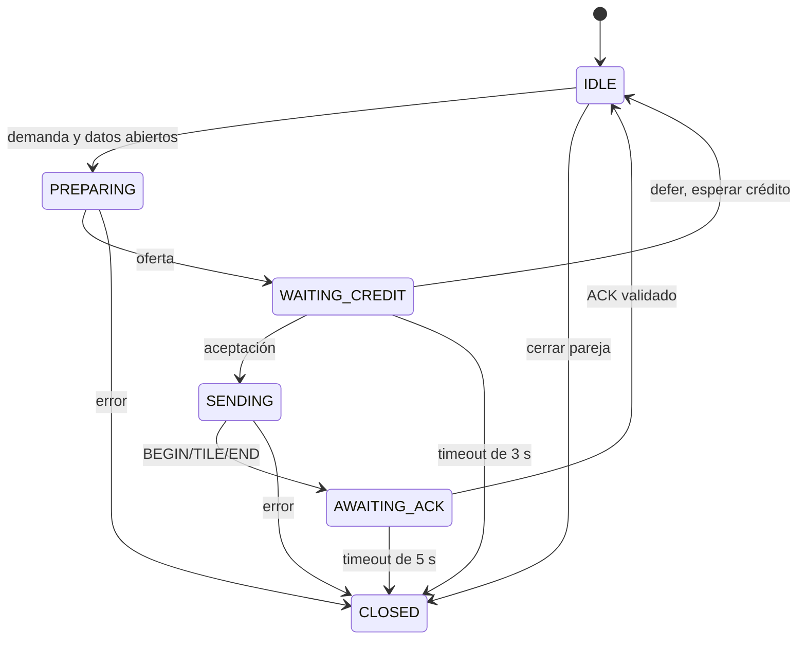

# UHIP v1.0: especificación del perfil BATCH_STREAM_V2

Actualizado el 5 de octubre de 2026. Describe la implementación actual Java 21 y JavaScript/Canvas. Para todos los algoritmos, codecs y sus archivos, consultar [CATALOGO_ALGORITMOS_Y_PROTOCOLOS_UHIP.md](CATALOGO_ALGORITMOS_Y_PROTOCOLOS_UHIP.md) y [PROTOCOLOS_Y_ALGORITMOS_UHIP.md](PROTOCOLOS_Y_ALGORITMOS_UHIP.md).

## 1. Transporte y rutas

| Servicio | Transporte | Puerto predeterminado | Uso |
|---|---|---|---|
| Recursos iniciales | HTTP | 8080 | `public/index.html`, CSS y módulos locales. |
| Control UHIP | WebSocket de texto/JSON | 8081 | `/control?clientId=<id>` |
| Datos UHIP | WebSocket binario | 8082 | `/data?clientId=<id>&generationId=<UUID>` |

WebSocket utiliza TCP. Vegas opera sobre lotes en la capa de aplicación: no configura el controlador TCP del sistema operativo. Las teselas actuales usan JPEG; los otros formatos/opcodes de documentos históricos no forman parte de este perfil. La evaluación funciona sin CDN ni servicios externos. La preparación permite seleccionar Java nativo o libvips embebido, descritos en [MOTOR_TESELAS_JAVA.md](MOTOR_TESELAS_JAVA.md). El contrato de archivos y de red se conserva.

## 2. Identidades y handshake

`clientId` identifica al cliente. `generationId` identifica una sesión negociada. `datasetId` identifica el almacenamiento abierto por `TileManager`. `epoch` identifica la revisión de vista; `batchId` y `grantId` vinculan transferencia y crédito. `residencySeq` ordena cambios de residencia dentro de la generación.

1. Abrir control y enviar `HELLO` con `clientVersion: "1.0"`, `protocolProfile: "BATCH_STREAM_V2"`, `clientId` igual al de la URL y `maxMemoryBytes` positivo.
2. Recibir `SESSION_READY`: `generationId`, `datasetId`, `originalWidth`, `originalHeight`, `tileSize`, `maxZoom`.
3. Abrir datos con esa generación. El servidor exige HELLO completo, generación vigente no vacía y control abierto; rechaza un segundo canal de datos.
4. Recibir `DATA_READY` por control. Hasta entonces el cliente no envía demanda.
5. Enviar `SYNC_VIEW` con época, nivel, límites y centro. El servidor añade la raíz `0:0:0` si falta, junto a la demanda de la vista.

La raíz se protege durante la sesión. No se precargan ni se hacen inmortales todos los niveles bajos. Una reconexión al mismo dataset conserva la cámara y vuelve a solicitar raíz/vista.

## 3. Mensajes de control

Los campos enumerados son obligatorios salvo que se indique lo contrario. `StrictJson` valida la sintaxis completa antes de `ControlMessage`, que valida tipos y rangos antes de cualquier mutación.

| Mensaje | Dirección | Campos y efecto |
|---|---|---|
| `HELLO` | Cliente → servidor | Versión/perfil/id/memoria; negociar sesión una sola vez por socket de control. |
| `SESSION_READY` | Servidor → cliente | Generación/dataset y geometría. |
| `DATA_READY` | Servidor → cliente | `generationId`; datos emparejados. |
| `SYNC_VIEW` | Cliente → servidor | `epoch`, `zoom`, `minX`, `minY`, `maxX`, `maxY`, `centerX`, `centerY`; sustituir demanda. |
| `BATCH_OFFER` | Servidor → cliente | Generación, lote, época y `candidates` con `key`, `zoom`, `tileX`, `tileY`, `jpegLength`, `rasterBytes`. |
| `BATCH_ACCEPT` | Cliente → servidor | Generación, lote, `grantId`, `acceptedKeys` únicos y contenidos en la oferta; enviar solamente lo aceptado. |
| `BATCH_DEFER` | Cliente → servidor | Generación, lote, `reason`; devolver tareas y esperar capacidad/nueva vista. |
| `CREDIT_AVAILABLE` | Cliente → servidor | `generationId`; reanudar una sesión aplazada cuando cambió capacidad/protección. |
| `ACK_BATCH` | Cliente → servidor | Generación/lote/época/crédito, `sentCount`, `omittedCount`, `terminalResults`, `admittedKeys`, `residencySeq`. |
| `EVICT` | Cliente → servidor | Generación, `key`, `residencySeq`; retirar residencia y reconstruir demanda vigente. |
| `ABORT` | Cliente → servidor | `epoch`; retirar demanda pendiente hasta esa época sin reducir multiplicativamente Vegas. |
| `GET_IMAGE_INFO` | Cliente → servidor | Solicitar `SESSION_READY` con los metadatos; si generación/dataset son iguales, el cliente no retira caché ni reabre datos. |
| `BATCH_START` | Servidor → cliente | Generación/lote/época/count/cwnd; aviso informativo. |
| `CWND_UPDATE` | Servidor → cliente | `algorithm`, `cwnd`, `rtt`, `baseRtt`, `diff`, `pending`, `maxZoom`. |

Ejemplo de recuperación de crédito:

```json
{"type":"CREDIT_AVAILABLE","generationId":"7e53b767-43cc-4bed-9bc6-3feb198d5ea1"}
```

Límites de control: 65 536 caracteres, profundidad JSON ≤12, hasta 1024 miembros/elementos por contenedor y cadenas ≤4096 caracteres. Listas/mapas de claves de lote ≤256. Se rechazan duplicados, entrada sobrante, campos obligatorios ausentes, tipo incorrecto y overflow. Los enteros se escriben sin fracción ni exponente: `1.5`, `1e0` y `"1"` no son épocas válidas. Épocas/lotes/créditos caben en entero Java no negativo/positivo; la secuencia es positiva y cabe en el entero seguro de JavaScript.

Los límites de vista deben estar ordenados, sus coordenadas en [-65535,65535] y el nivel dentro de la geometría. Tras limitar a la imagen, la demanda no excede 4096 celdas. El protocolo no utiliza valores por defecto para suplir campos obligatorios.

### 3.1 Ampliación digital y deduplicación de SYNC_VIEW
La navegación del cliente admite ampliación digital profunda hasta $32\times$ (3200%, configurable en rango $1..64\times$) mediante escalado en Canvas 2D sin generar niveles adicionales en el servidor. En imágenes pequeñas, el máximo visual puede elevarse a `minScale * minZoomRangeFromCover` para conservar un rango navegable desde cobertura. La cota de red permanece $0 \le z \le M = \text{maxZoom}$.

El cliente calcula una firma local `${generationId}|${datasetId}|${zoom}|${minX}|${minY}|${maxX}|${maxY}|${centerX}|${centerY}`. Si coincide con la última enviada y el envío no es forzado, no incrementa la época ni transmite una vista redundante. La firma y las épocas locales solo se registran cuando `WebSocket.send()` acepta el mensaje; un socket no disponible o un envío fallido conserva la demanda para recuperación. `DATA_READY` fuerza reenviar la vista y ABORT invalida la firma para permitir la siguiente navegación. La firma no es un campo nuevo del protocolo ni una confirmación del servidor.

AMP proyecta el movimiento durante 300 ms y añade únicamente las bandas que alcanzaría esa proyección, acotadas a cuatro teselas por eje y a la geometría real. El centro usado por Manhattan continúa siendo el de la vista estricta, sin prefetch.

## 4. Formato binario

Todos los enteros multibyte utilizan big-endian. Cada mensaje binario incluye exactamente una cabecera y su payload.

| Offset absoluto | Tamaño | Campo |
|---|---|---|
| 0 | 1 | Magic `0x55` |
| 1 | 1 | Versión `0x01` |
| 2 | 1 | Opcode |
| 3 | 1 | Flags: `0x02` en TILE JPEG; `0x00` en BEGIN/END |
| 4 | 4 | Época uint32; el perfil actual admite el rango no negativo de int Java |
| 8 | 4 | Longitud del payload |

El tamaño total debe ser exactamente `12 + payloadLength`. No se leen campos de payload sin comprobar primero el tamaño mínimo y el tamaño calculado del mensaje.

### BATCH_BEGIN (0x13)

Payload de `16 + 10 × plannedCount` bytes:

| Offset en payload | Tamaño | Campo |
|---|---|---|
| 0 | 4 | BatchId |
| 4 | 4 | GrantId |
| 8 | 2 | PlannedCount |
| 10 | 2 | Reservado |
| 12 | 4 | TotalJpegBytes |
| 16 + 10i | 10 | Entrada de manifiesto |

Entrada: zoom uint8, reservado uint8, X uint16, Y uint16, JPEG length uint32. El cliente exige concesión pendiente del mismo lote/época, igual cantidad de claves, claves únicas, longitudes idénticas a la oferta y suma igual a TotalJpegBytes. No permite dos lotes activos superpuestos.

### TILE_DATA (0x12)

Payload de `6 + N` bytes: zoom uint8, reservado uint8, X uint16, Y uint16 y JPEG de N bytes. Los datos de imagen empiezan en offset absoluto 18. La clave/época deben pertenecer al manifiesto y no haberse recibido antes; N debe coincidir con la longitud anunciada. Una tesela después de END es inválida.

### BATCH_END (0x14)

Payload de `8 + 8 × omittedCount` bytes: BatchId uint32, SentCount uint16, OmittedCount uint16 y entradas omitidas. Cada entrada contiene zoom uint8, reservado uint8, X uint16, Y uint16, reason uint8 y reservado uint8.

El lote/época coinciden con BEGIN; SentCount coincide con las claves recibidas; enviados más omitidos igualan PlannedCount. Las omisiones son únicas, del manifiesto y no recibidas. Los créditos omitidos se liberan. El servidor actual prepara los JPEG antes de ofrecer y normalmente emite cero omisiones.

## 5. Confirmación y residencia

El cliente emite un único ACK cuando llegó END y cada clave del manifiesto tiene resultado terminal: `admitted`, `discarded`, `failed_decode` u `omitted`. No confirma recepción física como si fuera admisión: espera los decodes y verifica la residencia efectiva.

`ActiveBatch` valida la partición de claves y cantidades; `ClientSession` valida estado, generación, lote, época y crédito. Un ACK duplicado o ajeno no aporta otra muestra a Vegas. `admittedKeys` solo puede contener claves con resultado admitted todavía residentes.

ACK/EVICT actualizan residencia solamente con `residencySeq` estrictamente mayor que la última aplicada. Es una secuencia global por sesión, no un registro causal independiente por clave. Tras ACK se liberan tokens y se reconcilia la demanda. Un decode fallido se excluye de nuevos intentos durante esa época; una vista nueva permite intentarlo otra vez.

## 6. Memoria administrada

Por defecto: B=128 MiB, máximo 512 residentes más plazas nuevas reservadas, máximo 8 MiB de crédito comprimido más JPEG pendiente y cuatro decodes simultáneos. `Application` pasa `CLIENT_CONFIG` al objeto `ProtocolClient` como configuración local; no se transmite como mensaje de red.

```text
R + T + J + D + G <= B
rasterCost = 4 * bitmapWidth * bitmapHeight
compressedCost = 2 * jpegLength + 18
```

R es raster residente; T es bitmap retirado aún prestado al frame; J es cargo comprimido; D es raster de decode iniciado; G es crédito aceptado aún sin materializar. `reserveCredit()` devuelve un token con fases y plaza de entrada. Todas las transiciones reciben ese mismo token; liberarlo dos veces no descuenta otra reserva. SIEVE libera víctimas no protegidas o rechaza el crédito.

Una admisión verifica que el raster decodificado tenga el costo reservado. Al retirar generación, los créditos inactivos y la cola se cancelan. Los decodes iniciados conservan J/D hasta finalizar; cierran resultados obsoletos sin admitir ni confirmar. T se conserva hasta liberar préstamos del frame. Estas cotas corresponden a recursos administrados, no a todo el heap/GPU/buffers internos del navegador o la JVM.

## 7. Orden, cierre y recuperación



Control, despacho y expiraciones usan una FIFO por sesión sobre hilos virtuales; hasta 256 comandos pendientes. Épocas antiguas no sustituyen demanda. La expiración comprueba generación/lote/estado al ejecutarse. Ante timeout incierto se cierra la pareja y se invalida la generación, en lugar de reutilizarla.

Cada socket se verifica por identidad. El cierre de un canal rechazado/antiguo no cierra la pareja actual. `close()` deja CLOSED terminal, cancela timeout, limpia recursos/demanda/cola y separa referencias; un listener elimina del registro solamente esa instancia. El cliente separa callbacks antes de cerrar, invalida inmediatamente su revisión/generación y reconecta tras 1, 2, 4 y hasta 8 segundos. DATA_READY restablece la espera inicial.

`BATCH_DEFER` no genera un ciclo de polling. La liberación de recursos o cambios de protección provocan una notificación agrupada `CREDIT_AVAILABLE`; una vista nueva también permite reintentar. EVICT reconstruye demanda desde los límites conservados aunque la cola física ya se haya consumido.

## 8. Implementación y verificación

Servidor: `ws/ControlWebSocket.java`, `ws/DataWebSocket.java`, `session/ClientSession.java`, `session/SessionManager.java`, `dispatch/TileDispatcher.java`, `protocol/StrictJson.java`, `protocol/ControlMessage.java`, `protocol/UhipCodec.java`. Cliente: `public/js/protocol.js`, `cache.js`, `main.js`, `config.js`.

La verificación y los comandos reproducibles están en [walkthrough.md](walkthrough.md). Los planes antiguos conservan propuestas históricas; este documento y el catálogo detallado describen el contrato ejecutado actualmente.
