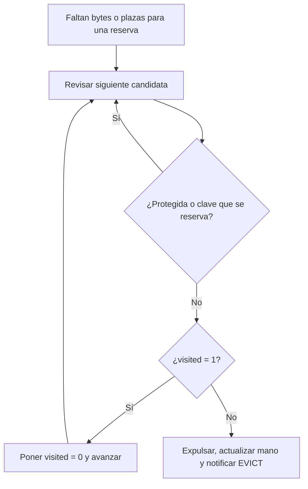
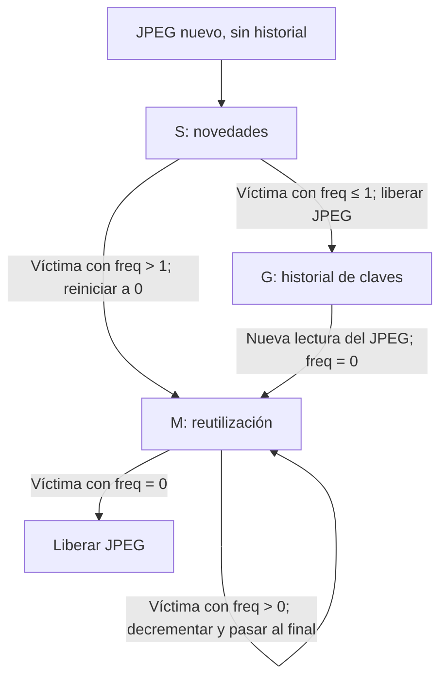

# UHIP v1.0: protocolo para imágenes de ultra resolución

**Perfil:** `BATCH_STREAM_V2`. **Implementación:** Java 21 y JavaScript/Canvas.

Las rutas Java parten de `src/main/java/com/uhip/`; las del navegador, de `public/js/`.

## 1. Propósito y arquitectura

UHIP permite navegar una imagen de gigapíxeles sin descargarla completa. Primero se prepara una pirámide de teselas JPEG; después el navegador solicita la región y resolución de su vista. Cada pestaña conserva su cámara, caché y sesión; el servidor comparte los JPEG leídos de disco.

`Main.java` inicia un dataset, un `storage/TileManager.java`, un `session/SessionManager.java` y estos servicios:

| Servicio | Dirección predeterminada | Implementación y función |
|---|---|---|
| HTTP | `http://localhost:8080/` | `http/HttpStaticServer.java`: entrega HTML, CSS y JavaScript desde `public/`, mediante GET; responde 200, 404 o 405. |
| Control | `ws://localhost:8081/control?clientId=<id>` | `ws/ControlWebSocket.java` y `protocol.js`: intercambian JSON de sesión, vista, crédito y confirmación. |
| Datos | `ws://localhost:8082/data?clientId=<id>&generationId=<UUID>` | `ws/DataWebSocket.java` y `protocol.js`: transportan lotes binarios UHIP con JPEG. |

HTTP sigue [RFC 9110](https://www.rfc-editor.org/rfc/rfc9110.txt); Java-WebSocket y la API del navegador proporcionan [WebSocket, RFC 6455](https://www.rfc-editor.org/rfc/rfc6455). Debajo, TCP ofrece entrega ordenada y fiable mediante la pila del sistema operativo, según [RFC 9293, sección 2.2](https://www.rfc-editor.org/rfc/rfc9293#section-2.2). El ACK de TCP confirma bytes; `ACK_BATCH` confirma el procesamiento de teselas en la aplicación.

Se separan control y datos para gestionar la demanda sin compartir la cola de envío de JPEG. Como las conexiones no tienen orden global entre sí, se relacionan mediante identidades de sesión y lote. El sistema se ejecuta localmente, sin CDN, autenticación ni TLS.

## 2. Preparación y almacenamiento

Las teselas miden hasta 256 × 256 píxeles: permiten solicitar regiones pequeñas y calcular su costo de memoria. JPEG reduce almacenamiento y transferencia mediante compresión con pérdida. Para ancho W y alto H, `M = maxZoom` es el menor entero no negativo que cumple `max(W,H) <= 256 × 2^M`. El nivel M conserva la resolución original y el nivel 0 contiene la raíz.

```text
ancho(z) = ceil(W / 2^(M-z))
alto(z) = ceil(H / 2^(M-z))
columnas(z) = ceil(ancho(z) / 256)
filas(z) = ceil(alto(z) / 256)
```

`tools/TileSlicer.java` selecciona Java o libvips. Ambos guardan `z/x_y.jpg`, respetando el tamaño real de los bordes. `imaging/DatasetMetadata.java` escribe `metadata.json` con `originalWidth`, `originalHeight`, `tileSize` y `maxZoom`; `manifest.json` registra `engine`, `complete`, `tileCount`, `jpegQuality`, `reducer`, `sourceFormat`, `bufferBytes` y `workers`.

En Java, `imaging/ImageReaders.java` identifica firma y dimensiones. PNG, JPEG y TIFF se importan a RGB8 temporal en disco; PSD/PSB comprimido conserva planos de 8/16 bits y RAW puede leerse directamente. `imaging/PyramidJob.java` toma regiones, codifica sus JPEG y genera el siguiente nivel con `RegionReducer`. Se reduce desde muestras sin compresión JPEG para evitar pérdidas acumuladas por recodificación.

### Formatos y codecs Java

| Entrada | Perfil admitido |
|---|---|
| PNG | Estático, gris/RGB/alfa/indexado, profundidades válidas de 1/2/4/8/16 bits según tipo, transparencia y Adam7. EXIF con orientación ausente o 1. |
| JPEG/JPG | Baseline secuencial de 8 bits, gris o RGB/YCbCr, un scan intercalado y reinicios; orientación EXIF ausente o 1. |
| PSD/PSB | Compuesto RGB/gris de 8/16 bits, RAW, PackBits, ZIP o ZIP con predicción. Requiere imagen compuesta compatible, sin reconstrucción de capas ni compuesto marcado como transparente. |
| TIFF/BigTIFF | Primer IFD, RGB/gris de 8/16 bits sin signo, canales intercalados, strips/tiles, RAW/PackBits/LZW/Deflate, predictor horizontal, alfa y orientación 1. |

Las muestras de 16 bits pasan a 8 y el alfa PNG/TIFF se compone sobre blanco. Se admiten ICC sRGB compatibles hasta 1 MiB y, en PNG, EXIF hasta 1 MiB; el procesamiento no aplica conversión ICC general ni gamma arbitraria. Una variante fuera de estos perfiles se rechaza explícitamente. Cada eje se limita a 16.777.216 píxeles para que las coordenadas de tesela quepan en `u16`; offsets y longitudes grandes usan `long`.

| Proceso de imagen | Función e implementación |
|---|---|
| JPEG | `imaging/codec/JpegEncoder.java`, `JpegMath.java` y `JpegDecoder.java`: DCT 8 × 8, cuantización, zigzag, diferencial DC, RLE AC y Huffman para comprimir/reconstruir píxeles. Salida JFIF baseline 4:4:4. [ITU-T T.81](https://www.itu.int/rec/T-REC-T.81/en). |
| PNG y zlib | `imaging/codec/PngDecoder.java` y `ZlibInput.java`: reconstruyen filas/pases con filtros, Paeth y Adam7; descomprimen con DEFLATE (LZ77/Huffman) y verifican CRC-32/Adler-32. [PNG](https://www.w3.org/TR/png-3/), [RFC 1951](https://www.rfc-editor.org/rfc/rfc1951.txt), [RFC 1950](https://www.rfc-editor.org/rfc/rfc1950.txt). |
| Photoshop y TIFF | `imaging/codec/PsdDecoder.java`, `TiffDecoder.java`, `PackBits.java` y `TiffLzw.java`: recuperan muestras mediante PackBits, LZW, ZIP/Deflate y predicción según formato. [Adobe Photoshop](https://www.adobe.com/devnet-apps/photoshop/fileformatashtml/), [TIFF](https://libtiff.gitlab.io/libtiff/specification/index.html), [BigTIFF](https://libtiff.gitlab.io/libtiff/specification/bigtiff.html). |
| Color y orientación | `imaging/codec/IccProfiles.java` y `ExifOrientation.java` validan los perfiles admitidos antes de procesar. |
| Burt–Adelson REDUCE | `imaging/RegionReducer.java`: aplica pesos `[1,5,8,5,1]/20` horizontal y verticalmente y muestrea cada dos píxeles. Halo de dos muestras y réplica de borde evitan costuras; el suavizado reduce aliasing. [Burt y Adelson](https://www.rctn.org/bruno/public/papers/Laplacian-pyramid-Burt%2BAdelson1983.pdf). |

Los codecs propios permiten preparar imágenes en Java sin depender de codecs nativos. Se conserva libvips como alternativa de corte con la misma estructura de salida para el servidor y el navegador. `tools/VipsTileSlicer.java` lo ejecuta localmente mediante `tools/NativeImageProcess.java`: usa [dzsave](https://www.libvips.org/API/current/method.Image.dzsave.html) con media 2 × 2, solapamiento cero y fondo blanco; adapta y verifica los niveles UHIP.

### Opciones y publicación

`tools/SliceRequest.java` comparte estas opciones: `--engine java|libvips` (Java predeterminado), `--quality` 1–100 (85), `--workers` 1–16 (hasta cuatro según CPU), `--buffer-mib` desde 8 (64) y `--reducer burt-adelson|box`. La calidad 85 ofrece un equilibrio ajustable entre detalle y tamaño del JPEG. Java permite ambos reductores y usa Burt–Adelson por defecto; libvips usa `box`.

`imaging/TileEncodingPool.java` acota las tareas pendientes a dos por trabajador. Java conserva el nivel actual y el siguiente, elimina el anterior y comprueba heap y espacio libre de `9 × W × H + 64 MiB` para temporales/salida. El buffer limita buffers Java o caché de operaciones libvips; no representa toda la RAM del proceso.

`imaging/DatasetPublisher.java` exige destino nuevo y genera bajo exclusión en una carpeta temporal hermana. Publica mediante movimiento atómico al completar y validar; ante error o cancelación controlada elimina su trabajo. Así el servidor recibe una pirámide terminada.

## 3. Sesión y recorrido de un lote

Control inicia con `HELLO`; el servidor devuelve geometría y generación en `SESSION_READY`. Datos se abre con esa generación y, después de `DATA_READY`, el cliente envía su vista. La raíz `0:0:0` se incluye hasta confirmar su residencia para respaldar el dibujo mientras llega detalle.

```mermaid
sequenceDiagram
    participant C as Navegador
    participant S as Servidor Java
    C->>S: HELLO
    S->>C: SESSION_READY
    C->>S: Abrir datos con generationId
    S->>C: DATA_READY
    Note over C: Viewport calcula vista; AMP anticipa movimiento
    C->>S: SYNC_VIEW
    Note over S: Manhattan ordena; Vegas limita; S3-FIFO reutiliza JPEG
    S->>C: BATCH_OFFER
    Note over C: Reserva memoria; SIEVE libera espacio
    C->>S: BATCH_ACCEPT
    S->>C: BATCH_BEGIN, TILE_DATA, BATCH_END
    Note over C: Decodifica y resuelve admisión
    C->>S: ACK_BATCH
    Note over S: Actualiza residencia y ventana Vegas
    Note over C: Renderer dibuja desde caché en cada frame
```

| Identidad | Tipo JSON | Función |
|---|---|---|
| `clientId` | Cadena | Identifica la pestaña; HELLO debe coincidir con la URL de control. |
| `generationId` | Cadena | UUID de sesión; distingue conexiones actuales de las retiradas. |
| `datasetId` | Cadena | UUID de la instancia que sirve el dataset. |
| `epoch` | Entero | Revisión de demanda; una anterior no reemplaza la vista actual. |
| `batchId` | Entero | Lote creado por el servidor. |
| `grantId` | Entero | Crédito reservado por el cliente. |
| `residencySeq` | Entero | Secuencia creciente para ordenar residencia. |
| `key` | Cadena | Tesela `z:x:y`, por ejemplo `2:1:0`. |

`session/SessionManager.java` localiza sesiones. Un nuevo control con el mismo `clientId` reemplaza la sesión y cierra sus canales anteriores. `session/ClientSession.java` empareja datos solo con HELLO completo, control abierto y generación vigente; datos duplicados u obsoletos cierran solo la conexión rechazada, conservando la pareja actual. Cada sesión mantiene un lote activo y recorre:

```text
IDLE → PREPARING → WAITING_CREDIT → SENDING → AWAITING_ACK → IDLE
                                  DEFER → IDLE, esperando capacidad
CLOSED: estado terminal que libera recursos y separa conexiones
```

## 4. Mensajes de control

Son objetos [JSON, RFC 8259](https://www.rfc-editor.org/rfc/rfc8259), con `type`. C→S significa cliente a servidor; S→C, servidor a cliente.

| `type` | Dirección | Campos además de `type` | Función |
|---|---|---|---|
| `HELLO` | C→S | `clientVersion`, `protocolProfile`, `clientId`, `maxMemoryBytes` | Negocia versión `"1.0"` y perfil `"BATCH_STREAM_V2"`. |
| `SESSION_READY` | S→C | `generationId`, `datasetId`, `originalWidth`, `originalHeight`, `tileSize`, `maxZoom` | Entrega sesión y geometría. |
| `DATA_READY` | S→C | `generationId` | Confirma datos emparejado. |
| `SYNC_VIEW` | C→S | `epoch`, `zoom`, `minX`, `minY`, `maxX`, `maxY`, `centerX`, `centerY` | Sustituye demanda por rectángulo inclusivo y centro. |
| `BATCH_OFFER` | S→C | `generationId`, `batchId`, `epoch`, `candidates` | Propone claves con costos. |
| `BATCH_ACCEPT` | C→S | `generationId`, `batchId`, `grantId`, `acceptedKeys` | Autoriza las claves reservadas. |
| `BATCH_DEFER` | C→S | `generationId`, `batchId`, `reason` | Aplaza por capacidad. |
| `CREDIT_AVAILABLE` | C→S | `generationId` | Reanuda demanda aplazada. |
| `ACK_BATCH` | C→S | `generationId`, `batchId`, `epoch`, `grantId`, `sentCount`, `omittedCount`, `terminalResults`, `admittedKeys`, `residencySeq` | Confirma resultados y residencia. |
| `EVICT` | C→S | `generationId`, `key`, `residencySeq` | Informa una expulsión. |
| `ABORT` | C→S | `epoch` | Cancela pendientes hasta esa época. |
| `GET_IMAGE_INFO` | C→S | Ninguno | Solicita SESSION_READY. |
| `BATCH_START` | S→C | `generationId`, `batchId`, `epoch`, `count`, `cwnd` | Aviso informativo del lote. |
| `CWND_UPDATE` | S→C | `algorithm`, `cwnd`, `rtt`, `baseRtt`, `diff`, `pending`, `maxZoom` | Entrega métricas. |

Cada candidata es `{key, zoom, tileX, tileY, jpegLength, rasterBytes}`; longitudes/costos se expresan en bytes. `acceptedKeys` y `admittedKeys` son listas únicas; `terminalResults`, un mapa de clave a resultado. `reason` es una cadena; coordenadas, cantidades y costos, enteros. En métricas, `algorithm="TCP_VEGAS"`, RTT está en milisegundos y `diff` admite decimales.

`min/max/center` y `tileX/tileY` son índices de tesela del nivel `zoom`, desde cero: X crece a la derecha y Y hacia abajo. Los límites son inclusivos; el centro corresponde a la vista visible antes del prefetch. `cwnd` cuenta teselas por lote y `pending`, teselas en cola del servidor.

`maxMemoryBytes` anuncia presupuesto; el crédito efectivo lo decide el cliente en BATCH_ACCEPT. `config.js` contiene la configuración local `CLIENT_CONFIG`.

### Validación

`protocol/StrictJson.java` y `protocol/ControlMessage.java` validan antes de cambiar estado:

| Dato | Regla |
|---|---|
| JSON | 65.536 caracteres, profundidad 12, 1.024 miembros/elementos por contenedor y cadenas de 4.096 caracteres como máximos. |
| `epoch` | Entero 0–2.147.483.647. |
| `batchId`, `grantId` | Enteros 1–2.147.483.647. |
| `maxMemoryBytes`, `residencySeq` | Enteros 1–9.007.199.254.740.991. |
| Vista | Zoom 0–30 y ≤M; coordenadas −65.535–65.535, límites ordenados y hasta 4.096 celdas después de recortar a la imagen. |
| Lote | Hasta 256 claves/resultados; aceptación única, no vacía y contenida en oferta; conteos ACK 0–256. |

Se rechazan campos obligatorios ausentes, duplicados, entrada sobrante, tipos/rangos incorrectos y decimales/exponentes/cadenas en enteros. Se permiten campos adicionales en mensajes conocidos. El cliente comprueba coherencia de clave, coordenadas y costos.

## 5. Estructura binaria

`protocol/UhipCodec.java` serializa y `protocol.js` interpreta. Cada mensaje tiene cabecera de **12 bytes** y payload. Los enteros multibyte usan **big-endian**; `u8/u16/u32` son enteros sin signo de 8/16/32 bits, con los rangos de época e identificadores anteriores.

| Offset absoluto | Bytes | Campo |
|---|---:|---|
| 0 | 1 | `magic=0x55`: identifica UHIP. |
| 1 | 1 | `version=0x01`: versión binaria. |
| 2 | 1 | `opcode`: BEGIN `0x13`, TILE `0x12`, END `0x14`. |
| 3 | 1 | `flags`: JPEG `0x02`; BEGIN/END cero. |
| 4 | 4 | `epoch`. |
| 8 | 4 | `payloadLength`: bytes del payload. |

La longitud total es `12+payloadLength`. Se comprueban magic, versión, opcode, longitudes y coherencia de lote. Los reservados se emiten en cero y flags con los valores indicados; el receptor no valida estos campos.

Los offsets siguientes son relativos al payload; i empieza en cero:

| Mensaje | Tamaño de payload | Campos y offsets |
|---|---|---|
| `BATCH_BEGIN` | `16+10×plannedCount` | `batchId:u32` @0; `grantId:u32` @4; `plannedCount:u16` @8; reservado:u16 @10; `totalJpegBytes:u32` @12; entradas desde `16+10i`. |
| Entrada BEGIN | 10 bytes | `zoom:u8` @0; reservado:u8 @1; `tileX:u16` @2; `tileY:u16` @4; `jpegLength:u32` @6. |
| `TILE_DATA` | `6+N` | `zoom:u8` @0; reservado:u8 @1; `tileX:u16` @2; `tileY:u16` @4; JPEG de N bytes @6, offset absoluto 18. |
| `BATCH_END` | `8+8×omittedCount` | `batchId:u32` @0; `sentCount:u16` @4; `omittedCount:u16` @6; omisiones desde `8+8i`. |
| Entrada END | 8 bytes | `zoom:u8` @0; reservado:u8 @1; `tileX:u16` @2; `tileY:u16` @4; `reason:u8` @6; reservado:u8 @7. |

`plannedCount` cuenta teselas del manifiesto aceptado; `sentCount`, JPEG enviados; `omittedCount`, claves omitidas. `totalJpegBytes` suma las longitudes JPEG sin cabeceras UHIP; N es la longitud JPEG de una tesela.

BEGIN debe coincidir con el lote de la generación actual, época, grant, claves y longitudes aceptadas, sin duplicados y con suma JPEG correcta. Cada TILE pertenece al manifiesto y coincide en longitud; no puede repetirse ni llegar después de END. Enviados y omitidos cubren exactamente el manifiesto; se libera crédito omitido. El cliente no interpreta `reason`; el servidor prepara JPEG antes de ofrecer y emite cero omisiones.

## 6. Entrega, memoria y recuperación

### Crédito y confirmación

Antes de aceptar, `protocol.js` reserva en `cache.js` raster `4×ancho×alto` y comprimido `2×jpegLength+18` (buffer/Blob y cabecera). Los valores predeterminados son **128 MiB administrados por pestaña**, **512 plazas entre residentes y reservas nuevas**, **8 MiB de cargo comprimido concedido/pendiente** y **cuatro decodes simultáneos**. Estas cotas limitan memoria, cantidad de objetos y trabajo de decodificación por pestaña.

```text
R + T + J + D + G <= B
R: raster residente; T: bitmap retirado todavía prestado al frame
J: JPEG recibido; D: raster reservado para decode iniciado
G: crédito aceptado aún no materializado; B: presupuesto
```

Los tokens impiden liberar dos veces una reserva. SIEVE retira víctimas disponibles y protege raíz, visibles y reservas. Los préstamos del frame aplazan `ImageBitmap.close()` hasta terminar el dibujo. Si se retira una generación, se cancela trabajo pendiente; los decodes iniciados conservan sus cargos hasta terminar y cierran resultados obsoletos.

Sin capacidad se envía DEFER; al liberarse, CREDIT_AVAILABLE despierta la demanda. Puede aceptarse solo parte de una oferta. La cota cubre recursos administrados por UHIP, no todo el heap o GPU.

El cliente decodifica con `createImageBitmap()` y comprueba ancho y alto enteros positivos y que `ancho×alto×4` coincida con el costo raster reservado. Envía un ACK después de END y de resolver todas las candidatas: `admitted`, `discarded`, `failed_decode` u `omitted`. `admittedKeys` incluye las admitidas que siguen residentes. `session/ActiveBatch.java` y `ClientSession` comprueban identidad, grant, época de origen, conteos y partición; un ACK válido finaliza una vez y alimenta Vegas, sin esperar el dibujo.

ACK/EVICT cambian residencia solo si aumenta `residencySeq`, global por sesión; una secuencia antigua puede finalizar un ACK válido sin actualizar residencia. `session/BoundedKeySet.java` conserva hasta 512 claves confirmadas. `session/TransferContext.java` posee claves mediante token para evitar ofertas duplicadas y liberar solo su transferencia. EVICT repone demanda todavía necesaria aunque la cola esté vacía.

### Concurrencia, cancelación y errores

`ClientSession` ordena control, despacho y expiraciones en una FIFO de hasta 256 comandos usando el ejecutor virtual de `SessionManager`. Esto ordena el estado de cada cliente mientras otros progresan. `TileManager` comparte lecturas mediante `CompletableFuture` (*single-flight*), evitando leer simultáneamente el mismo JPEG para varias sesiones.

Cada nueva época sustituye demanda. ABORT cancela pendientes hasta su época y conserva Vegas; los bytes ya encolados pueden llegar y se admiten si siguen siendo útiles. La raíz siempre es relevante; las demás teselas deben ser válidas, intersectar la demanda actual y diferir como máximo dos niveles de ella. `main.js` agrupa cambios cada unos 30 ms y deduplica por generación, dataset, nivel, límites y centro. Registra firma/época después del envío aceptado; DATA_READY fuerza vista y ABORT permite reenviarla.

| Situación | Política |
|---|---|
| Oferta sin respuesta a los 3 s; ACK sin llegar a los 5 s; fallo del canal propietario | Cierra la pareja e invalida generación. |
| JSON inválido, aceptación inválida del lote activo o binario incoherente | Cierra el intercambio. |
| Tipo de control desconocido | C→S: el servidor cierra la sesión. S→C: el navegador ignora el mensaje. |
| ACK ajeno/incoherente con formato válido | No cambia lote, residencia ni Vegas. |
| JPEG ausente o decode fallido | Excluye la clave durante la época; otra época permite reintentar. |
| Excepción de lectura o cola desbordada | Cierra sesión y libera pendientes. |

Cada callback verifica el socket propietario. `protocol.js` reconecta tras 1, 2, 4 y hasta 8 segundos; negocia nueva generación y solicita raíz/vista. DATA_READY restablece la espera inicial.

## 7. Algoritmos y su interacción

| Algoritmo | Dónde actúa y qué decide |
|---|---|
| **Vegas de aplicación** | `traffic/TrafficEngine.java`: tamaño del siguiente lote según retardo del ACK. El crédito limita lo aceptado; `hud.js` muestra CWND/RTT/Diff. Adaptación de [Brakmo y Peterson](https://www.cs.princeton.edu/courses/archive/fall06/cos561/papers/vegas.pdf). |
| **Distancia Manhattan, L1** | `dispatch/TileDispatcher.java`: prioridad de las teselas alrededor del centro visible; Vegas limita cuántas se toman de esa cola. |
| **SIEVE** | `cache.js`: víctimas para liberar bytes/plazas de bitmaps. La expulsión notifica EVICT y aparece en el HUD. Adaptación de [Zhang et al.](https://www.usenix.org/system/files/nsdi24-zhang-yazhuo.pdf). |
| **S3-FIFO** | `storage/S3FifoCache.java`: JPEG reutilizables compartidos entre sesiones. `TileManager` lo consulta antes de leer disco y preparar BATCH_OFFER. [Yang et al.](https://s3fifo.com/). |
| **Prefetch inspirado en AMP** | `viewport.js`, `AmpTilePrefetcher`: bandas que se agregan a SYNC_VIEW hacia el movimiento previsto, conservando el centro visible para Manhattan. Adaptación espacial de [Gill y Bathen](https://www.usenix.org/conference/fast-07/amp-adaptive-multi-stream-prefetching-shared-cache). |

### Vegas: ajuste del lote por retardo

`cwnd` es el máximo de teselas que se propone: inicia en 32 y se limita a 16–256. El rango acota el trabajo por lote; el crédito del cliente lo ajusta a su capacidad. Después de encolar las tramas se registra el inicio; un ACK válido calcula `RTT=max(1 ms,ahora−inicioLote)`. `BaseRTT` conserva la menor muestra de la sesión. La señal Diff compara las tasas calculadas con esa ventana:

```text
Diff = max(0, (cwnd/BaseRTT − cwnd/RTT) × BaseRTT)
Diff < 2: aumentar cwnd en 1
Diff > 5: disminuir cwnd en 1
Entre 2 y 5: conservar cwnd, siempre dentro de 16–256
```

Un Diff mayor refleja más retardo respecto al mínimo observado. Por ejemplo, con `cwnd=32`, `BaseRTT=100 ms` y `RTT=125 ms`, Diff es 6,4 y la ventana pasa a 31. Se mide el intercambio de aplicación, incluido el procesamiento del cliente; la pila TCP mantiene su propio control.

### Manhattan: orden de prioridad

Para una tesela `(x,y)` y centro visible `(cx,cy)`, sumamos la separación en columnas y filas:

```text
d = abs(x-cx) + abs(y-cy)
```

La cola de prioridad entrega primero la menor d; desempata por nivel, Y y X. La raíz recibe prioridad cero. Con centro `(2,2)`, `(3,2)` tiene d=1 y `(4,3)`, d=3: la primera se propone antes. Esta regla decide el orden; Vegas y el crédito deciden la cantidad del lote.

### SIEVE: elección de una víctima

Combina un mapa por clave con una lista en orden de inserción. `visited` registra uso sin mover la entrada; la mano recuerda dónde iniciar la búsqueda y la candidata es la entrada que se examina. Cada entrada nueva comienza con `visited=0`; demanda, claves visibles y préstamos para dibujo lo marcan en 1. La búsqueda avanza hacia entradas más recientes y vuelve a la más antigua al llegar al extremo:



El bit 1 da una oportunidad adicional: se limpia y se continúa; el bit 0 permite expulsar si la clave no está protegida. Cada búsqueda se limita a dos recorridos y se repite si falta espacio. Sin víctima, falla esa reserva: se acepta un lote parcial si otras candidatas caben o se envía DEFER si ninguna cabe. Un bitmap expulsado que esté prestado se cierra al terminar el frame.

### S3-FIFO: admisión y reutilización

**S** guarda JPEG nuevos; **M**, los reutilizados; **G**, solo claves de JPEG retirados de S. S y M son FIFO: se inserta al final y se examina la entrada más antigua de la cola elegida. El contador `freq` inicia en 0 y registra accesos hasta 3, sin reordenar. Una clave encontrada en G se elimina del historial y su JPEG, leído de disco, reingresa en M con contador 0.



Solo se retira bajo presión: cuando los bytes de S+M superan **128 MiB**. Se elige S si supera el 10 % del presupuesto; en otro caso M, o S si M está vacía. El diagrama describe qué hacer con la víctima; se repite hasta cumplir el presupuesto porque promover o dar otra oportunidad no libera bytes. G conserva hasta **4.000 claves**, retirando la más antigua al llenarse.

### AMP adaptado: anticipación del movimiento

Se calcula por eje. `delta` es el desplazamiento de cámara en píxeles y dt, el intervalo en segundos. La velocidad conserva su signo para elegir el lado hacia el que se anticipa. Se proyecta un horizonte de 300 ms y se compara su recorrido con T, el tamaño de tesela en pantalla. El horizonte corto y el tope de cuatro bandas limitan la demanda anticipada que puede quedar obsoleta al cambiar la vista:

```text
v = delta / max(dt,0.001)
T = 256 × scale × 2^(M-z)
pObjetivo = min(4, ceil(abs(v)×0.300/max(1,T)), max(1,floor(abs(v)/400)))
p = 0.7pAnterior + 0.3pObjetivo
grado = ceil(p)
```

`pObjetivo` combina distancia prevista con un grado por velocidad, hasta cuatro. `p` suaviza cambios usando 70 % de su valor anterior y 30 % del objetivo; su techo da el máximo entero de bandas. Solo se agregan las bandas cruzadas por los límites de cámara proyectados, recortadas a la imagen. Al invertir dirección o bajar de 5 px/s se reinicia el grado a cero. Esta adaptación responde al movimiento, no a aciertos/fallos de caché.

S3-FIFO y lecturas compartidas están en memoria Java; su presupuesto cuenta JPEG residentes y los mayores que él se sirven sin cachearse. Vegas, cola Manhattan y residencia pertenecen a cada sesión. SIEVE y AMP pertenecen a cada pestaña. La pirámide JPEG y sus metadatos permanecen en disco.

## 8. Navegación y dibujo

`main.js` coordina `viewport.js`, `protocol.js`, `cache.js`, `renderer.js` y `hud.js`. La escala representa píxeles de Canvas por píxel original. Cover usa `minScale=max(canvasW/W,canvasH/H)` y limita la cámara a los bordes para llenar el visor. El máximo es `max(maxVisualScale,minScale×minZoomRangeFromCover)`; `config.js` usa 32 y 4, configurables en 1–64 y 1–8, conservando margen de acercamiento en imágenes pequeñas.

`Viewport.getTileLevel()` toma el piso de `M+log2(scale)`, adelanta un nivel si el estiramiento supera 1,25 y exige cobertura `max(0,ceil(log2(max(canvasW,canvasH)/256)))`; limita el resultado a `0..M`. Por encima de escala 1 amplía píxeles del nivel M sin solicitar niveles inexistentes.

El zoom aplica LERP con `alpha=1−0.78^(60dt)`, dt en segundos limitado a 0.001–0.05, y fija el objetivo cuando el error relativo ≤`1e-6`. Conserva el punto bajo el cursor. La rueda escala por 1,18 y los botones por 1,4. La inercia reduce desplazamiento por frame con factor 0,92 hasta que ambos ejes tienen valor absoluto ≤0,1.

`renderer.js` dibuja raíz y luego tesela directa o antecesor disponible. `geometry.js` calcula recortes y bordes parciales, compartiendo límites vecinos para evitar costuras. La raíz se recorta proporcionalmente al Canvas y el detalle reemplaza al respaldo al llegar.

**Suave** activa suavizado del navegador con calidad `high`; **Píxeles** lo desactiva. **100%** fija escala 1 y se deshabilita si cover necesita más. Resize conserva el centro original, sujeto al ajuste de bordes, y restaura el modo de dibujo. La cuadrícula identifica claves y el HUD muestra vista, ventana/retardo, memoria administrada, expulsiones, bytes recibidos y FPS.

## 9. Ejecución

`build.bat` compila con JDK 21 y dependencias locales de `lib/`, generando `target/uhip-server.jar`. `run.bat` abre el menú para servir, procesar con Java/libvips o crear datos sintéticos mediante `tools/TileCutter.java`. Se sirve una carpeta de teselas por proceso; otra imagen requiere preparar su carpeta e iniciar el servidor con ella.

`config/ServerConfig.java` permite indicar puertos HTTP/control/datos, carpeta de teselas y carpeta pública. Los puertos WebSocket deben coincidir con los usados por el navegador. Al cerrar, `Main.java` detiene servicios y sesiones.
