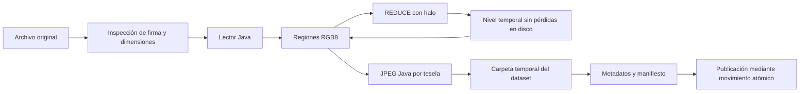

# Motor de teselas Java de UHIP

Estado: implementado el 5 de octubre de 2026. El motor Java está disponible junto a libvips como alternativa seleccionable. La selección predeterminada por CLI es Java; el servidor entrega el mismo contrato JPEG/UHIP con cualquiera de los motores.

## Ejecución

```cmd
build.bat
java -Xmx512m -jar target/uhip-server.jar --slice "C:\imagenes\original.psb" "C:\imagenes\original_java_tiles"
java -jar target/uhip-server.jar "C:\imagenes\original_java_tiles"
```

La carpeta de salida debe ser nueva. Si se omite, se propone `nombre_original_tiles` al lado del archivo. También están disponibles el menú de `run.bat`, opción 2, y `cut-tiles.bat`. El selector de archivos usa AWT/Swing para el diálogo del sistema operativo; el procesamiento de imágenes no usa codecs de AWT ni ImageIO.

Opciones después de los argumentos de entrada y salida:

| Opción | Valor por defecto | Uso |
|---|---|---|
| `--quality` | `85` | Calidad de cuantización JPEG, de 1 a 100. |
| `--workers` | CPU disponibles, limitado a 4 | Codificadores JPEG simultáneos; rango 1 a 16. |
| `--buffer-mib` | `64` | Máximo admitido para los buffers de lectura de un lector; mínimo 8 MiB. No equivale al heap total ni al consumo íntegro del proceso. |
| `--reducer` | `burt-adelson` | Filtro REDUCE reservado en el proyecto. `box` habilita media 2 × 2 como alternativa. |

Ejemplo de heap pequeño:

```cmd
java -Xmx128m -jar target/uhip-server.jar --slice original.png nuevo_dataset --workers 1 --buffer-mib 8 --reducer box
```

El trabajo comprueba el heap y el espacio libre antes de importar. Un ancho extremo puede necesitar un buffer de fila mayor que el elegido; en ese caso se rechaza antes de asignarlo y se debe aumentar la opción junto con `-Xmx`.

## Selección entre Java y libvips

`Main` conserva sus cuatro opciones: iniciar servidor, procesar imagen, generar dataset sintético y salir. Dentro de procesar imagen se elige `[1] Java nativo` o `[2] libvips embebido`; Enter selecciona Java. Después se mantienen el explorador/manual de imagen, la carpeta de salida y la pregunta para iniciar el servidor con el dataset. `cut-tiles.bat` sin argumentos ofrece la misma elección.

```cmd
java -jar target/uhip-server.jar --slice original.psb nuevo_java --engine java
java -jar target/uhip-server.jar --slice original.psb nuevo_vips --engine libvips
```

Se conservan `--slice`/`-s`, las rutas de entrada/salida y las opciones `--quality`, `--workers`, `--buffer-mib` y `--reducer`. Sin `--engine`, la ruta CLI usa Java. Los alias `nativo` y `vips` se aceptan como valores del motor. Las opciones se pueden colocar antes o después de las rutas; duplicados y valores inválidos se rechazan.

| Parámetro | Java | Libvips |
|---|---|---|
| Calidad | JPEG Java, 85 por defecto | `.jpg[Q=85]` por defecto |
| Trabajadores | Pool JPEG acotado | `--vips-concurrency` |
| Buffer MiB | Límite de buffers del lector | `--vips-cache-max-memory`; limita la caché de operaciones, no toda la memoria nativa |
| Reductor por defecto | Burt–Adelson | Media 2 × 2 (`box`) como en la ruta libvips original |
| Reductores seleccionables | `burt-adelson` y `box` | `box`; solicitar Burt–Adelson produce un error claro para seleccionar Java |

`TileSlicer` coordina la interfaz común, `SliceRequest` valida los argumentos y `VipsTileSlicer` encapsula la alternativa externa. Esta última busca `vips-dev-8.18/bin/vips.exe`, otros `vips-dev-*/bin/vips.exe` o `bin/vips.exe` en la raíz de ejecución; JPEG/TIFF usan `vipsheader.exe` junto al ejecutable. PNG y PSD/PSB pueden obtener dimensiones directamente del encabezado, sin decodificar el original.

Libvips ejecuta `dzsave` con tesela 256, solapamiento cero, profundidad hasta un píxel, JPEG, reducción por media y sin omitir bloques blancos. El adaptador renumera los niveles a partir de `ceil(log2(max(W,H))) - maxZoom`, verifica conteo/coordenadas y dimensiones JPEG en las esquinas de cada nivel y publica con el mismo `DatasetPublisher` que Java. Así se corrige también el caso de imágenes menores que una tesela: la raíz conserva su tamaño real, no se publica una raíz de un píxel por elegir mal el primer nivel.

Ambos motores usan carpeta nueva, exclusión por archivo, staging y publicación atómica; el manifiesto indica el motor real. Si libvips falta o falla, se informa el error y no se cambia automáticamente de motor. El procesamiento Java no invoca libvips. Las variantes que libvips admite dependen de sus loaders instalados; la matriz siguiente corresponde específicamente a Java.

## Alcance de formatos

El despacho identifica la firma del archivo. Las variantes fuera de esta matriz se rechazan explícitamente; no se invoca un conversor alternativo y nunca se inventan dimensiones.

| Entrada | Variantes implementadas | Límites explícitos |
|---|---|---|
| PNG | Gris, RGB, gris con alfa, RGBA e indexado; profundidades válidas 1/2/4/8/16 según tipo; filtros None/Sub/Up/Average/Paeth; Adam7; `tRNS`; IDAT dividido; CRC y Adler-32; `eXIf` con orientación normal o ausente. | APNG se rechaza. EXIF máximo 1 MiB; se rechazan orientación distinta de 1, orientación duplicada, cabecera/IFD0 inválidos y chunks EXIF duplicados. Las muestras se interpretan como sRGB; no se transforma una curva de gamma arbitraria. |
| JPEG | Baseline secuencial de 8 bits, gris o RGB/YCbCr; tablas DQT/DHT, submuestreo con factores enteros, reinicios DRI/RST; JFIF y Adobe RGB/YCbCr. | Se requiere un scan intercalado con todos los componentes en orden SOF. No se admite progresivo, aritmético, CMYK/YCCK ni orientación EXIF distinta de 1. |
| PSD/PSB | Imagen compuesta RGB o gris de 8/16 bits; RAW, RLE/PackBits, ZIP y ZIP con predicción; longitudes PSB de 64 bits; conteos RLE PSB de 32 bits. | Requiere el compuesto guardado, equivalente a maximizar compatibilidad. No reconstruye capas. Canales extra de máscaras/tintas se omiten. Un compuesto marcado transparente por conteo negativo de capas se rechaza: debe aplanarse sobre blanco. No admite CMYK/Lab ni 32 bits flotantes. |
| TIFF/BigTIFF | Primer IFD; ambos órdenes de bytes; RGB/gris de 8/16 bits sin signo, chunky; strips o tiles; RAW, PackBits, LZW y Deflate; predictor horizontal; alfa asociado o sin asociar. | Orientación 1. No admite planar separado, TIFF con JPEG, YCbCr/paleta, muestras flotantes ni otras compresiones. No recorre páginas, SubIFD ni capas. |
| Perfil ICC | Reconocimiento Java de perfiles sRGB RGB matriciales y gris con TRC sRGB en los contenedores implementados. | Máximo 1 MiB por perfil. Se verifican matrices y curvas, no solo el nombre. Perfiles distintos o estructuras no admitidas se rechazan; no hay conversión ICC general. |

Las muestras de 16 bits se normalizan a 8 con redondeo. PNG y TIFF con alfa se componen sobre blanco para producir JPEG. No se promete identidad binaria con libvips ni cobertura de toda su API. La media `box` y el filtro Burt–Adelson producen suavizados distintos; el valor predeterminado conserva Burt–Adelson como algoritmo activo del proyecto.

### EXIF en PNG

`PngDecoder.readExif()` admite un único chunk `eXIf`, antes o después de los IDAT, sin convertir el original ni cargarlo completo en RAM. Comprueba el tamaño antes de asignar el buffer y verifica el CRC. `ExifOrientation.checkPng()` interpreta el encabezado TIFF directamente, sin el prefijo `Exif\0\0` de JPEG; acepta los órdenes little endian y big endian, verifica los límites del primer directorio y comprueba su etiqueta Orientation. El corte continúa cuando esta etiqueta falta o tiene valor 1. Rotaciones/reflejos siguen requiriendo normalizar el original o seleccionar libvips explícitamente.

Las dimensiones proceden de IHDR; no se usan otros campos EXIF para modificar píxeles o color ni se copian a las teselas JPEG. Este soporte elimina el rechazo general de cualquier `eXIf`; no implementa todas las transformaciones ni todo el modelo EXIF.

## Ruta de procesamiento



1. `ImageReaders.inspect()` obtiene dimensiones reales y selecciona el lector. El límite de cada eje es 16.777.216 píxeles, consistente con 65.536 teselas de 256 por eje en UHIP. Productos y offsets usan `long`.
2. `DatasetPublisher.publish()`, compartido por ambos motores, rechaza destinos existentes, crea un archivo de exclusión junto al destino y una carpeta temporal única en el mismo volumen.
3. Los lectores secuenciales importan una sola vez a un raster temporal. PNG, JPEG y TIFF usan RGB8; PSD/PSB comprimido conserva planos de 8/16 bits. PSD/PSB RAW lee los planos directamente del original mediante offsets, sin duplicarlo.
4. El coordinador lee regiones de hasta 256 × 256 para codificar JPEG. `TileEncodingPool` mantiene como máximo dos tareas pendientes por trabajador; la lectura permanece en un único coordinador y los lectores no necesitan sincronización interna.
5. El siguiente nivel se reduce desde datos sin pérdidas, nunca desde los JPEG generados. Solo se conservan el nivel actual y el siguiente. El nivel anterior se cierra y su raster temporal se elimina al dejar de necesitarse.
6. Al terminar las tareas JPEG se comprueba el número geométrico de teselas, se elimina el área de trabajo y se escriben los metadatos y el manifiesto.
7. La carpeta completa se mueve al destino con `ATOMIC_MOVE`. Si el sistema de archivos no permite ese movimiento, el trabajo falla; no publica mediante una copia parcial.

La exclusión es entre generadores cooperativos. Después de una terminación forzada del proceso pueden quedar una carpeta `.nombre.uhip-*` y un archivo `.nombre.uhip.lock`; solo deben retirarse cuando se haya comprobado que ese trabajo ya no está activo. Una excepción o interrupción gestionada limpia sus propios recursos.

## Geometría y contrato de salida

Con teselas de 256, `maxZoom` es el menor entero `M` que satisface `max(W,H) <= 256 * 2^M`. Hay niveles desde cero hasta `M`:

```text
ancho(z) = ceil(W / 2^(M-z))
alto(z)  = ceil(H / 2^(M-z))
teselasX(z) = ceil(ancho(z) / 256)
teselasY(z) = ceil(alto(z) / 256)
```

El borde conserva sus dimensiones físicas; no se añade relleno negro al JPEG. Una imagen 513 × 257 produce seis teselas en el nivel 2, dos en el nivel 1 y una raíz de 129 × 65 en el nivel 0. La última tesela del nivel 2 mide 1 × 1.

```text
nuevo_dataset/
  metadata.json
  manifest.json
  0/0_0.jpg
  1/0_0.jpg
  ...
  M/x_y.jpg
```

`metadata.json` conserva exclusivamente `originalWidth`, `originalHeight`, `tileSize` y `maxZoom`. `manifest.json` añade versión del motor, finalización, conteo, formato de origen, calidad, reductor, trabajadores y límite de buffers. `TileManager` sigue leyendo los mismos archivos de teselas; no hay modificaciones en opcodes, cabecera binaria, ACK, crédito ni sesiones.

## Algoritmos de imagen y ubicación

| Nombre | Archivo / método | Función |
|---|---|---|
| Burt–Adelson REDUCE | `imaging/RegionReducer.java`, `burt()` y `horizontal()` | Dos pasos separables con `[1,5,8,5,1]/20`, halo de dos muestras, réplica en el borde y un solo redondeo final `(suma+200)/400`. Centros en coordenadas globales para evitar costuras. |
| Media 2 × 2 | `RegionReducer`, filtro `BOX` | Promedia cuatro muestras y replica el borde impar; opción alternativa. |
| DCT-II 8 × 8 / DCT inversa | `imaging/codec/JpegMath.java` | Transformadas separables ortonormales; tablas calculadas matemáticamente en Java. |
| Conversión RGB↔YCbCr, cuantización, zigzag | `JpegEncoder`, `JpegDecoder`, `JpegMath` | JPEG baseline. El codificador produce JFIF 4:4:4 con una tabla de cuantización compartida y tablas Huffman canónicas propias. |
| Codificación Huffman y diferencial DC / RLE AC | `JpegEncoder.writeDc()` / `writeAc()` | Emite coeficientes y stuffing de bytes `FF`; conserva dimensiones físicas del JPEG. |
| Decodificación Huffman JPEG | `JpegDecoder.Huffman` y `decodeBlock()` | Lee las tablas del archivo, reinicios y coeficientes; escribe bandas MCU a disco. |
| DEFLATE: bloques RAW/fijos/dinámicos, LZ77 y Huffman | `imaging/codec/ZlibInput.java` | Ventana circular de 32 KiB y comprobación Adler-32; sin `Inflater` ni zlib nativo. |
| PackBits | `imaging/codec/PackBits.java` | RLE de filas PSD/PSB y chunks TIFF con expansión acotada por el lector. |
| LZW TIFF | `imaging/codec/TiffLzw.java` | Diccionario de 4.096 entradas, bits MSB y transición temprana de tamaño de código. |
| Filtros PNG / Paeth / Adam7 / CRC-32 | `imaging/codec/PngDecoder.java` | Reconstrucción por filas y pases; tabla CRC Java; combinación sobre blanco. |
| Predicción Photoshop | `PsdDecoder.undoPrediction()` | Acumulación modular por fila: bytes en 8 bits y palabras big endian en 16 bits. |
| Predictor horizontal TIFF | `TiffDecoder.undoPredictor()` | Recuperación por componente respetando profundidad y orden de bytes. |
| Reconocimiento ICC sRGB | `imaging/codec/IccProfiles.java` | Comprueba matrices XYZ y curvas TRC sin CMM nativo. |
| Validación de orientación EXIF | `imaging/codec/ExifOrientation.java`, `check()` / `checkPng()` | Lee TIFF/IFD0 en ambos órdenes de bytes; admite orientación 1 o ausente en JPEG/PNG y rechaza transformaciones pendientes. |

`BurtAdelsonReducer` permanece como implementación de referencia para imágenes pequeñas y para comparar el resultado exacto en las pruebas. La producción masiva del motor Java usa `RegionReducer`, que no crea imágenes completas en RAM. La generación sintética dibuja una tesela AWT pequeña y también utiliza el codificador JPEG Java.

## Memoria, disco y errores

- No hay un `BufferedImage` del original ni de un nivel completo en la ruta de imágenes reales. Las regiones, filas de importación y bandas JPEG son los buffers activos.
- El mínimo configurado de buffers es 8 MiB. Los buffers del reductor son regiones pequeñas; los trabajos JPEG adicionales están limitados por trabajadores y cola. La comprobación de heap reserva margen para esos recursos. No es una cota de RSS, memoria del sistema operativo o page cache.
- La estimación inicial de espacio es `9 * W * H + 64 MiB`, que cubre una reserva amplia para rasters y salida habitual. El tamaño JPEG depende del contenido/calidad; esta estimación no garantiza que cualquier archivo de máxima entropía quepa. Un fallo de escritura por espacio detiene el trabajo y no publica el destino.
- Los buffers de lectores se verifican antes de asignarse; la expansión comprimida debe producir exactamente las muestras esperadas. CRC, Adler-32, tablas, cabeceras, rangos y códigos inválidos se propagan como errores.
- El movimiento final depende de que origen temporal y destino pertenezcan al mismo sistema de archivos y permitan movimiento atómico. No se reemplazan datasets previos.

## Verificación

`src/test/java/com/uhip/TestJavaImaging.java` usa los codecs del JDK solamente como oráculos de prueba. No se empaquetan las clases de test en el servidor.

```cmd
java -Xmx128m -cp "target/test-classes;target/uhip-server.jar" com.uhip.TestJavaImaging
java -Xmx64m -cp "target/test-classes;target/uhip-server.jar" com.uhip.TestJavaImaging --large-only
```

La suite comprueba DEFLATE a distintas compresiones, corrupción de Adler/CRC, JPEG propio frente al JDK, JPEG externo 4:2:0 y DRI/RST, rechazo de progresivo, filtros PNG/Adam7/alfa e indexado con tRNS, PSD y PSB RAW/RLE/ZIP/predicción de 8/16 bits, conteos RLE mayores de 65.535, TIFF/BigTIFF y LZW externo, gris de 16 bits y tiles TIFF parciales, perfiles sRGB, REDUCE exacto con dimensiones impares y halos, publicación, rechazo de destino existente, cancelación y offsets PSB superiores a 4 GiB con un archivo disperso.

La prueba grande genera un PSB RAW de 8.192 × 4.097, mayor que el heap de 64 MiB, y verifica la pirámide de 745 teselas y su borde parcial. Esto valida procesamiento acotado para ese caso; todavía no sustituye una ejecución con el original masivo real del usuario ni demuestra rendimiento idéntico a libvips.

`TestPngExif` añade 29 comprobaciones: EXIF normal/ausente antes y después de IDAT en ambos órdenes de bytes, orientaciones 2..8, duplicados, corrupción de CRC, límites del IFD0, tipos/conteos de Orientation, tamaño excesivo y conservación del rechazo APNG y de las reglas JPEG. Puede recibir un PNG para probar su perfil EXIF real en una imagen pequeña independiente; no decodifica el original completo.

```cmd
java -ea -cp "target/test-classes;target/uhip-server.jar" com.uhip.TestPngExif
java -ea -cp "target/test-classes;target/uhip-server.jar" com.uhip.TestPngExif "C:\imagenes\original.png"
```

El 5 de octubre se validó así el perfil real de 180 bytes del PNG de 96.922 × 96.922 del usuario: orientación 1, CRC válido y 30 comprobaciones aprobadas contando ese caso. No se ejecutó su importación/pirámide completa de aproximadamente 28 GB durante esta revisión.

## Dependencias según la selección

La alternativa Java usa sus propios codecs; no usa `ProcessBuilder`, JNI/JNA/FFM, JavaCV, ImageIO ni `java.util.zip` para imágenes. `NativeImageProcess` inicia exclusivamente los procesos del motor libvips seleccionado y los termina si se interrumpe la espera. No hay conversor Python.

La carpeta `libvips/` con la fuente C se conserva como referencia. La alternativa libvips utiliza los binarios de `vips-dev-*` o `bin/`. La compilación incluye ambos adaptadores y el servidor puede consumir datasets preparados por cualquiera, sin necesitar el ejecutable cuando simplemente sirve archivos ya generados.

`TestDualSlicing` pasó 132 verificaciones con libvips real y Java: imágenes pequeñas/rectangulares/impares, mismos metadatos, lectura desde `TileManager`, parámetros, selección por menú, inicio posterior, rechazo de destinos existentes, interrupción, fallo de inspección sin dimensiones inventadas, JPEG progresivo por libvips y funcionamiento de Java con los binarios nativos ausentes.

```cmd
java -ea -cp "target/test-classes;target/uhip-server.jar" com.uhip.TestDualSlicing
```

Referencias de formato: [PNG, W3C](https://www.w3.org/TR/png-3/), [DEFLATE, RFC 1951](https://www.rfc-editor.org/rfc/rfc1951), [Photoshop PSD/PSB, Adobe](https://www.adobe.com/devnet-apps/photoshop/fileformatashtml/), [BigTIFF, libtiff](https://libtiff.gitlab.io/libtiff/specification/bigtiff.html). Las descripciones de implementación y los resultados corresponden al código y las pruebas locales.
