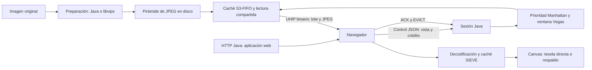
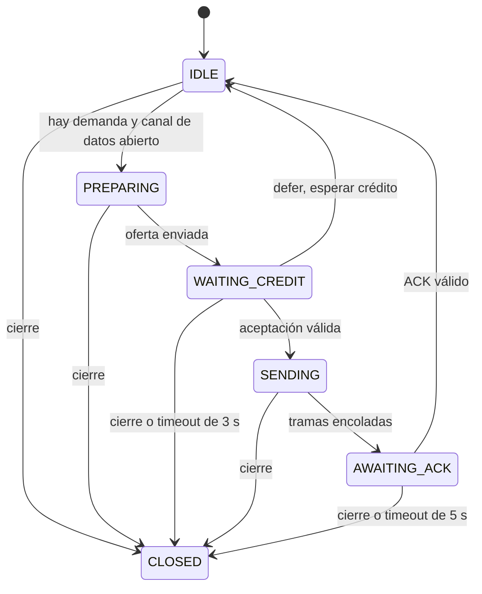

# Protocolos y algoritmos del proyecto UHIP

**Proyecto:** Servidor asíncrono de imágenes de ultra resolución, CC8.  
**Fecha de revisión:** 5 de octubre de 2026.  
**Base documental:** código Java y JavaScript existente en el proyecto en esta fecha.  
**Propósito:** describir qué se utiliza, cómo funciona, dónde está implementado y cómo participa en la visualización progresiva.

Este documento es un catálogo de la implementación actual. No es un plan de implementación ni una declaración de ausencia de errores. Distingue los algoritmos publicados de sus adaptaciones locales, los protocolos de los formatos de archivo y las funciones activas de los elementos que solamente están declarados.

El inventario ampliado que incluye todos los codecs propios y el mapa detallado de archivos está en [CATALOGO_ALGORITMOS_Y_PROTOCOLOS_UHIP.md](CATALOGO_ALGORITMOS_Y_PROTOCOLOS_UHIP.md).

El servidor utiliza Java 21. El cliente actual utiliza JavaScript con módulos ES, HTML, CSS y Canvas 2D; no utiliza Angular. La preparación permite elegir el motor Java propio o el libvips embebido, descritos en [MOTOR_TESELAS_JAVA.md](MOTOR_TESELAS_JAVA.md). La fuente C clonada es referencia; la alternativa libvips ejecuta los binarios instalados, exclusivamente cuando se elige ese motor.

## 1. Vista general del funcionamiento

El sistema prepara una pirámide de imágenes dividida en teselas. El navegador descarga inicialmente la aplicación web mediante HTTP y establece dos conexiones WebSocket con el servidor Java. Una transporta mensajes de control JSON; la otra transporta mensajes binarios UHIP con JPEG y manifiestos de lotes.

El cliente calcula el nivel de resolución y las coordenadas necesarias para su vista. El servidor prioriza las teselas, obtiene sus bytes desde disco o caché y propone un lote. El cliente reserva memoria y acepta las candidatas que puede recibir. Después de recibir y decodificar el lote, comunica sus resultados y su residencia al servidor. El renderizador combina las teselas disponibles con una imagen de respaldo y antecesores de menor resolución.



### 1.1 Inventario de protocolos y formatos

| Nombre | Tipo | Función en el proyecto | Implementación principal |
|---|---|---|---|
| HTTP | Protocolo de aplicación estándar | Entregar HTML, CSS y módulos JavaScript iniciales. | `HttpStaticServer`, `Main`, `public/index.html`. |
| TCP | Protocolo de transporte estándar | Transportar las conexiones HTTP y WebSocket. | Pila de red del sistema operativo, JDK y Java-WebSocket. |
| WebSocket | Protocolo de aplicación estándar sobre TCP | Mantener canales persistentes de control y datos. | `ControlWebSocket`, `DataWebSocket`, `ProtocolClient`. |
| UHIP v1.0, plano de control | Protocolo propio expresado en JSON | Negociar sesión, vista, crédito, confirmaciones y residencia. | `ControlWebSocket`, `ClientSession`, `public/js/protocol.js`. |
| UHIP v1.0, plano de datos | Protocolo binario propio | Transportar manifiestos y teselas mediante tres operaciones binarias. | `UhipCodec`, `ClientSession`, `public/js/protocol.js`. |
| `BATCH_STREAM_V2` | Identificador de perfil de aplicación | Identificar el flujo de negociación de lotes en el mensaje `HELLO`. | `ProtocolClient.sendHello()`. |
| JSON | Formato de intercambio | Representar mensajes de control y metadatos de la pirámide. | `protocol.js`, `ControlWebSocket`, `TileManager`, herramientas de corte. |
| JPEG | Formato de imagen comprimida | Almacenar y transportar el contenido de las teselas. | `JpegEncoder`, `TileCutter`, `TileManager`, `decodeJpegBitmap()`. |
| Pirámide UHIP | Organización multirresolución | Niveles rectangulares y bordes físicos. Java los genera directamente; libvips prepara Deep Zoom intermedio y lo normaliza al contrato UHIP. | `PyramidJob`, `RegionReducer`, `VipsTileSlicer`. |

### 1.2 Inventario de los seis algoritmos principales

| Nombre | Ubicación | Papel | Naturaleza de la implementación |
|---|---|---|---|
| TCP Vegas adaptado a capa de aplicación | `TrafficEngine.java` y `ClientSession.java` | Ajustar cuántas teselas se ofrecen por lote a cada cliente. | Adaptación de control basado en retardo; no modifica el TCP del sistema operativo. |
| Distancia de Manhattan, norma L1 | `TileDispatcher.java` | Priorizar teselas cercanas al centro visible. | Métrica espacial usada como prioridad en una cola. |
| SIEVE | `public/js/cache.js` | Elegir qué bitmap residente desalojar del cliente. | Adaptación con presupuesto por bytes, protección visual y préstamos de frame. |
| S3-FIFO | `S3FifoCache.java` | Reutilizar JPEG leídos por el servidor. | Implementación con colas S, M y G, frecuencias pequeñas y límite de bytes. |
| AMP, adaptación espacial | `public/js/viewport.js` | Anticipar franjas de teselas según el movimiento. | Heurística de velocidad inspirada en AMP; no reproduce íntegramente el algoritmo del artículo. |
| Burt–Adelson REDUCE | `RegionReducer.java` | Construir niveles reducidos por regiones en el motor Java. | Filtro separable de cinco coeficientes y reducción por dos. |

Además se utilizan algoritmos y mecanismos auxiliares: generación de pirámides Java, teselación rectangular, cálculo geométrico multirresolución, selección de nivel, respaldo jerárquico, interpolación de zoom, inercia, lectura single-flight, sustitución de demanda por épocas, deduplicación, memoria con crédito y reconexión con espera exponencial. Se describen en las secciones 4 y 5.

## 2. Protocolos de comunicación

### 2.1 HTTP: entrega inicial y recursos locales

**Nombre:** Hypertext Transfer Protocol. Las referencias estándar son [RFC 9110, semántica HTTP](https://www.rfc-editor.org/rfc/rfc9110.txt) y [RFC 9112, HTTP/1.1](https://www.rfc-editor.org/rfc/rfc9112.txt).

**Dónde se usa:** [HttpStaticServer.java](<C:/Users/Emmanuel Santos/Desktop/proyecto-imagenes-cc8/src/main/java/com/uhip/http/HttpStaticServer.java>), especialmente `start()`, `handleStaticRequest()`, `resolveSafePath()`, `detectContentType()` y `sendResponse()`. Su arranque se realiza desde `Main.launchHttpServer()`.

El servidor usa `com.sun.net.httpserver.HttpServer`, normalmente en el puerto **8080**. La ruta `/` se resuelve a `public/index.html`. Los recursos pedidos se buscan dentro del directorio público normalizado. Una ruta que escape de ese directorio se transforma en un destino inexistente.

La implementación acepta `GET`, devuelve `405` para otros métodos y `404` para archivos ausentes. Los archivos válidos se envían con `200`, el tipo MIME correspondiente y `Cache-Control: no-cache`. El ejecutor de las solicitudes utiliza hilos virtuales de Java.

HTTP entrega la aplicación; el flujo principal de teselas utiliza WebSocket. Las hojas de estilo y módulos del visor se alojan localmente en el servidor. Este código no implementa un protocolo HTTP desde cero: utiliza el servidor del JDK.

### 2.2 TCP: transporte subyacente

**Nombre:** Transmission Control Protocol. Referencia: [RFC 9293](https://www.rfc-editor.org/rfc/rfc9293).

TCP proporciona el transporte de bytes sobre el que funcionan HTTP y WebSocket. La aplicación no implementa segmentos TCP, números de secuencia, retransmisiones de segmentos ni el algoritmo de congestión del núcleo del sistema operativo.

**Dónde se usa:** indirectamente en `HttpServer`, en la biblioteca Java-WebSocket del servidor y en la API `WebSocket` del navegador. No existe una clase del proyecto que sustituya la pila TCP.

El `ACK_BATCH` de UHIP es una confirmación de aplicación: comunica que un lote terminó su procesamiento. Es diferente del ACK que TCP utiliza para confirmar bytes del transporte.

### 2.3 WebSocket: canales persistentes

**Nombre:** The WebSocket Protocol. Referencia: [RFC 6455](https://www.rfc-editor.org/info/rfc6455).

**Dónde se usa:**

- [ControlWebSocket.java](<C:/Users/Emmanuel Santos/Desktop/proyecto-imagenes-cc8/src/main/java/com/uhip/ws/ControlWebSocket.java>): servidor de mensajes de texto JSON.
- [DataWebSocket.java](<C:/Users/Emmanuel Santos/Desktop/proyecto-imagenes-cc8/src/main/java/com/uhip/ws/DataWebSocket.java>): servidor de mensajes binarios.
- [protocol.js](<C:/Users/Emmanuel Santos/Desktop/proyecto-imagenes-cc8/public/js/protocol.js>): `openControlChannel()`, `openDataChannel()` y recepción de mensajes.
- [WsUtils.java](<C:/Users/Emmanuel Santos/Desktop/proyecto-imagenes-cc8/src/main/java/com/uhip/ws/WsUtils.java>): extracción de `clientId` y parámetros de conexión.

| Canal | Dirección que construye el cliente | Puerto predeterminado | Contenido |
|---|---|---:|---|
| Control | `ws://host:8081/control?clientId=id` | 8081 | Mensajes JSON, incluidos ACK y telemetría. |
| Datos | `ws://host:8082/data?clientId=id&generationId=uuid` | 8082 | Mensajes binarios UHIP. |

La biblioteca del servidor es **Java-WebSocket 1.5.4**, declarada en `pom.xml`. La negociación HTTP de apertura, las tramas WebSocket y sus operaciones de cierre pertenecen a esa biblioteca y al navegador. Los puertos del servidor pueden configurarse en `ServerConfig`; el cliente utiliza 8081 y 8082 por defecto.

Las URL anteriores son las convenciones del cliente. Las clases actuales de servidor obtienen los parámetros de conexión; no debe atribuirse a esas clases una validación estricta de todas las rutas por el mero hecho de usar `/control` y `/data`.

La configuración actual utiliza `http://` y `ws://`, sin una capa TLS configurada por este proyecto. El transporte WebSocket admite bidireccionalidad, aunque el canal de datos se usa principalmente del servidor al cliente.

### 2.4 UHIP: identidad, sesión y negociación inicial

**Nombre:** Ultra-High-Resolution Image Protocol, UHIP v1.0. Es el protocolo propio del proyecto. No es un RFC ni un estándar público registrado.

**Dónde se usa:** `ProtocolClient`, `ControlWebSocket`, `DataWebSocket`, `ClientSession`, `SessionManager`, `ActiveBatch`, `TransferContext` y `UhipCodec`.

El protocolo separa tres identidades:

| Campo | Significado | Generación y uso |
|---|---|---|
| `clientId` | Identidad de una instancia del visor. | El cliente genera un identificador; `SessionManager` lo usa para encontrar su sesión. |
| `generationId` | Identidad de una generación de sesión. | UUID generado en `ClientSession`; acompaña el emparejamiento y mensajes de lote/residencia. |
| `datasetId` | Identidad de la instancia del dataset servido. | UUID creado por `TileManager`; no es un hash del contenido ni un catálogo multiimagen. |
| `epoch` | Revisión de la demanda de visualización. | Cambia cuando se modifica el nivel o los límites solicitados de la vista. |
| `batchId` | Identidad de un lote. | Contador de `ClientSession`. |
| `grantId` | Identidad de una concesión de crédito. | Contador del cliente, comunicado en `BATCH_ACCEPT`. |
| `residencySeq` | Secuencia de actualizaciones de residencia. | El cliente la incrementa al enviar `ACK_BATCH` o `EVICT`. |

El flujo inicial activo es:

1. El navegador obtiene la aplicación mediante HTTP.
2. Abre el canal de control y envía `HELLO`.
3. El servidor reinicia la generación y responde `SESSION_READY` con identidad y geometría.
4. El cliente abre el canal de datos con `clientId` y `generationId`.
5. El servidor empareja el canal y emite `DATA_READY` por control.
6. `ProtocolClient.handleDataReady()` activa el callback de `Application.handleDataReady()`.
7. La aplicación envía la demanda visible mediante `SYNC_VIEW`.
8. `ControlWebSocket.handleSyncView()` incorpora la raíz `0:0:0` mediante `ClientSession.ensureBootstrapRootTask()` cuando todavía no está excluida por residencia o transferencia.

Esto evita que una solicitud independiente de respaldo reemplace la vista principal. La función `Application.requestImmortalBaseTile()` marca/protege la raíz; en el código actual no envía por sí sola un `SYNC_VIEW` de nivel cero.

**Ubicaciones del arranque:** [main.js](<C:/Users/Emmanuel Santos/Desktop/proyecto-imagenes-cc8/public/js/main.js:97>) y [ClientSession.java](<C:/Users/Emmanuel Santos/Desktop/proyecto-imagenes-cc8/src/main/java/com/uhip/session/ClientSession.java:118>).

### 2.5 UHIP: mensajes JSON del plano de control

JSON es un formato de intercambio definido en [RFC 8259](https://www.rfc-editor.org/rfc/rfc8259). Las reglas de cada mensaje y sus nombres pertenecen a UHIP.

| Mensaje | Dirección | Campos utilizados | Función y punto de manejo |
|---|---|---|---|
| `HELLO` | Cliente → servidor | `clientVersion`, `protocolProfile`, `clientId`, `maxMemoryBytes` en el emisor. | `sendHello()` → `handleHello()`: iniciar generación y publicar metadatos. |
| `SESSION_READY` | Servidor → cliente | `generationId`, `datasetId`, `originalWidth`, `originalHeight`, `tileSize`, `maxZoom`. | `sendSessionReady()` → `handleSessionReady()`: establecer geometría y abrir datos. |
| `DATA_READY` | Servidor → cliente | `generationId`. | `sendDataReady()` → `handleDataReady()`: habilitar el envío de la vista. |
| `SYNC_VIEW` | Cliente → servidor | `epoch`, `zoom`, `minX`, `minY`, `maxX`, `maxY`, `centerX`, `centerY`. | `sendSyncView()` → `ControlWebSocket.handleView()` → `ClientSession.handleSyncView()`: sustituir la demanda pendiente y despachar. |
| `BATCH_OFFER` | Servidor → cliente | `generationId`, `batchId`, `epoch`, `candidates`. | `sendBatchOffer()` → `handleBatchOffer()`: ofrecer las teselas y sus costos. |
| `BATCH_ACCEPT` | Cliente → servidor | `generationId`, `batchId`, `grantId`, `acceptedKeys`. | `emitBatchAccept()` → `handleBatchAccept()`: aceptar un subconjunto con memoria reservada. |
| `BATCH_DEFER` | Cliente → servidor | `generationId`, `batchId`, `reason`. | `emitBatchDefer()` → `handleBatchDefer()`: aplazar un lote; devolver sus tareas a la cola. |
| `BATCH_START` | Servidor → cliente | `generationId`, `batchId`, `epoch`, `count`, `cwnd`. | Emitido por `notifyControlBatchStart()`; el cliente actual no tiene un caso específico para este mensaje. |
| `ACK_BATCH` | Cliente → servidor | `generationId`, `batchId`, `epoch`, `grantId`, `sentCount`, `omittedCount`, `terminalResults`, `admittedKeys`, `residencySeq`. | `sendAckBatch()` → `handleAckBatch()`: terminar el lote y actualizar residencia/Vegas. |
| `EVICT` | Cliente → servidor | `generationId`, `key`, `residencySeq`. | `sendEvict()` → `handleEvict()`: informar el desalojo de una tesela. |
| `CREDIT_AVAILABLE` | Cliente → servidor | `generationId`. | `sendCreditAvailable()` → `handleCreditAvailable()`: reanudar demanda aplazada tras cambios de capacidad/protección. |
| `ABORT` | Cliente → servidor | `epoch`. | `sendAbort()` → `handleAbort()`: cancelar tareas pendientes hasta esa época. |
| `CWND_UPDATE` | Servidor → cliente | `algorithm`, `cwnd`, `rtt`, `baseRtt`, `diff`, `pending`, `maxZoom`. | `broadcastTelemetry()` → `updateCwndTelemetry()`: mostrar estado real del control de lotes. |
| `GET_IMAGE_INFO` | Cliente → servidor | `type`. | Aceptado por el servidor; responde mediante `sendSessionReady()`. El visor normal no lo emite. |
| `IMAGE_INFO` | Servidor → cliente, compatibilidad de recepción | Metadatos de imagen. | El cliente conserva `handleImageInfo()`; la ruta actual del servidor publica `SESSION_READY`. |

Cada candidata de `BATCH_OFFER` incluye `key`, `zoom`, `tileX`, `tileY`, `jpegLength` y `rasterBytes`. Una clave de control tiene forma `z:x:y`, por ejemplo `2:1:1`. El almacenamiento interno utiliza rutas como `2/1_1.jpg`.

El valor `BATCH_STREAM_V2` viaja dentro del JSON de `HELLO`. No cambia la versión binaria `0x01` y no se negocia como cabecera `Sec-WebSocket-Protocol`. El servidor actual no valida exhaustivamente el perfil, la versión ni el presupuesto informado en `HELLO`; `maxMemoryBytes` no configura por sí solo una cuota estricta del lado Java.

En el cliente se utilizan `JSON.stringify()` y `JSON.parse()`. El servidor extrae campos con expresiones regulares y búsquedas de texto en `ControlWebSocket`, no con un parser JSON completo. Esta diferencia importa al describir la validación real.

### 2.6 UHIP: negociación y confirmación de lotes

El servidor propone hasta `cwnd` tareas mediante `BATCH_OFFER`. El cliente evalúa relevancia y memoria. Si puede recibir alguna candidata, reserva el costo y devuelve `BATCH_ACCEPT`; si no acepta ninguna, envía `BATCH_DEFER`.

El servidor transmite solamente las candidatas aceptadas. Las no aceptadas se liberan de `keyOwnership` y se devuelven a la cola por `filterAcceptedCandidates()` y `TileDispatcher.reenqueueTasks()`, siempre que su época siga siendo vigente y no estén excluidas. El aplazamiento y el timeout de oferta también devuelven tareas a la cola.

El cliente no confirma un lote solamente porque llegó `BATCH_END`: espera que todas las entradas del manifiesto tengan un resultado terminal. Los estados utilizados son:

| Estado terminal | Significado |
|---|---|
| `admitted` | Bitmap decodificado y admitido por la caché. |
| `discarded` | Información descartada, por ejemplo por falta de relevancia o cambio de generación. |
| `failed_decode` | El JPEG no pudo convertirse en bitmap. |
| `omitted` | El manifiesto del fin de lote identifica una entrada no enviada. |

`checkBatchCompletion()` marca el lote como completado antes de emitir su ACK, para impedir dos confirmaciones del mismo lote. `admittedKeys` incluye únicamente entradas marcadas como admitidas que todavía están en la caché al construir el mensaje.

En el servidor, `ActiveBatch.validateCounts()` y `validateTerminalResults()` contrastan las cantidades y claves con el manifiesto. `ClientSession.isValidAckBase()` comprueba generación, lote, época y concesión. Un ACK duplicado ya no encuentra un lote activo válido y no vuelve a actualizar Vegas.

**Dónde se implementa:** `ProtocolClient.handleBatchOffer()`, `tryReserveCandidate()`, `checkBatchCompletion()`; `ClientSession.handleBatchAccept()`, `handleAckBatch()`; [ActiveBatch.java](<C:/Users/Emmanuel Santos/Desktop/proyecto-imagenes-cc8/src/main/java/com/uhip/session/ActiveBatch.java>).

### 2.7 UHIP: cabecera binaria común

**Dónde se implementa:** [UhipCodec.java](<C:/Users/Emmanuel Santos/Desktop/proyecto-imagenes-cc8/src/main/java/com/uhip/protocol/UhipCodec.java>) en Java y `handleBinaryDataOrchestrator()` en `protocol.js`.

Cada mensaje de datos UHIP tiene una cabecera de **12 bytes**, seguida de su payload. Los enteros de varios bytes utilizan **big-endian**, seleccionado con `ByteOrder.BIG_ENDIAN` en Java y con `false` en las lecturas `DataView` del cliente.

| Offset absoluto | Bytes | Campo | Valor o interpretación |
|---:|---:|---|---|
| 0 | 1 | Magic | `0x55`, carácter `U`. |
| 1 | 1 | Version | `0x01`. |
| 2 | 1 | OpCode UHIP | `0x12`, `0x13` o `0x14`. |
| 3 | 1 | Flags | `0x02` para `TILE_DATA` JPEG; `0x00` para los sobres de lote. |
| 4 | 4 | Epoch | Revisión de origen del lote, representación de 32 bits. |
| 8 | 4 | PayloadLength | Cantidad de bytes posteriores a la cabecera. |

El opcode de mensaje binario de WebSocket y el OpCode UHIP son campos de capas distintas. WebSocket transporta el mensaje; UHIP interpreta sus bytes internos.

El cliente comprueba magic, versión y que el tamaño recibido coincida con `12 + PayloadLength`. La representación admite coordenadas de tesela de 16 bits y nivel de 8 bits; Java usa `int` para los identificadores de 32 bits. Esta implementación no debe presentarse como capaz de utilizar ilimitadamente todo el rango unsigned de 32 bits.

#### 2.7.1 `BATCH_BEGIN`, OpCode `0x13`

Introduce el manifiesto de lo que se enviará. Su tamaño total es `28 + 10n` bytes, donde `n` es la cantidad planificada.

| Offset dentro del payload | Bytes | Campo |
|---:|---:|---|
| 0 | 4 | `batchId`. |
| 4 | 4 | `grantId`. |
| 8 | 2 | `plannedCount`. |
| 10 | 2 | Reservado. |
| 12 | 4 | `totalJpegBytes`. |
| 16 en adelante | 10 por entrada | Nivel, reservado, X, Y y longitud JPEG. |

Cada entrada contiene: nivel de 1 byte, reservado de 1 byte, X de 2 bytes, Y de 2 bytes y longitud de 4 bytes. `handleBatchBeginFrame()` vincula el manifiesto con una concesión pendiente y crea `activeBatch`.

#### 2.7.2 `TILE_DATA`, OpCode `0x12`

Transporta una tesela. Su tamaño total es `18 + L` bytes, donde `L` es la longitud del JPEG.

| Offset dentro del payload | Bytes | Campo |
|---:|---:|---|
| 0 | 1 | Nivel de zoom. |
| 1 | 1 | Reservado. |
| 2 | 2 | Coordenada X de tesela. |
| 4 | 2 | Coordenada Y de tesela. |
| 6 | L | Bytes JPEG. |

En el mensaje completo, el JPEG empieza en el offset **18**. El cliente verifica que la clave pertenezca al manifiesto activo, que coincida la época y que no se haya recibido ya esa clave. Después la incorpora a la cola de decodificación.

#### 2.7.3 `BATCH_END`, OpCode `0x14`

Cierra la transmisión del lote. Su tamaño total es `20 + 8m` bytes, donde `m` es la cantidad de omisiones.

| Offset dentro del payload | Bytes | Campo |
|---:|---:|---|
| 0 | 4 | `batchId`. |
| 4 | 2 | `sentCount`. |
| 6 | 2 | `omittedCount`. |
| 8 en adelante | 8 por entrada | Nivel, reservado, X, Y, motivo y reservado. |

La representación de omisiones está implementada en el codec y en el cliente. En la ruta actual `appendCandidatesJson()` solamente agrega candidatas cuyo JPEG existe, y la transmisión normal no llena una lista de omisiones por cada fallo de disco o cambio de época. Por ello, soporte del formato y emisión efectiva de todos esos casos no son equivalentes.

UHIP no incorpora en estos mensajes un CRC propio, cifrado propio, retransmisión de segmentos ni un mecanismo de compresión WebP activo. El contenido de tesela que esta ruta emite es JPEG.

### 2.8 Formatos de procesamiento y almacenamiento

**JPEG.** En el motor Java, `JpegEncoder` produce JFIF baseline YCbCr 4:4:4 con DCT separable, cuantización de calidad 85 por defecto, zigzag y Huffman canónico propio. Los lectores y descompresores de imagen son Java. `TileManager` entrega los bytes sin recomprimir y el navegador usa `createImageBitmap()`.

**Pirámide UHIP.** Con Java, `PyramidJob` genera directamente `z/x_y.jpg`, `metadata.json` y `manifest.json`. Hay teselas de 256, solapamiento cero y bordes parciales. En esta ruta no hay `.dzi`. Con libvips, `VipsTileSlicer` ejecuta `dzsave`, verifica y renumera niveles Deep Zoom, elimina los intermedios y publica el mismo contrato.

**Dónde se implementa:** `tools/TileSlicer.java`, `tools/VipsTileSlicer.java`, `tools/JavaTileSlicer.java`, `imaging/PyramidJob.java`, `imaging/RegionReducer.java` y `imaging/codec/JpegEncoder.java`. La matriz de formatos y la descripción de todos los codecs están en [MOTOR_TESELAS_JAVA.md](MOTOR_TESELAS_JAVA.md).

## 3. Algoritmos principales

### 3.1 TCP Vegas adaptado al control de lotes

**Nombre y origen:** TCP Vegas, desarrollado por Lawrence S. Brakmo y Larry L. Peterson; la publicación inicial de 1994 también incluye a Sean W. O'Malley. En este proyecto se adapta su señal de retardo a la capa de aplicación. Referencias: [publicación inicial de TCP Vegas](https://doi.org/10.1145/190314.190317) y [TCP Vegas: End to End Congestion Avoidance on a Global Internet](https://www.cs.princeton.edu/courses/archive/fall06/cos561/papers/vegas.pdf).

**Dónde se usa:** [TrafficEngine.java](<C:/Users/Emmanuel Santos/Desktop/proyecto-imagenes-cc8/src/main/java/com/uhip/traffic/TrafficEngine.java>), métodos `recordBatchStart()`, `computeRttAndQueueDiff()`, `adjustVegasWindow()`, `onAck()`, `onCongestion()` y `onAbort()`. Lo integra `ClientSession` al ofrecer lotes, registrar el inicio de transmisión y recibir ACK válidos.

Cada sesión mantiene su propio motor. Su ventana se mide en **teselas por lote**, no en segmentos ni bytes TCP.

| Parámetro | Valor activo |
|---|---:|
| Ventana inicial | 32 teselas. |
| Ventana mínima | 16 teselas. |
| Ventana máxima | 256 teselas. |
| Umbral alfa | 2.0. |
| Umbral beta | 5.0. |

El algoritmo obtiene:

```text
actualRTT = max(1, tiempo_del_ACK - tiempo_registrado_de_inicio)
baseRTT = menor RTT observado por el motor
expected = cwnd / baseRTT
actual = cwnd / actualRTT
diff = max(0, (expected - actual) * baseRTT)
```

Si `diff < 2`, incrementa la ventana en una tesela. Si `diff > 5`, la reduce en una. Entre ambos límites la conserva. Aplica siempre los límites 16 y 256.

El RTT medido incluye el tiempo que transcurre hasta el ACK de aplicación: transporte, espera y procesamiento del cliente pueden influir. El registro actual ocurre después de encolar las tramas del lote, por lo que tampoco es una medición exacta de todos los costos de preparación. No representa el RTT TCP del sistema operativo.

El timeout de ACK invoca `onCongestion()` y resta uno, respetando el mínimo, antes de cerrar la sesión incierta. Al reconectar se crea otro motor con ventana inicial 32. `onAbort()` conserva la ventana; no la colapsa a uno. La implementación actual no utiliza slow start, reducción multiplicativa a la mitad ni `ssthresh` para este motor, aunque `ServerConfig` conserva campos con esos nombres.

**Ejemplo:** para `cwnd=32`, `baseRTT=20 ms` y `actualRTT=25 ms`, `diff=6.4`; el próximo ajuste reduce la ventana a 31. La prioridad espacial de las teselas la decide Manhattan; Vegas regula la cantidad.

Esta es una adaptación de la parte de evitación de congestión basada en retardo. No implementa todas las técnicas del TCP Vegas original, ni demuestra que el TCP de Windows esté configurado con Vegas.

### 3.2 Priorización espacial por distancia de Manhattan

**Nombre:** distancia de Manhattan o norma L1.

**Dónde se usa:** [TileDispatcher.java](<C:/Users/Emmanuel Santos/Desktop/proyecto-imagenes-cc8/src/main/java/com/uhip/dispatch/TileDispatcher.java>), métodos `calculateManhattanDistance()`, `offerTileIfNew()`, `reconcileExistingViewportTasks()` y `pollBatch()`.

Para una tesela `(x,y)` y un centro `(cx,cy)`, la prioridad se calcula como:

```text
prioridad = |x - cx| + |y - cy|
```

Las tareas se almacenan en `PriorityQueue<TileTask>` con un comparador ascendente de prioridad. Primero salen las de menor distancia. El centro comunicado por `Viewport.computeVisibleBounds()` corresponde al área visible estricta y se conserva después de ampliar los límites por prefetch.

**Ejemplo:** con centro `(5,5)`, las prioridades de `(5,5)`, `(6,5)` y `(8,7)` son 0, 1 y 5. El usuario recibe antes el entorno central que las zonas lejanas.

El cálculo de una distancia cuesta tiempo constante; cada inserción o extracción de la cola cuesta normalmente `O(log n)`. El comparador desempata por nivel, Y y X, después de la prioridad. La raíz de respaldo entra con prioridad 0 y nivel 0, por lo que precede una tesela central de nivel mayor que empate en prioridad.

La cuadrícula válida se obtiene de `PyramidGeometry`, para evitar la suposición de que toda imagen es cuadrada. Manhattan no determina cuánto tráfico emitir ni qué bitmap desalojar: trabaja junto con Vegas y las cachés.

### 3.3 SIEVE: caché de bitmaps del navegador

**Nombre y origen:** SIEVE, descrito por Yazhuo Zhang, Juncheng Yang, Yao Yue, Ymir Vigfusson y K. V. Rashmi en NSDI 2024. Referencia: [SIEVE is Simpler than LRU](https://www.usenix.org/conference/nsdi24/presentation/zhang-yazhuo).

**Dónde se usa:** [cache.js](<C:/Users/Emmanuel Santos/Desktop/proyecto-imagenes-cc8/public/js/cache.js>), clases `SieveNode` y `TileCache`; métodos `insertNewSieveNode()`, `borrow()`, `recordDemand()`, `sieveEvictOneVictim()` y `discardSieveVictim()`.

Cada entrada contiene clave, bitmap, costo raster, un bit `visited` y enlaces de lista. Un mapa proporciona el acceso por clave y una mano `hand` permite recorrer candidatas de desalojo sin mover una entrada al frente en cada lectura.

El comportamiento local es:

1. Insertar entradas nuevas en la cabeza de la lista, con `visited=false`.
2. Marcar el bit al registrar demanda, prestar una entrada al renderizador o actualizar las claves visibles.
3. Recorrer candidatas con la mano; saltar claves protegidas o excluidas.
4. Si una candidata tiene `visited=true`, limpiar el bit y darle otra oportunidad.
5. Desalojar una candidata no protegida con el bit apagado.
6. Actualizar los bytes, cerrar o retirar el bitmap y emitir el callback `onEvict`.

La búsqueda limita el recorrido a dos veces la cantidad de entradas. Si todas están protegidas, puede rechazar una reserva o admisión. Un recorrido particular puede costar `O(n)`; no se debe describir cada desalojo como estrictamente constante.

La adaptación añade protección de la raíz `0:0:0`, protección de claves visibles/antecesoras y préstamos por frame. El presupuesto predeterminado de la caché administrada es 128 MiB. Existe un límite secundario configurado de 512 entradas, con las salvedades de la sección 7.

Los métodos `lockLevel()` y `unlockLevel()` existen por compatibilidad, pero no protegen niveles completos. La raíz protegida es una tesela; no existe una pirámide completa de niveles 0 a 3 permanentemente residente.

La política no es LRU exacto. Además, las lecturas de renderizado marcan `visited` en `borrow()`; por ello esta adaptación protege accesos visuales además de accesos de demanda.

### 3.4 S3-FIFO: caché de JPEG del servidor

**Nombre y origen:** S3-FIFO, *Simple and Scalable caching with three Static FIFO queues*, presentado por Juncheng Yang y colaboradores en SOSP 2023. Referencia: [FIFO Queues are All You Need for Cache Eviction](https://www.cs.cmu.edu/~rvinayak/papers/s3-fifo-sosp-2023-fifo-queues-are-all-you-need-for-cache-eviction.pdf).

**Dónde se usa:** [S3FifoCache.java](<C:/Users/Emmanuel Santos/Desktop/proyecto-imagenes-cc8/src/main/java/com/uhip/storage/S3FifoCache.java>), especialmente `admitEntry()`, `recordHit()`, `rebalanceAndEvict()`, `evictFromSmallQueue()`, `evictFromMainQueue()` y `recordGhostKey()`. `TileManager.getTile()` consulta esta caché antes de ir al disco.

| Estructura | Contenido | Papel |
|---|---|---|
| S, Small | Claves y bytes JPEG. | Filtrar objetos de uso pasajero. |
| M, Main | Claves y bytes JPEG. | Conservar objetos que muestran reutilización. |
| G, Ghost | Solamente claves, sin JPEG. | Reconocer solicitudes que vuelven después de un desalojo desde S. |

El presupuesto predeterminado de payload es 128 MiB. S tiene un umbral de aproximadamente el 10 % del presupuesto; M utiliza el espacio restante disponible, sujeto al límite total. G se limita a 4,000 claves por defecto.

Solo hay desalojo cuando `bytesS + bytesM > maxBytes`. El umbral del 10 % selecciona la cola que debe revisar bajo esa presión; durante el calentamiento S puede excederlo y utilizar capacidad libre. Un payload mayor que todo el presupuesto no se admite y no provoca la expulsión de residentes. El constructor exige un presupuesto positivo y un límite G no negativo; G=0 desactiva el histórico.

Una entrada empieza con frecuencia 0. Los hits aumentan la frecuencia hasta un máximo de 3. Una clave nueva entra en S; una clave encontrada en G entra directamente en M y sale del histórico.

Al retirar el elemento más antiguo de S, se lo promueve a M si `freq > 1`, reiniciando la frecuencia. De lo contrario se eliminan sus bytes y se registra la clave en G. En M, una frecuencia positiva concede otra oportunidad: decrementa la frecuencia y reinserta al final. Si vale cero, se eliminan los bytes. En esta implementación, el desalojo desde M no agrega una clave a G.

Los contenedores son `LinkedHashMap` en orden de inserción y `LinkedHashSet` para el histórico. Las operaciones públicas están sincronizadas: esta implementación no es lock-free ni reproduce necesariamente el rendimiento del prototipo del artículo.

La caché pertenece a `TileManager`, compartido por las sesiones del servidor. Por tanto, clientes que solicitan el mismo JPEG pueden reutilizar los mismos bytes. Es diferente de SIEVE, que maneja bitmaps decodificados dentro de cada pestaña.

### 3.5 AMP: prefetch espacial adaptativo

**Nombre y origen:** AMP, *Adaptive Multi-stream Prefetching in a Shared Cache*, de Binny S. Gill y Luis Angel D. Bathen, FAST 2007. Referencia: [publicación de AMP](https://www.usenix.org/conference/fast-07/amp-adaptive-multi-stream-prefetching-shared-cache).

**Dónde se usa:** [viewport.js](<C:/Users/Emmanuel Santos/Desktop/proyecto-imagenes-cc8/public/js/viewport.js>), clase `AmpTilePrefetcher`, métodos `computeDegree()`, `updateVelocity()`, `getDegrees()` y `getPredictedTravel()`; integración mediante `Viewport.applyAmpStreamPrefetch()`.

El código adapta la idea de anticipación a dos ejes de una imagen. Mantiene grados `pX` y `pY` entre 0 y 4 teselas y observa velocidad/dirección por eje.

Para cada eje:

```text
velocidad = desplazamiento / max(0.001, dt_segundos)
si |velocidad| < 5 px/s o se invierte la dirección: p = 0
en otro caso:
    viaje = |velocidad| * 0.300 segundos
    límite_por_viaje = ceil(viaje / max(1, tamaño_tesela_en_pantalla))
    grado_por_velocidad = min(4, max(1, floor(|velocidad| / 400)))
    objetivo = min(4, límite_por_viaje, grado_por_velocidad)
    p = 0.7 * p + 0.3 * objetivo
grado_utilizado = ceil(p)
```

`getPredictedTravel()` conserva el signo de la velocidad y proyecta 300 ms de movimiento. `applyAmpStreamPrefetch()` agrega únicamente las bandas que alcanzarían los límites proyectados, hasta el grado permitido, y restringe el resultado a la geometría real. Conserva el centro de la vista estricta para que Manhattan siga priorizando la zona que el usuario está mirando.

Como se transmite un rectángulo de límites, ampliar simultáneamente ambos ejes también puede incluir la esquina formada por esas ampliaciones. El prefetch no usa un manifiesto separado de dos bandas independientes.

**Alcance real de la adaptación:** el artículo original adapta grado y distancia de disparo por flujo. El código actual usa una heurística de velocidad; no implementa una distancia de disparo `g` adaptativa ni conecta `recordConsumption()` con el consumo real de teselas. Tampoco reduce explícitamente la especulación según presión de memoria. Por ello su nombre documental preciso es **prefetch espacial inspirado en AMP**.

La anticipación aumenta la demanda enviada al servidor, mientras Manhattan organiza el orden y Vegas regula la cantidad por lote. No elimina la necesidad de una imagen de respaldo.

### 3.6 Burt–Adelson REDUCE: reducción por regiones en Java

**Nombre y origen:** operador REDUCE de Burt y Adelson, 1983. Se usa como filtro predeterminado de `JavaTileSlicer` / `PyramidJob`.

**Dónde:** `imaging/RegionReducer.java`, `region()`, `burt()` y `horizontal()`. El método `pyramid/BurtAdelsonReducer.reduce()` permanece como referencia para pruebas pequeñas.

El filtro separable `[1,5,8,5,1]/20` se aplica con halo de dos muestras, centros en coordenadas globales y réplica del borde. Mantiene los acumuladores intermedios sin división y redondea una sola vez con `(suma+200)/400`. La salida mide `ceil(W/2) × ceil(H/2)`. Las pruebas contrastan todos los píxeles con la implementación de referencia y cubren costuras de regiones y dimensiones impares.

Se construye una pirámide suavizada; no hay residuos laplacianos. Los niveles se guardan sin pérdidas en disco y se procesan por regiones acotadas, sin cargar un nivel completo en RAM. La opción `--reducer box` selecciona una media 2 × 2 alternativa.

## 4. Algoritmos de procesamiento, geometría y presentación

### 4.1 Generación de pirámides con selección Java/libvips

`PyramidJob.run()` coordina inspección real del original, reserva de recursos, importación secuencial o lectura directa de planos RAW, codificación JPEG con pool acotado, REDUCE a disco, comprobación de conteos y publicación atómica. `ImageReaders` selecciona por firma los lectores PNG, JPEG baseline, PSD/PSB y TIFF/BigTIFF.

Cuando se selecciona Java, la compresión de imagen y JPEG se implementan en Java: DCT, Huffman, LZ77/DEFLATE, PackBits, LZW, CRC/Adler, filtros PNG y predictores PSD/TIFF. Los JPEG no son intermedios de la reducción. El destino debe ser nuevo y no se publica en caso de error/cancelación. Esta ruta no ejecuta conversores nativos ni Python. La alternativa libvips usa `dzsave` con tesela 256, solapamiento cero, JPEG de calidad 85 y reducción por media; comparte `DatasetPublisher` y `DatasetMetadata` para la publicación y el contrato de archivos. `TileSlicer`/`SliceRequest` seleccionan explícitamente el motor; no hay cambio automático en caso de fallo. Véase [MOTOR_TESELAS_JAVA.md](MOTOR_TESELAS_JAVA.md) para clases, variantes implementadas, recursos y límites; no se afirma compatibilidad general con toda la API de libvips.

### 4.2 Teselación rectangular y generación procedural de pruebas

**Nombre:** partición espacial por cuadrícula y generación de datasets sintéticos.

**Dónde se usa:** `PyramidJob.writeLevel()`, `TileCutter.generateSyntheticDatasetOrchestrator()`, `generateZoomLevel()` y `createProceduralTile()`.

Para un nivel de ancho `Wz`, alto `Hz` y tamaño `T=256`, el corte usa:

```text
columnas = ceil(Wz / T)
filas    = ceil(Hz / T)
ancho de borde = min(T, Wz - x*T)
alto de borde  = min(T, Hz - y*T)
```

Las teselas parciales conservan su tamaño físico real en la ruta Java. Cada nivel se almacena en una carpeta numérica y cada tesela como `x_y.jpg`. La preparación se realiza antes de atender la navegación; el servidor de transmisión no vuelve a cortar la imagen original ante cada movimiento.

El modo sintético genera para el nivel `z` una cuadrícula de `2^z × 2^z` y dibuja patrones y etiquetas con Java2D. Es un generador de datos de prueba, no una técnica de reconstrucción de imágenes reales ni un algoritmo publicado de compresión. Produce geometría y metadatos que permiten ejercitar el protocolo sin necesitar una imagen original enorme.

### 4.3 Geometría multirresolución y límites reales

**Nombre:** cálculo de pirámide geométrica con potencias de dos y límites rectangulares.

**Dónde se usa:** [PyramidGeometry.java](<C:/Users/Emmanuel Santos/Desktop/proyecto-imagenes-cc8/src/main/java/com/uhip/pyramid/PyramidGeometry.java>) y [geometry.js](<C:/Users/Emmanuel Santos/Desktop/proyecto-imagenes-cc8/public/js/geometry.js>). Lo consumen `TileDispatcher`, `TileManager`, `Viewport`, `CanvasRenderer` y la comprobación de relevancia de `Application`.

Para resolución original `(W,H)`, máximo nivel `Z` y nivel solicitado `z`:

```text
k(z) = 2^(Z-z)
Wz = ceil(W / k(z))
Hz = ceil(H / k(z))
```

Los métodos `cols()`, `rows()`, `tileWidth()`, `tileHeight()` e `isValidTile()` derivan la cuadrícula válida. `clampBounds()` restringe los índices solicitados a esa cuadrícula.

En el cliente, `tileOriginalExtent()` proyecta una tesela al espacio original. `tileContentDimensions()` conserva la extensión útil como fracción, aunque el bitmap físico tenga dimensiones enteras. `computeAncestorCrop()` calcula el recorte en un antecesor disponible.

**Ejemplo:** para 257 × 129 y `Z=1`, el raster del nivel cero mide 129 × 65, pero el área útil exacta corresponde a 128.5 × 64.5 píxeles a esa escala. El renderizador usa esa extensión para evitar estirar el redondeo del borde como si fuera contenido adicional.

Esto es un procedimiento geométrico del proyecto. No utiliza una heurística de brillo para decidir qué píxeles pertenecen a la imagen. Las operaciones con desplazamientos de bits son adecuadas para los niveles usados por el proyecto; no constituyen soporte de niveles arbitrariamente altos.

### 4.4 Selección del nivel de tesela según escala de pantalla

**Nombre:** selección discreta de resolución con umbral de ampliación.

**Dónde se usa:** `Viewport.getTileLevel()`, `calculateSharpenedLevel()` y `computeMinMonitorCoverLevel()`.

La escala continua `s` se convierte primero en:

```text
nivel_crudo = Z + log2(s)
nivel_base = floor(nivel_crudo)
estiramiento = 2^(nivel_crudo - nivel_base)
```

Si el estiramiento supera **1.25**, se elige el nivel siguiente. También se calcula un piso a partir del mayor lado del canvas y del tamaño de tesela. El resultado se restringe al rango `[0,Z]`.

Es una heurística local de nitidez y cobertura. Cambiar de nivel modifica la demanda transmitida y aporta JPEG con detalle distinto; el zoom no se limita a estirar siempre la misma imagen descargada.

### 4.5 Respaldo jerárquico ancestral

**Nombre:** Hierarchical Ancestor Fallback, respaldo por antecesores de la pirámide.

**Dónde se usa:** [renderer.js](<C:/Users/Emmanuel Santos/Desktop/proyecto-imagenes-cc8/public/js/renderer.js>), métodos `renderFrame()`, `drawImmortalBaseCanvas()`, `drawTileWithHierarchicalFallback()`, `drawBestAncestor()` y `drawAncestorSubRect()`.

El frame se construye en este orden:

1. Pintar el fondo `#0a0d14`.
2. Dibujar la raíz `0:0:0` sobre la extensión completa de la imagen, si está disponible.
3. Para cada celda visible, intentar dibujar su tesela exacta.
4. Si falta, recorrer antecesores desde `z-1` hasta cero y usar el primero disponible.
5. Liberar los préstamos de bitmaps al terminar el frame.

Para un antecesor `za`, la coordenada se deriva con:

```text
d = 2^(z-za)
xa = floor(x/d)
ya = floor(y/d)
```

`computeAncestorCrop()` encuentra qué parte de ese bitmap representa la región de la tesela faltante. El renderizador la amplía mientras espera mayor detalle. La búsqueda cuesta hasta `O(Z)` por celda que no tenga tesela exacta.

El respaldo es una forma de mantener contenido visible con menor resolución. No reconstruye detalle que aún no llegó ni busca automáticamente todas las teselas hijas de mayor resolución. Si falta tanto la tesela como cualquier respaldo disponible, puede quedar el fondo oscuro; el algoritmo no garantiza matemáticamente ausencia de huecos ante cualquier error de carga.

La raíz se protege en `TileCache`, y se vuelve a incorporar a la demanda desde el servidor cuando corresponde. `lastStableLevel` se actualiza con información de cobertura, pero no constituye una segunda capa de renderizado ni vuelve a activar el bloqueo de niveles completos.

### 4.6 Proyección y ajuste a píxeles de pantalla

**Nombre:** transformación entre coordenadas originales, nivel de pirámide y pantalla, con ajuste de bordes a píxeles enteros.

**Dónde se usa:** `CanvasRenderer.computeTileScreenRect()` y `PyramidGeometry.tileContentDimensions()`.

El destino de cada tesela se calcula a partir de su extensión original, la escala continua y la posición de cámara. Los extremos de destino se ajustan con `round` y se restan para obtener ancho y alto, compartiendo el mismo redondeo entre vecinos; el origen de muestreo conserva las fracciones útiles de la geometría.

El contexto Canvas configura `imageSmoothingEnabled=true` e `imageSmoothingQuality='high'`. El navegador elige cómo realiza ese suavizado. El proyecto no implementa un interpolador bicúbico o Lanczos propio dentro de `CanvasRenderer`.

El modo Píxeles cambia `imageSmoothingEnabled` a `false`; la elección visual no genera nuevas peticiones de teselas.

### 4.7 Zoom con interpolación hacia el objetivo

**Nombre:** interpolación lineal iterativa, LERP, usada como suavizado temporal del zoom.

**Dónde se usa:** `Viewport.updateZoomLerp()` y `adjustCameraForScaleChange()`.

En cada frame:

```text
dt = clamp(dt_segundos, 0.001, 0.05)
tasa = 1 - (1 - 0.22)^(dt * 60)
escala_actual += tasa * (escala_objetivo - escala_actual)
```

Se actualiza mientras `abs(objetivo-actual) / max(1e-6, objetivo)` supere **1e-6**; al alcanzar la tolerancia se asigna el objetivo exacto. `adjustCameraForScaleChange()` modifica la cámara para preservar el punto bajo el cursor como ancla del zoom. El delta se acota en la actualización normal del viewport.

La rueda modifica el objetivo por un factor 1.18 o su inverso. Los botones utilizan 1.4 o su inverso. Estas constantes son decisiones de interacción del proyecto, no propiedades de UHIP ni de un artículo de algoritmos.

### 4.8 Inercia de desplazamiento y fricción discreta

**Nombre:** integración discreta de movimiento con decaimiento multiplicativo de velocidad.

**Dónde se usa:** `Viewport.handleMouseMove()`, `handleMouseUp()` y `updateKinematicInertia()`.

Durante el arrastre se registra el último desplazamiento como velocidad. Al soltar el botón se conserva la velocidad y, en cada frame, se actualiza la posición y se multiplica la velocidad por **0.92**. Cuando ambas componentes están por debajo del umbral **0.1**, se detiene el movimiento.

Esta heurística hace que el desplazamiento continúe brevemente después del arrastre. También alimenta la adaptación de velocidad del prefetch. Usa valores por frame, no una integración normalizada por segundos; su efecto depende de la frecuencia de actualización.

### 4.9 Cover mode y restricción de cámara

**Nombre:** escala mínima de cobertura y clamping espacial.

**Dónde se usa:** `Viewport.computeMinScale()`, `handleResize()` y `clampPosition()`.

La escala mínima es:

```text
minScale = max(ancho_canvas/W, alto_canvas/H)
```

El objetivo es cubrir el canvas con la imagen. `clampPosition()` limita la cámara al rectángulo escalado y detiene la velocidad al alcanzar un borde. Si una dimensión escalada es menor que el canvas, centra la imagen en ese eje.

Este mecanismo impide navegar fuera de los límites geométricos; la disponibilidad de las teselas sigue siendo responsabilidad del protocolo, la caché y el respaldo.

### 4.10 Zoom digital profundo, deduplicación canónica y modo de interpolación dual

**Nombre:** Ampliación digital en Canvas 2D, firma canónica de SYNC_VIEW y conmutación de suavizado.

**Dónde se usa:** `Viewport.applyScaleFactor()`, `Viewport.zoomTo100Percent()`, `CanvasRenderer.setInterpolationMode()`, `CanvasRenderer.drawClippedRootBitmap()`, `Application.createViewSignature()`, `Application.dispatchSyncViewOrchestrator()`.

1. **Ampliación visual hasta 32× (3200%):** La cámara permite ampliar la escala continua hasta `maxVisualScale` (32.0 por defecto, configurable entre 1 y 64). En todo momento, el nivel discreto de pirámide se acota a $z \le M = \text{maxZoom}$.
2. **Clipping proporcional de la raíz:** `drawClippedRootBitmap()` intersecta el destino con el Canvas y proyecta proporcionalmente el recorte fuente en la raíz. Evita enviar a `drawImage()` un rectángulo de destino de toda la imagen ampliada; no se presupone un límite GPU universal.
3. **Deduplicación de SYNC_VIEW:** La firma local `${generationId}|${datasetId}|${zoom}|${minX}|${minY}|${maxX}|${maxY}|${centerX}|${centerY}` incluye la generación y solo se registra si el socket acepta el envío. Se deduplican vistas con los mismos límites/centro entero; `DATA_READY` fuerza el reenvío y ABORT invalida la firma. Un fallo no consume época ni firma.
4. **Modo de interpolación dual:** Suave solicita `imageSmoothingQuality = 'high'` al navegador sin imponer un kernel concreto; Píxeles usa `imageSmoothingEnabled = false`. El modo se restaura después de resize, que conserva el centro en coordenadas originales capturado antes de cambiar el Canvas. La acción 100% se deshabilita cuando `minScale > 1`.
5. **AMP a escala profunda:** `getPredictedTravel()` proyecta velocidad durante 300 ms; `applyAmpStreamPrefetch()` calcula qué fronteras alcanzaría y añade solo esas bandas, con grado adaptativo máximo de cuatro. Un movimiento dentro de una tesela a 32× no obliga a anticipar otra; acercarse a su frontera puede anticipar una sin recorrer antes toda la tesela. Manhattan mantiene el centro de los límites estrictamente visibles.

## 5. Mecanismos auxiliares de demanda, concurrencia y memoria

### 5.1 Sustitución de demanda por épocas

**Nombre:** revisión de viewport mediante épocas e invalidación de tareas pendientes.

**Dónde se usa:** `Application.dispatchSyncViewOrchestrator()`, `ControlWebSocket.handleSyncView()`, `TileDispatcher.enqueueViewport()`, `cancelEpoch()` y `reenqueueTasks()`.

La aplicación compara nivel y límites con la última vista solicitada. Si cambian, incrementa `lastEpoch`. Movimientos que mantienen los mismos límites no incrementan la época solamente por cambiar algunos píxeles de cámara.

En el dispatcher, una época mayor limpia la cola anterior. En la misma época se conservan tareas que siguen dentro de la vista, se recalculan prioridades y se incorporan las faltantes. Una época menor que la del dispatcher se rechaza. Las candidatas devueltas a la cola se filtran también por época y exclusión.

`ABORT` elimina tareas pendientes cuya época sea menor o igual a la indicada. El botón de simulación del visor lo envía explícitamente. La navegación ordinaria reemplaza la demanda mediante `SYNC_VIEW`; no envía obligatoriamente un `ABORT` por cada movimiento.

La cancelación de cola no retira bytes ya encolados en WebSocket ni detiene por sí sola una decodificación iniciada. `Application.isKeyRelevant()` comprueba la región original de una tesela contra la vista actual y permite niveles próximos, hasta una diferencia de dos, además de la raíz. El cliente utiliza esa relevancia y la generación para decidir si admite el resultado de decode; no aplica solamente una regla de rechazo por desigualdad de época.

### 5.2 Deduplicación por claves, residencia y tokens

**Nombre:** exclusión de trabajo redundante y propiedad temporal por transferencia.

**Dónde se usa:** `TileDispatcher.enqueuedKeys`, `ClientSession.isTileExcluded()`, `residentConfirmedKeys`, `keyOwnership` y [TransferContext.java](<C:/Users/Emmanuel Santos/Desktop/proyecto-imagenes-cc8/src/main/java/com/uhip/session/TransferContext.java>).

`enqueuedKeys` evita duplicar una clave en la cola pendiente. `residentConfirmedKeys` evita volver a transmitir información que el cliente confirmó residente. `keyOwnership` identifica claves pertenecientes a una transferencia en preparación o activa.

Cada `TransferContext` tiene un token UUID. Al finalizar se elimina la propiedad mediante la pareja clave/token, lo que evita que una liberación de una transferencia anterior borre la propiedad de otra transferencia distinta.

El ACK agrega residencia; `EVICT` la elimina. `residencySeq` aplica un orden global por sesión. La actualización actual de ACK exige una secuencia mayor; EVICT también exige una secuencia estrictamente mayor. Esta lógica reduce resurrecciones por mensajes antiguos, pero no constituye un registro causal independiente para cada clave.

El conjunto [BoundedKeySet.java](<C:/Users/Emmanuel Santos/Desktop/proyecto-imagenes-cc8/src/main/java/com/uhip/session/BoundedKeySet.java>) limita la residencia recordada a 512 claves. Utiliza `LinkedHashSet`, elimina la entrada más antigua al llenarse y renueva la posición al volver a insertar una clave existente. Es un conjunto acotado por orden de inserción actualizado, no la caché S3-FIFO de bytes ni un LRU por cada lectura.

### 5.3 Lectura single-flight de disco

**Nombre:** single-flight o agrupación de misses concurrentes por clave.

**Dónde se usa:** `TileManager.loadTileSingleFlight()`, `inFlightReads` y `getTile()`.

Si varios clientes necesitan un JPEG no residente, `ConcurrentHashMap.computeIfAbsent()` asocia la clave con un `CompletableFuture<byte[]>`. Los solicitantes comparten ese futuro en lugar de iniciar, cada uno, una lectura mientras ese trabajo está registrado. Al terminar, el resultado se incorpora a S3-FIFO y se elimina la asociación con `remove(clave,futuro)`.

El futuro usa `CompletableFuture.supplyAsync()` sin ejecutor explícito; por tanto la tarea de lectura no se envía directamente al ejecutor de hilos virtuales de `SessionManager`. Los consumidores esperan mediante `join()`. Es una optimización de lectura y concurrencia, no un protocolo de red adicional.

### 5.4 Máquina de estados y un lote activo por sesión

**Nombre:** máquina de estados finitos con despacho y confirmación de lote.

**Dónde se usa:** `ClientSession.SessionState`, `pumpBatchOrchestration()`, `handleBatchAccept()`, `markBatchInFlight()`, `handleAckBatch()` y `resetToIdle()`.



Mientras la sesión espera el ACK no inicia un segundo lote normal. El tamaño ofrecido depende de Vegas y de las tareas existentes. Esta espera se parece a un flujo de tipo stop-and-wait aplicado a lotes, pero no implementa un nuevo protocolo ARQ de segmentos.

`armOfferTimeout()` espera **3 segundos**. `armBatchTimeout()` espera **5 segundos**. La espera utiliza hilos virtuales; la expiración entra al coordinador FIFO y verifica generación, lote y estado. El timeout invalida la generación y cierra ambos canales; reconectar negocia otra generación y reenvía la vista con su raíz.

Cada cliente dispone de su propio dispatcher, motor Vegas, generación y estado de lote. Comparte con los demás el almacenamiento y su caché. Los mensajes de control, el bombeo de lotes y las expiraciones utilizan `executeSerial()`/`drainCommands()`, un coordinador FIFO por sesión sobre hilos virtuales. Admite hasta 256 comandos pendientes; saturarlo cierra la sesión. Los cambios de sockets verifican propiedad por identidad. `CLOSED` es terminal. `setCurrentEpoch()` no retrocede y una vista antigua se ignora antes de sustituir demanda.

### 5.5 Crédito de memoria y contabilidad R + T + J + D + G

**Nombre:** control de flujo por reserva de memoria administrada.

**Dónde se usa:** `ProtocolClient.tryReserveCandidate()`, `TileCache.reserveCredit()`, `transitionGrantToJpeg()`, `transitionGrantToDecode()`, `admitDecoded()` y `releaseDecode()`.

El cliente mantiene las siguientes cuentas:

| Símbolo | Cuenta de código | Contenido |
|---|---|---|
| R | `currentBytes` | Raster residente. |
| T | `borrowedRetiredBytes` | Bitmap retirado todavía prestado al frame. |
| J | `pendingJpegBytes` | Costo administrado de payload JPEG pendiente. |
| D | `pendingDecodeBytes` | Raster reservado para decodificación en curso. |
| G | `grantedBytes` | Crédito de candidatas aceptadas todavía no materializado. |

El presupuesto objetivo es:

```text
R + T + J + D + G <= B
B predeterminado = 128 * 1024 * 1024 bytes
costo raster = 4 * ancho * alto
costo comprimido reservado = 2 * longitud_JPEG + 18
```

Para una tesela completa 256 × 256, el raster contabilizado es **262,144 bytes**, equivalentes a 256 KiB. La reserva comprimida intenta representar payload/buffer y Blob además de la cabecera asociada; es un modelo de contabilidad, no una medición exacta de todas las copias internas del navegador.

Antes de aceptar se reserva su costo y una plaza nueva si no está residente. `reserveCredit()` devuelve un token o `null`; las transiciones reciben ese token, no cantidades sueltas. Residentes más plazas nuevas reservadas no superan 512 por defecto; el crédito comprimido en G más JPEG en J no supera `maxPendingJpegBytes` (8 MiB por defecto). Liberar tokens es idempotente. Si hace falta espacio, SIEVE busca víctimas no protegidas. Al llegar el JPEG, parte de G pasa a J. Al iniciar decode, la reserva raster pasa de G a D. Al admitir el bitmap, D pasa a R y se libera el costo J. Fallos, descartes y omisiones liberan las cuentas correspondientes.

Esta suma limita memoria administrada por el código. No incluye con precisión todo el heap JavaScript, memoria del DOM, backing store del canvas, estructuras del motor gráfico o buffers de red del navegador. Tampoco es un límite de toda la JVM: la caché Java de JPEG tiene su propio presupuesto y las transferencias activas conservan referencias fuera de ella.

### 5.6 Cola de decodificación asíncrona acotada

**Nombre:** cola FIFO de tareas de decode con límite de concurrencia.

**Dónde se usa:** `ProtocolClient.decodeQueue`, `pumpDecodeQueue()`, `executeDecodeTask()`, `finalizeDecodedTask()` y `cleanupDecodeTask()`.

Se ejecutan como máximo **cuatro** decodificaciones simultáneas por defecto; `Application` pasa ese límite local de `CLIENT_CONFIG` a `ProtocolClient`, sin mensaje de red. El resto permanece en cola. Cada tarea conserva lote, generación, revisión local de sesión, clave y token. Ante falla se vacían colas y créditos inactivos. Los decodes iniciados mantienen su cargo J/D hasta terminar; los resultados obsoletos se cierran sin admisión ni ACK. La conversión usa `createImageBitmap()`; después se comprueban generación y relevancia antes de admitir.

Los resultados terminales permiten completar el lote aunque una tesela falle o deje de ser pertinente. La limitación evita iniciar una decodificación por cada JPEG recibido sin control. No debe describirse como un grupo de cuatro Web Workers creado por el proyecto: se utilizan promesas y el servicio de decodificación del navegador.

### 5.7 Préstamos de bitmap y retiro diferido por frame

**Nombre:** préstamo temporal de recursos gráficos y liberación diferida.

**Dónde se usa:** `TileCache.borrow()`, `frameBorrows`, `retireReplacedBitmap()`, `retireSingleNode()`, `retiredBitmaps`, `releaseFrameBorrows()` y el `finally` de `CanvasRenderer.renderFrame()`.

Una entrada usada por el renderizador se marca como prestada. Si se reemplaza o retira mientras está prestada, su bitmap permanece en `retiredBitmaps`, contabilizado en T. Al terminar el frame, se libera el préstamo, se cierra con `ImageBitmap.close()` y se descuenta T.

La finalidad es conservar la vida útil del recurso hasta finalizar su uso y contabilizar la coexistencia entre bitmap antiguo y nuevo. Es una política local de propiedad y memoria; no implementa el garbage collector del navegador ni un sistema general de conteo de referencias para todos los objetos.

### 5.8 Reconexión con espera exponencial

**Nombre:** exponential backoff o espera exponencial de reconexión.

**Dónde se usa:** `ProtocolClient.handleChannelFailure()`, `closeBothSockets()` y `scheduleCoordinatedReconnect()`.

Los intentos se programan con esperas de **1, 2, 4 y 8 segundos**, permaneciendo en 8 para los intentos siguientes. `isReconnecting` intenta evitar programar varios temporizadores simultáneos y `DATA_READY` restablece la espera inicial. No se añade jitter aleatorio.

La recuperación cierra ambos canales, invalida inmediatamente la generación, retira la caché y abre nuevamente control. Cada callback verifica el socket vigente; al retirar sockets se separan sus callbacks antes de cerrar. El servidor también verifica propiedad y elimina del registro la instancia exacta sin esperar a que `isClosed()` cambie durante el callback. Se conserva la vista cuando reconecta al mismo dataset.

### 5.9 Agrupación temporal de actualizaciones de vista

**Nombre:** limitación de frecuencia y agrupación de `SYNC_VIEW`.

**Dónde se usa:** `Application.scheduleSyncView()` y `dispatchSyncViewOrchestrator()`.

La aplicación procura espaciar las actualizaciones aproximadamente **30 ms**. Si ha transcurrido el intervalo, despacha; si no, mantiene un temporizador para el siguiente envío. Esto combina envío inmediato cuando corresponde y agrupación del movimiento durante el intervalo.

No es un debounce puro que espere siempre a que el usuario termine de mover la cámara. `handleWheel()` actualiza el objetivo y notifica cambios; los campos conservados con nombres de debounce de rueda no demuestran por sí solos una pausa de red hasta el final de cada gesto.

## 6. Mapa de archivos y responsabilidades

Los enlaces apuntan al código inspeccionado en el workspace de esta revisión. Los nombres de archivo y métodos permiten localizarlo si se traslada el repositorio a otro equipo.

| Archivo | Responsabilidad y algoritmos/protocolos asociados |
|---|---|
| [Main.java](<C:/Users/Emmanuel Santos/Desktop/proyecto-imagenes-cc8/src/main/java/com/uhip/Main.java>) | Menú/CLI, selección de dataset, preparación, arranque HTTP y WebSocket. |
| [ServerConfig.java](<C:/Users/Emmanuel Santos/Desktop/proyecto-imagenes-cc8/src/main/java/com/uhip/config/ServerConfig.java>) | Puertos, rutas y configuración del servidor. Algunos campos históricos no dirigen el motor Vegas actual. |
| [HttpStaticServer.java](<C:/Users/Emmanuel Santos/Desktop/proyecto-imagenes-cc8/src/main/java/com/uhip/http/HttpStaticServer.java>) | Entrega inicial HTTP y recursos locales mediante hilos virtuales. |
| [ControlWebSocket.java](<C:/Users/Emmanuel Santos/Desktop/proyecto-imagenes-cc8/src/main/java/com/uhip/ws/ControlWebSocket.java>) | Recepción de control UHIP JSON, demanda, ACK, cancelación y residencia. |
| [DataWebSocket.java](<C:/Users/Emmanuel Santos/Desktop/proyecto-imagenes-cc8/src/main/java/com/uhip/ws/DataWebSocket.java>) | Emparejamiento del canal binario con la sesión. |
| [WsUtils.java](<C:/Users/Emmanuel Santos/Desktop/proyecto-imagenes-cc8/src/main/java/com/uhip/ws/WsUtils.java>) | Identificación de cliente y parámetros de URL. |
| [SessionManager.java](<C:/Users/Emmanuel Santos/Desktop/proyecto-imagenes-cc8/src/main/java/com/uhip/session/SessionManager.java>) | Registro de sesiones y ejecutor compartido de hilos virtuales. |
| [ClientSession.java](<C:/Users/Emmanuel Santos/Desktop/proyecto-imagenes-cc8/src/main/java/com/uhip/session/ClientSession.java>) | Máquina de estados, ventana de lote, raíz, ofertas, transmisión y confirmación. |
| [ActiveBatch.java](<C:/Users/Emmanuel Santos/Desktop/proyecto-imagenes-cc8/src/main/java/com/uhip/session/ActiveBatch.java>) | Manifiesto activo, validación de resultados y conteos. |
| [TransferContext.java](<C:/Users/Emmanuel Santos/Desktop/proyecto-imagenes-cc8/src/main/java/com/uhip/session/TransferContext.java>) | Propiedad temporal de claves mediante token y datos de la transferencia. |
| [BoundedKeySet.java](<C:/Users/Emmanuel Santos/Desktop/proyecto-imagenes-cc8/src/main/java/com/uhip/session/BoundedKeySet.java>) | Conjunto acotado de claves residentes confirmadas. |
| [UhipCodec.java](<C:/Users/Emmanuel Santos/Desktop/proyecto-imagenes-cc8/src/main/java/com/uhip/protocol/UhipCodec.java>) | Big-endian, cabecera y codecs `BATCH_BEGIN`, `TILE_DATA`, `BATCH_END`. |
| [StrictJson.java](<C:/Users/Emmanuel Santos/Desktop/proyecto-imagenes-cc8/src/main/java/com/uhip/protocol/StrictJson.java>) | Parser JSON completo y acotado, rechazo de duplicados y entrada sobrante. |
| [ControlMessage.java](<C:/Users/Emmanuel Santos/Desktop/proyecto-imagenes-cc8/src/main/java/com/uhip/protocol/ControlMessage.java>) | Esquemas, tipos y campos obligatorios antes de mutar sesión. |
| [TrafficEngine.java](<C:/Users/Emmanuel Santos/Desktop/proyecto-imagenes-cc8/src/main/java/com/uhip/traffic/TrafficEngine.java>) | Vegas adaptado: RTT de aplicación, Diff y ajuste de ventana. |
| [TileDispatcher.java](<C:/Users/Emmanuel Santos/Desktop/proyecto-imagenes-cc8/src/main/java/com/uhip/dispatch/TileDispatcher.java>) | Manhattan, cola prioritaria, épocas, deduplicación y reencolado. |
| [TileManager.java](<C:/Users/Emmanuel Santos/Desktop/proyecto-imagenes-cc8/src/main/java/com/uhip/storage/TileManager.java>) | Metadatos, acceso a JPEG, caché compartida y single-flight. |
| [S3FifoCache.java](<C:/Users/Emmanuel Santos/Desktop/proyecto-imagenes-cc8/src/main/java/com/uhip/storage/S3FifoCache.java>) | Caché Java de bytes JPEG con colas S, M y G. |
| [PyramidGeometry.java](<C:/Users/Emmanuel Santos/Desktop/proyecto-imagenes-cc8/src/main/java/com/uhip/pyramid/PyramidGeometry.java>) | Límites y tamaños físicos de niveles/teselas del servidor. |
| [BurtAdelsonReducer.java](<C:/Users/Emmanuel Santos/Desktop/proyecto-imagenes-cc8/src/main/java/com/uhip/pyramid/BurtAdelsonReducer.java>) | Filtro REDUCE separable en Java. |
| [TileCutter.java](<C:/Users/Emmanuel Santos/Desktop/proyecto-imagenes-cc8/src/main/java/com/uhip/tools/TileCutter.java>) | Preparación Java, teselación, JPEG y datasets procedurales. |
| [JavaTileSlicer.java](<C:/Users/Emmanuel Santos/Desktop/proyecto-imagenes-cc8/src/main/java/com/uhip/tools/JavaTileSlicer.java>) | Entrada directa al motor Java; `TileSlicer` ofrece selección común y `PyramidJob` genera niveles. |
| [MOTOR_TESELAS_JAVA.md](<C:/Users/Emmanuel Santos/Desktop/proyecto-imagenes-cc8/MOTOR_TESELAS_JAVA.md>) | Mapa de codecs/algoritmos, buffers, archivos temporales y matriz de formatos. |
| [VipsTileSlicer.java](<C:/Users/Emmanuel Santos/Desktop/proyecto-imagenes-cc8/src/main/java/com/uhip/tools/VipsTileSlicer.java>) | Adaptador explícito de libvips, verificación y renumeración Deep Zoom. |
| [GuiPicker.java](<C:/Users/Emmanuel Santos/Desktop/proyecto-imagenes-cc8/src/main/java/com/uhip/tools/GuiPicker.java>) | Selección de archivos/carpetas; interfaz auxiliar, sin algoritmo de imagen propio. |
| [main.js](<C:/Users/Emmanuel Santos/Desktop/proyecto-imagenes-cc8/public/js/main.js>) | Coordinación del visor, generación de demanda, arranque de respaldo y relevancia geométrica. |
| [protocol.js](<C:/Users/Emmanuel Santos/Desktop/proyecto-imagenes-cc8/public/js/protocol.js>) | WebSocket, UHIP JSON/binario, concesiones, decode, ACK, EVICT y backoff. |
| [cache.js](<C:/Users/Emmanuel Santos/Desktop/proyecto-imagenes-cc8/public/js/cache.js>) | SIEVE, presupuesto, préstamos, cierre y retiro de bitmaps. |
| [viewport.js](<C:/Users/Emmanuel Santos/Desktop/proyecto-imagenes-cc8/public/js/viewport.js>) | Selección de nivel, prefetch inspirado en AMP, LERP, inercia y límites de cámara. |
| [geometry.js](<C:/Users/Emmanuel Santos/Desktop/proyecto-imagenes-cc8/public/js/geometry.js>) | Extensiones originales, tamaños útiles fraccionarios y recortes ancestrales. |
| [renderer.js](<C:/Users/Emmanuel Santos/Desktop/proyecto-imagenes-cc8/public/js/renderer.js>) | Canvas 2D, raíz y respaldo jerárquico, proyección y cierre de frame. |
| [config.js](<C:/Users/Emmanuel Santos/Desktop/proyecto-imagenes-cc8/public/js/config.js>) | Valores declarados de memoria, entradas y decode del cliente. |
| [hud.js](<C:/Users/Emmanuel Santos/Desktop/proyecto-imagenes-cc8/public/js/hud.js>) | Presentación de métricas: no sustituye la política de caché o tráfico. |

## 7. Precisiones sobre el estado actual (correcciones del 5 de octubre de 2026)

Estas precisiones impiden atribuir al proyecto funciones que no están implementadas o garantías más fuertes que las verificadas. No convierten automáticamente cada decisión interna en un requisito del PDF académico.

| Elemento | Descripción precisa |
|---|---|
| Algoritmos publicados | Vegas y AMP tienen adaptaciones locales; SIEVE y S3-FIFO incluyen políticas propias de memoria, protección o sincronización. Los resultados de rendimiento de sus artículos no son mediciones de este proyecto. |
| Eliminación real | Se eliminan tareas pendientes, bytes de caché y bitmaps. Una cancelación no recupera bytes ya enviados o encolados ni cancela automáticamente toda tarea del navegador. |
| Límite de entradas | Residentes más plazas nuevas reservadas ≤512 por defecto, incluido el camino de admisión después de decode. |
| JPEG pendiente | Crédito comprimido más JPEG materializado ≤8 MiB por defecto; aceptación parcial conserva las otras candidatas en el servidor. |
| Configuración de decode | `Application` pasa `CLIENT_CONFIG` al protocolo, incluido el máximo predeterminado de cuatro decodes. |
| ACK y JSON | Parser completo, esquemas, campos obligatorios y rangos antes de mutar. Decimales, exponentes y cadenas no son enteros del contrato. Se rechazan duplicados y entrada sobrante. |
| Recuperación de canales | Se verifica identidad del socket. Un canal de datos rechazado no posee la sesión y su cierre no afecta a la pareja válida. |
| Limpieza de sesiones | `close()` elimina tiempos, cola, demanda, claves y referencias; un listener elimina solo la instancia cerrada del registro. |
| Aplazamiento de oferta | `BATCH_DEFER` verifica generación/lote, devuelve tareas y espera `CREDIT_AVAILABLE` o nueva vista. La notificación depende de cambios de capacidad/protección y se agrupa para evitar reintentos por frame. |
| Timeout | Oferta sin respuesta a los 3 s o lote sin ACK a los 5 s: invalidar y cerrar pareja. Reconectar negocia otra generación y reenvía vista/raíz. |
| Épocas | Control, bombeo y expiraciones usan FIFO por sesión; las épocas no retroceden y las vistas antiguas se ignoran. |
| EVICT | Retira residencia y reconstruye demanda vigente aunque la cola física esté vacía. Finalizar lote también reconcilia trabajo todavía necesario. |
| Respaldo | Se protege y solicita la raíz desde la demanda del servidor. La protección no crea un bitmap ausente ni representa una reserva de todos los niveles bajos. |
| Soporte declarado en formato | WebP, otros opcodes históricos y operaciones de otros motores no participan en la ruta de datos actual solamente porque aparezcan en documentos antiguos. |

No se utilizan en la ruta actual un caché LRU exacto de bitmaps, un controlador AIMD con slow start, una reducción multiplicativa de la ventana por ABORT ni la API completa de libvips. La generación de teselas sí usa un motor Java propio con el alcance documentado. Tampoco se utilizan OpenSeadragon o Leaflet como bibliotecas del visor: la lógica de respaldo y Canvas es propia del código JavaScript del proyecto.

El método `BoundedKeySet` no debe confundirse con S3-FIFO, el JPEG no debe contarse como un protocolo de control y los hilos virtuales no son un algoritmo de procesamiento de imágenes. Son herramientas y mecanismos que permiten ejecutar los algoritmos descritos.

## 8. Cómo cooperan durante una navegación

En un desplazamiento, la cámara cambia por arrastre o inercia. El cálculo geométrico obtiene el nivel y la cuadrícula visible; la heurística inspirada en AMP amplía moderadamente el área en la dirección del movimiento. `scheduleSyncView()` agrupa actualizaciones y publica la nueva demanda con su época.

El servidor restringe los límites reales, sustituye la cola y calcula prioridades Manhattan. La raíz de respaldo se incorpora si falta. El motor Vegas proporciona el tamaño máximo del siguiente lote. La residencia y los tokens excluyen trabajo redundante. S3-FIFO reutiliza JPEG ya leídos y single-flight agrupa lecturas concurrentes pendientes.

El cliente reserva crédito antes de aceptar. Tras recibir el lote, la cola acotada convierte JPEG en bitmaps. SIEVE admite los resultados pertinentes, retira entradas que ya no tienen protección y comunica EVICT. El renderizador dibuja detalle exacto donde existe y antecesores donde todavía falta. El ACK confirma el procesamiento del manifiesto y permite continuar el despacho.

En una reducción de zoom se solicitan teselas de otro nivel, se reutiliza el respaldo disponible y las entradas de mayor resolución pueden salir de la caché cuando dejan de estar protegidas y aparece presión de memoria. De esta forma existe intercambio y eliminación de información, además de la animación visual de escala.

## 9. Evidencia de verificación y alcance

El 5 de octubre de 2026 se recompilaron fuentes Java y el JAR local. Con assertions habilitadas se verificaron:

- Las cinco suites existentes: `TestS3FifoCache`, `TestBurtAdelsonReducer`, `TestPyramidGeometry`, `TestFunctionalCorrections` y `TestPendingCorrections`.
- `TestRecoveryIntegration`: ocho verificaciones con JSON y WebSockets reales, dataset JPEG temporal y puertos asignados por el sistema. Comprueba rechazo de mensajes malformados, sockets obsoletos, limpieza del registro, aceptación parcial, EVICT sin nueva vista, crédito tras DEFER, monotonía de épocas, timeout/reconexión y tres clientes con su nivel solicitado y raíz.
- `TestMultiClient` y `TestUhipClient`: integración con el JAR recompilado y dataset sintético local.
- `public/test_recovery_regression.html`: siete pruebas de límites, identidad de sockets, retiro de decodes, recuperación de crédito, tramas truncadas/manifiesto discrepante y ACK tras el último decode.
- `public/test_cache_regression.html`: siete pruebas de caché/geometría. E5 usa capacidad para coexistir tres rasters y protege explícitamente la entrada que espera conservar.

Todas pasaron. Ambas suites HTML se ejecutaron en el navegador; también se probó el visor con tres pestañas y cambios rápidos de zoom, sin errores de consola. Las tres pestañas también recuperaron automáticamente conexión y teselas después de un reinicio controlado del servidor de prueba. El dataset de la prueba visual fue el sintético local de 2048 × 2048.

Estas pruebas cubren las regresiones reproducidas; no son mediciones sobre una imagen de 700 GB ni una cota de toda la memoria nativa del navegador/JVM. Los resultados publicados de algoritmos se citan como procedencia, sin trasladar sus cifras al proyecto.

## 10. Referencias y procedencia

Las descripciones de comportamiento, métodos, constantes y estructuras de este catálogo provienen del código enlazado. Las fuentes externas identifican protocolos estándar, algoritmos originales y formatos de imagen.

1. IETF. [RFC 9110: HTTP Semantics](https://www.rfc-editor.org/rfc/rfc9110.txt) y [RFC 9112: HTTP/1.1](https://www.rfc-editor.org/rfc/rfc9112.txt).
2. Fette, I.; Melnikov, A. [RFC 6455: The WebSocket Protocol](https://www.rfc-editor.org/info/rfc6455).
3. IETF. [RFC 9293: Transmission Control Protocol](https://www.rfc-editor.org/rfc/rfc9293).
4. Bray, T., editor. [RFC 8259: The JavaScript Object Notation Data Interchange Format](https://www.rfc-editor.org/rfc/rfc8259).
5. Brakmo, L. S.; O'Malley, S. W.; Peterson, L. L. [TCP Vegas, publicación de 1994](https://doi.org/10.1145/190314.190317). Brakmo, L. S.; Peterson, L. L. [TCP Vegas: End to End Congestion Avoidance on a Global Internet](https://www.cs.princeton.edu/courses/archive/fall06/cos561/papers/vegas.pdf).
6. Zhang, Y.; Yang, J.; Yue, Y.; Vigfusson, Y.; Rashmi, K. V. [SIEVE is Simpler than LRU: an Efficient Turn-Key Eviction Algorithm for Web Caches](https://www.usenix.org/conference/nsdi24/presentation/zhang-yazhuo), NSDI 2024.
7. Yang, J. y colaboradores. [FIFO Queues are All You Need for Cache Eviction](https://www.cs.cmu.edu/~rvinayak/papers/s3-fifo-sosp-2023-fifo-queues-are-all-you-need-for-cache-eviction.pdf), SOSP 2023; [repositorio de los autores](https://github.com/Thesys-lab/sosp23-s3fifo).
8. Gill, B. S.; Bathen, L. A. D. [AMP: Adaptive Multi-stream Prefetching in a Shared Cache](https://www.usenix.org/conference/fast-07/amp-adaptive-multi-stream-prefetching-shared-cache), FAST 2007.
9. Burt, P. J.; Adelson, E. H. [The Laplacian Pyramid as a Compact Image Code](https://www.rctn.org/bruno/public/papers/Laplacian-pyramid-Burt%2BAdelson1983.pdf), 1983.
10. [MOTOR_TESELAS_JAVA.md](MOTOR_TESELAS_JAVA.md): implementación propia y referencias primarias de formatos. La fuente local de libvips queda como antecedente del plan, sin compilarla para la alternativa Java; la alternativa libvips usa sus binarios instalados.

La migración Java añadió `TestJavaImaging` (86 verificaciones de codecs y pipeline, además del caso grande con heap de 64 MiB). Estos resultados complementan la verificación de red ya descrita; no constituyen un ensayo con el original masivo real.

La revisión posterior añadió `TestPngExif`: 29 verificaciones de orientación normal/ausente y rechazo controlado, con un caso adicional usando el perfil real de 180 bytes del PNG de 96.922 × 96.922. `PngDecoder.readExif()` valida CRC/tamaño y `ExifOrientation.checkPng()` lee cabecera TIFF/IFD0 en Java; ya no rechaza todo PNG por contener `eXIf`. No se procesó la imagen masiva completa. Las regresiones de zoom pasaron 14/14 en navegador con métodos reales del cliente y Canvas 2D; caché 7/7 y recuperación 7/7 también pasaron.

La selección dual se verifica con `TestDualSlicing`: generación con libvips real y Java, metadatos idénticos, bordes y niveles, selección interactiva, opciones y errores.
